# 🪟 modal-crud

---

## 1. Problem & Context

In data management interfaces (such as admin index tables for packages, tenants, users, or tags), creating new entities and editing existing rows frequently share identical input controls.

The `modal-crud` pattern uses a **single `<form>` inside a `<dialog data-ln-modal>`** to serve both Create and Edit operations:
- **Zero Coordinator JS:** Edit values are stamped declaratively on each row's trigger button via `data-ln-fill-*` and `data-ln-modal-*`.
- **Automatic Form Reset:** Clicking "Create" opens the modal with an empty payload, resetting the form and switching `data-ln-modal-mode="new"`.
- **Automatic Prefill:** Clicking "Edit" populates form inputs and sets `data-ln-modal-mode="edit"`.
- **Dynamic Header:** `<h3 data-ln-fillable>` toggles display titles between `<span data-ln-modal-when="new">` and `<span data-ln-modal-when="edit">`.

---

## 2. Complete HTML Markup

### Base HTML Markup

```html
<!-- Main Table -->
<div class="table-container">
    <table>
        <thead>
            <tr>
                <th>Name</th>
                <th>Max Users</th>
                <th>Status</th>
                <th>Actions</th>
            </tr>
        </thead>
        <tbody>
            <tr>
                <td>Pro Plan</td>
                <td>50</td>
                <td><span class="badge success">Active</span></td>
                <td>
                    <!-- Declarative Edit Trigger -->
                    <button type="button" 
                            class="btn btn-sm btn-soft"
                            data-ln-modal-for="package-modal"
                            data-ln-modal-name="Pro Plan"
                            data-ln-fill-form="package-form"
                            data-ln-fill-id="42"
                            data-ln-fill-name="Pro Plan"
                            data-ln-fill-max-users="50"
                            data-ln-fill-is-active="1">
                        Edit
                    </button>
                </td>
            </tr>
        </tbody>
    </table>
</div>

<!-- Create Trigger (No fill payload -> resets form) -->
<button type="button" 
        class="btn"
        data-ln-modal-for="package-modal"
        data-ln-fill-form="package-form">
    New Package
</button>

<!-- Shared Modal Dialog -->
<dialog class="ln-modal" data-ln-modal data-ln-modal-mode="new" id="package-modal" aria-labelledby="package-modal-title">
    <form data-ln-form="package-form" id="package-form" data-ln-form-scope="packages" method="post" action="/api/packages" data-ln-form-action-edit="/api/packages/:id">
        <input type="hidden" name="id">
        
        <header>
            <h3 id="package-modal-title" data-ln-fillable>
                <span data-ln-modal-when="new">New package</span>
                <span data-ln-modal-when="edit">Edit package — <span data-ln-field="name"></span></span>
            </h3>
            <button type="button" data-ln-modal-close aria-label="Close">&times;</button>
        </header>
        
        <main>
            <div class="form-element">
                <label for="pkg-name">Package Name</label>
                <input type="text" id="pkg-name" name="name" required>
            </div>

            <div class="form-element">
                <label for="pkg-users">Max Users</label>
                <input type="number" id="pkg-users" name="max_users" data-ln-fill-as="maxUsers" required>
            </div>

            <div class="form-element">
                <input type="hidden" name="is_active" value="0">
                <label class="pill-switch">
                    <input type="checkbox" name="is_active" value="1" data-ln-fill-as="isActive">
                    <span>Active Plan</span>
                </label>
            </div>
        </main>
        
        <footer>
            <button type="button" class="btn btn-ghost" data-ln-modal-close>Cancel</button>
            <button type="submit" class="btn">Save Changes</button>
        </footer>
    </form>
</dialog>
```

---

## 3. Included Components

| Component | Role in the Pattern |
|---|---|
| [`ln-modal`](../components/ln-modal.md) | Manages native `<dialog>` overlay, visibility, and mode state |
| [`ln-fill`](../components/ln-fill.md) | Listens to trigger clicks and fills form controls from `data-ln-fill-*` |
| [`ln-form`](../components/ln-form.md) | Rewrites form action / method between `POST` and `PUT` on edit |
| [`ln-validate`](../components/ln-validate.md) | Encapsulated field validation before submission |

---

## 4. Data Flow

```mermaid
sequenceDiagram
    autonumber
    actor User
    participant Trigger as Edit Button [data-ln-fill-*]
    participant Fill as ln-fill Engine
    participant Modal as ln-modal (<dialog>)
    participant Form as ln-form (<form>)

    User->>Trigger: Click "Edit"
    Trigger-->>Modal: data-ln-modal-for="package-modal"
    Modal->>Modal: setAttribute('data-ln-modal', 'open')
    Modal->>Modal: setAttribute('data-ln-modal-mode', 'edit')
    Modal->>Modal: fill [data-ln-fillable] title
    Trigger-->>Fill: data-ln-fill-form="package-form"
    Fill->>Form: populate inputs from data-ln-fill-*
    Form->>Form: rewrite action to /api/packages/42 (PUT)
```



---

## 5. Common Pitfalls

> [!CAUTION]
> 1. **CamelCase Dataset Keys:** `data-ln-fill-max-users` maps to `maxUsers` in the JS dataset. If the input name has underscores (`name="max_users"`), supply `data-ln-fill-as="maxUsers"` on the input to match.
> 2. **Fillable Header Slot:** Non-form display text (e.g. modal title) must carry `data-ln-fillable` with inner `<span data-ln-field="...">` to receive values from `data-ln-modal-*` attributes.
> 3. **Hidden Inputs for Checkboxes:** Standalone checkboxes submit nothing when unchecked. Always include `<input type="hidden" name="is_active" value="0">` immediately preceding the checkbox.

---

## 6. Related Patterns & Components

- [`data-table-sync`](./data-table-sync.md) — Synchronized table search, filter, and pagination.
- [`ln-modal`](../components/ln-modal.md) — Modal dialog component reference.
- [`ln-fill`](../components/ln-fill.md) — Form population helper.
