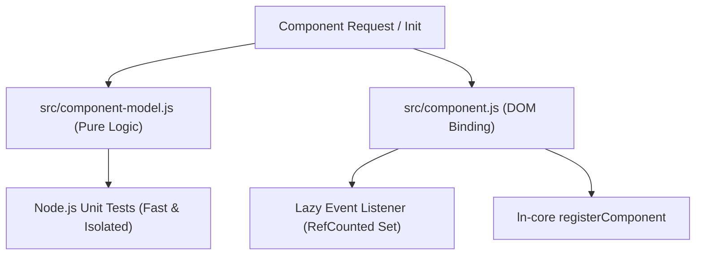

# Component Refactoring Blueprint: Isolated Model & Lazy Lifecycle Pattern

> 📌 **Internal Architecture Note:** This guide documents the engineering blueprint derived from `ln-key` to be used for future component refactoring across `ln-ashlar`.

---

## 1. Executive Summary & Core Objective

The `ln-key` component introduces a refined, high-performance component architecture for `ln-ashlar`. By decoupling pure business/domain logic from DOM lifecycle management, we achieve:
1. **100% Isolated Unit Testing** in Node.js without DOM mock overhead (`jsdom`).
2. **Zero Idle Resource Consumption** via lazy, reference-counted event listeners.
3. **Strict Adherence to Ashlar Doctrines** (Zero JS display text, Attribute Single Source of Truth, Paired Cancelable Events).

---

## 2. The 4 Pillars of the Refactoring Pattern



### Pillar 1: Pure Functional Domain Model (`src/{component}-model.js`)
- Contains **all** state normalization, string parsing, key/value aliases, target suitability checks, and browser semantic rules.
- **Rule:** Zero `document`, `window`, or DOM dependencies in `*-model.js` (except simple object shape checks or pure parameters).
- Export clean, pure functions for easy unit testing.

### Pillar 2: Lazy Dynamic Listener Lifecycle (Ref-Counted `Set`)
Instead of registering global event listeners at script load time, use an instance `Set` and reference counting:

```javascript
const instances = new Set();
let globalListener = null;

function _ensureListener() {
    if (globalListener) return;
    globalListener = function (event) { /* handle event across instances */ };
    document.addEventListener('event-name', globalListener);
}

function _maybeRemoveListener() {
    if (instances.size > 0 || !globalListener) return;
    document.removeEventListener('event-name', globalListener);
    globalListener = null;
}
```

### Pillar 3: Semantic Guarding & Target Suitability
- Protect form inputs (`isEditableEventTarget`) against unwanted trigger activations.
- Check element state (`isVisible()`, `!disabled`, `aria-disabled !== 'true'`, `!closest('[inert]')`).
- Respect native browser behavior (e.g. don't fire duplicate clicks when Enter is pressed on an already focused button).

### Pillar 4: Standard Event Lifecycle & Attribute Observer
- **Pre-fact Event:** `dispatchCancelable(el, 'ln-{component}:before-{action}', detail)`
- **Native Action Execution:** Call target method or update DOM attribute.
- **Post-fact Event:** `dispatch(el, 'ln-{component}:{action}', detail)`
- **Destruction Cleanup:** Emit `ln-{component}:destroyed`, remove from `instances Set`, and attempt listener teardown.

---

## 3. Candidate Components for Future Refactoring

| Component | Current Weakness | Refactoring Goal |
|---|---|---|
| [`ln-toggle`](file:///c:/laragon/www/ln-ashlar/components/ln-toggle/src/ln-toggle.js) | Global `click` listener attached unconditionally on load | Move toggle logic to `toggle-model.js`, make `click` listener lazy. |
| [`ln-tooltip`](file:///c:/laragon/www/ln-ashlar/components/ln-tooltip/src/ln-tooltip.js) | Hover/focus event bindings directly coupled to DOM | Extract positioning math & boundary calculations into `tooltip-model.js`. |
| [`ln-tabs`](file:///c:/laragon/www/ln-ashlar/components/ln-tabs/src/ln-tabs.js) | Keyboard navigation logic mixed with DOM manipulation | Extract ARIA keyboard navigation & panel indexing into `tabs-model.js`. |
| [`ln-search`](file:///c:/laragon/www/ln-ashlar/components/ln-search/src/ln-search.js) | Throttling & string matching tied to DOM inputs | Extract search matching, normalization & debounce logic into `search-model.js`. |

---

## 4. Refactoring Step-by-Step Checklist

When refactoring any existing component to this pattern:

- [ ] **Step 1:** Create `src/{component}-model.js` and extract pure logic functions.
- [ ] **Step 2:** Write Node test suite `tests/{component}.test.js` targeting `*-model.js`.
- [ ] **Step 3:** Update `src/{component}.js` to import model helpers and use `Set` instance tracking.
- [ ] **Step 4:** Implement lazy event listener registration/teardown (`_ensureListener` / `_maybeRemoveListener`).
- [ ] **Step 5:** Ensure full compatibility with `ln-core` `registerComponent` and `onAttributeChange`.
