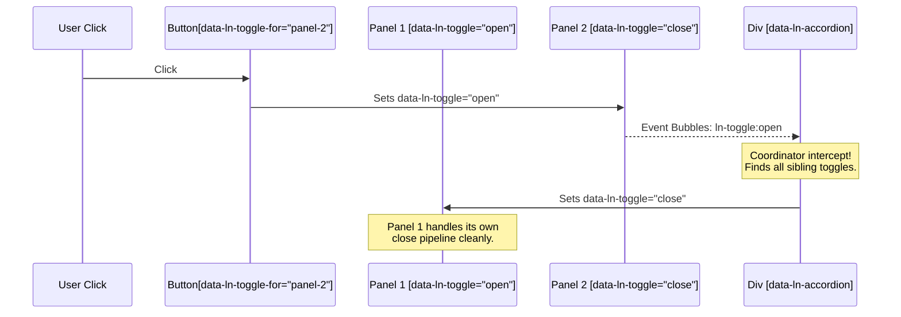

# The Coordinator Doctrine

In `ln-ashlar`, the **Coordinator** is an architectural pattern that acts as the decoupled "brain" of a multi-component layout or data flow. 

Instead of building massive, monophonic components that try to own state, layout, user interaction, and data transport all at once, `ln-ashlar` decomposes systems into lightweight, independent **primitives** (like toggles, caches, and forms) and glues them together using **Coordinators**.

---

## 🧭 Core Philosophy

The Coordinator Doctrine is guided by three non-negotiable rules:

### 1. The DOM is the Contract
A coordinator does not maintain private JavaScript state (e.g. `this.isOpen = true` or `this.activeStep = 3`). The state is written directly into the DOM as standard HTML attributes (e.g. `data-ln-toggle="open"` or `class="active"`). The HTML attribute is the sole source of truth.

### 2. Read via Events, Write via Attributes
A coordinator interacts with its child elements through decoupled channels:
* **Inbound (Reading):** The coordinator listens for standard, bubbled events emitted by its children (e.g., `ln-toggle:open`, `ln-form:submit`).
* **Outbound (Writing):** The coordinator acts on other elements purely by writing HTML attributes back to them (e.g., setting `data-ln-toggle="close"` on a sibling). It **never** calls internal instance methods directly.

### 3. Absolute Testability & Inspectability
Because all state transitions are reflected as attribute mutations in the DOM, you can test and debug the entire layout by manually changing attributes in your browser's Developer Tools or running automated testing scripts. Setting `data-ln-toggle="open"` in DevTools behaves exactly the same as clicking the physical trigger button.

---

## 🎭 The Two Flavours of Coordinators

Coordinators in `ln-ashlar` operate at both the **Presentation (UI) Layer** and the **Data Layer**.

### A. Presentation Layer Coordinators (UI)
These are visual components designed to coordinate layout primitives. They are lightweight, completely headless (they don't generate HTML or inject raw styles), and purely orchestrate.

#### 1. `ln-accordion` (Orchestrating Sibling Toggles)
* **Children:** Multiple independent panels, each carrying a standard `data-ln-toggle` primitive.
* **The Rule:** Only one panel can be open at a time.
* **Flow:** 
  1. A panel opens and bubbles an `ln-toggle:open` event.
  2. `ln-accordion` catches the bubbled event.
  3. It scans its scoped subtree for sibling toggles, and writes `data-ln-toggle="close"` to all other open panels.
  4. The closed toggles run their own individual close lifecycles (persistence updates, trigger ARIA updates, class removals).



#### 2. `ln-dropdown` (Orchestrating Teleportation & Positioning)
* **Children:** A single trigger button and a standard `data-ln-toggle` menu.
* **The Rule:** The menu must float precisely below the trigger without being clipped by parent overflow containers.
* **Flow:**
  1. The menu opens and bubbles `ln-toggle:open`.
  2. `ln-dropdown` catches it, teleports the menu element to `<body>` to escape parent `overflow: hidden` restrictions, and sets `position: fixed`.
  3. It measures the trigger and places the menu right-aligned beneath it.
  4. It listens for viewport resizes and outside clicks to safely write `data-ln-toggle="close"` back to the menu when needed.

#### 3. `ln-modal-fill` (Bridging Hash-Param Opens to Form Fills)
* **Children:** none — a global document listener (mirrors `ln-fill`).
* **The Rule:** when a hash-bound modal opens via a deep-link / Back-Forward (no
  click), its form must still be filled from the record identified by the hash
  param.
* **Flow:**
  1. A modal opens and bubbles `ln-modal:open { target, param }`.
  2. `ln-modal-fill` catches it; if `param` is present it finds the
     `[data-ln-fill-id="<param>"]` source (preferring one whose
     `data-ln-fill-form` lives inside the modal).
  3. It builds a record from the source's `data-ln-fill-*` attributes (same rules
     as `ln-fill`) and calls `window.lnCore.lnFill(modal, record)`.
  4. It NEVER clicks the source — `lnFill` only dispatches `ln-fill` events, so
     the open modal stays open and the URL hash is untouched (no re-open).
* `param` absent or no matching source → no-op.

See also: [Hash-state doctrine](hash-state.md) — the cross-cutting rules for namespace ownership, foreign-segment preservation, and anchor interception that make hash-param coordinators like `ln-modal-fill` safe to compose.

---

### B. Data Layer Coordinators
These are non-visual components designed to decouple client-side local database caches from network transport APIs.

#### `data-ln-data-coordinator` (The 3-Tier Sync Orchestrator)
* **Children:** A local IndexedDB cache database (`data-ln-data-store`) and a transport gateway connector (`data-ln-rest-connector` or `data-ln-websocket-connector`).
* **The Rule:** Decouple schema cache from endpoints.
* **Flow:**
  1. `ln-data-coordinator` claims the native form submission (or coordinator request event).
  2. The coordinator performs an **optimistic write** to the store (`ln-data-store:request-create`), which fans out `ln-data-store:created` to immediate table views.
  3. The parent `data-ln-data-coordinator` passes the local record through an Ingress/Egress data mapper (to sanitize and shape the payload), and invokes the transport connector to write to the server.
  4. Once resolved, the coordinator feeds the server's authoritative response back to the local database via `ln-data-store:request-update` (rekey).

---

## 🛠️ Developer Guide: Building a Custom Coordinator

When you build complex features in your project, **never** mix custom logic directly into the reusable library primitives. Instead, write a custom, project-specific coordinator.

### Scenario: A Multi-Step Form Wizard (`[data-ln-wizard]`)
We want to create a form wizard where only one step is visible at a time. The wizard has "Next" and "Previous" buttons. Each step panel is managed by a standard `data-ln-toggle` primitive.

#### Step 1: The Declarative HTML Markup
```html
<div data-ln-wizard data-ln-wizard-active-step="1">
    
    <!-- Step Panels (Independent primitives) -->
    <div id="step-1" data-ln-toggle="open" class="wizard-step">
        <h4>Step 1: Account Information</h4>
        <input type="text" placeholder="Username" required>
    </div>
    
    <div id="step-2" data-ln-toggle="close" class="wizard-step">
        <h4>Step 2: Profile Settings</h4>
        <input type="text" placeholder="Full Name">
    </div>
    
    <div id="step-3" data-ln-toggle="close" class="wizard-step">
        <h4>Step 3: Confirmation</h4>
        <p>Review and submit your details.</p>
    </div>

    <!-- Wizard Controls -->
    <div class="wizard-actions">
        <button type="button" data-ln-wizard-action="prev" disabled>Back</button>
        <button type="button" data-ln-wizard-action="next">Next Step</button>
    </div>
</div>
```

#### Step 2: The Coordinator JavaScript Logic
Write a clean, Vanilla ES component that registers under the `ln-core` component registry.

```javascript
import { registerComponent, dispatch } from '../ln-core';

(function () {
	const DOM_SELECTOR = 'data-ln-wizard';
	const DOM_ATTRIBUTE = 'lnWizard';

	if (window[DOM_ATTRIBUTE] !== undefined) return;

	function _component(dom) {
		this.dom = dom;
		this.steps = Array.from(dom.querySelectorAll('.wizard-step'));
		this.prevBtn = dom.querySelector('[data-ln-wizard-action="prev"]');
		this.nextBtn = dom.querySelector('[data-ln-wizard-action="next"]');
		
		const self = this;

		// ─── Event handler: Listen to control clicks ───
		this._onControlClick = function (e) {
			const actionBtn = e.target.closest('[data-ln-wizard-action]');
			if (!actionBtn) return;

			const action = actionBtn.getAttribute('data-ln-wizard-action');
			const activeIndex = parseInt(self.dom.getAttribute('data-ln-wizard-active-step')) - 1;
			
			let nextIndex = activeIndex;
			if (action === 'next' && activeIndex < self.steps.length - 1) {
				nextIndex++;
			} else if (action === 'prev' && activeIndex > 0) {
				nextIndex--;
			}

			if (nextIndex !== activeIndex) {
				self.goToStep(nextIndex + 1);
			}
		};

		this.dom.addEventListener('click', this._onControlClick);
		this.syncControls();

		return this;
	}

	// ─── Coordinator action: Transition steps purely via attribute writes ───
	_component.prototype.goToStep = function (stepNumber) {
		const targetIndex = stepNumber - 1;
		if (targetIndex < 0 || targetIndex >= this.steps.length) return;

		// 1. Write state back to coordinator attribute
		this.dom.setAttribute('data-ln-wizard-active-step', stepNumber);

		// 2. Coordinate transitions on step panels via standard toggle attributes
		this.steps.forEach((stepEl, idx) => {
			const shouldOpen = idx === targetIndex;
			stepEl.setAttribute('data-ln-toggle', shouldOpen ? 'open' : 'close');
		});

		// 3. Update action buttons state
		this.syncControls();

		// 4. Emit a unified event notifying the parent application of the transition
		dispatch(this.dom, 'ln-wizard:change', { activeStep: stepNumber });
	};

	// ─── Sync controls based on DOM attributes ───
	_component.prototype.syncControls = function () {
		const activeStep = parseInt(this.dom.getAttribute('data-ln-wizard-active-step')) || 1;
		
		if (this.prevBtn) {
			this.prevBtn.disabled = activeStep === 1;
		}
		if (this.nextBtn) {
			if (activeStep === this.steps.length) {
				this.nextBtn.textContent = 'Finish';
				this.nextBtn.setAttribute('data-ln-wizard-action', 'submit');
			} else {
				this.nextBtn.textContent = 'Next Step';
				this.nextBtn.setAttribute('data-ln-wizard-action', 'next');
			}
		}
	};

	// ─── Teardown ───
	_component.prototype.destroy = function () {
		if (!this.dom[DOM_ATTRIBUTE]) return;
		this.dom.removeEventListener('click', this._onControlClick);
		delete this.dom[DOM_ATTRIBUTE];
	};

	// Register with Core
	registerComponent(DOM_SELECTOR, DOM_ATTRIBUTE, _component, 'ln-wizard');
})();
```

---

## Normalize Reused Surfaces at the Open Boundary

A modal, drawer, or inline editor persists in the DOM and is reused across many records. Unlike a per-render row it accumulates residual state. Re-establish a known state every time it's shown — at the **open boundary**, never on the cancelable close.

**Default: declarative trigger** — for click-triggered fills from table rows or
inline buttons, `data-ln-fill-form` + `data-ln-fill-*` attributes on the trigger
require no coordinator at all (see [`js/ln-fill/README.md`](../../js/ln-fill/README.md)).

**Coordinator pattern** — use `ln-modal:before-open` + `lnFill` when the fill is
programmatic and not click-triggered (e.g. a store conflict handler, an import
workflow, or a deep-link pre-fill). Pattern: on `ln-modal:before-open`, call
`window.lnCore.lnFill(modalEl, record)`. For the hash-param deep-link case specifically,
the shipped generic coordinator `ln-modal-fill` handles this automatically (see
[`js/ln-modal-fill/README.md`](../../js/ln-modal-fill/README.md)); the manual
`before-open` + `lnFill` pattern remains valid for non-hash programmatic fills.
Pass `record` to fill; pass `null` to reset. The helper fans out to all `[data-ln-form]`
and `[data-ln-fillable]` descendants — coordinator never calls `lnForm.reset()` /
`lnForm.fill()` directly.

Reset-first is load-bearing: `ln-form`'s `ln-fill` handler calls `this.reset()` when
`detail` is `null`, so without a null call a prior record's fields linger (field-leak).

**State placement:**

- **Mode → DOM** (`data-ln-modal-mode` attribute). DOM is the single source of truth per the coordinator doctrine.
- **Record → JS** (`pendingRecord` variable). Consume-once: read into a local, null it immediately in the `before-open` handler.
- **No `editMode` boolean** — the record's presence IS the mode.

```js
modalEl.addEventListener('ln-modal:before-open', () => {
	const record = pendingRecord;
	pendingRecord = null;

	// lnFill fans out to all [data-ln-form] and [data-ln-fillable] descendants.
	// null → reset/clear; record → fill. Coordinator never calls form methods directly.
	window.lnCore.lnFill(modalEl, record);
	modalEl.dataset.lnModalMode = record ? 'edit' : 'new';
});
```

See the mode-toggle markup and coordinator wiring in [`js/ln-modal/README.md §7`](../../js/ln-modal/README.md).

---

## 📝 Best Practices Checklist for Coordinators

When writing your own custom coordinators, adhere to this checklist to ensure stability and compatibility:

* **[ ] Never import children:** A presentation coordinator must remain oblivious to the internal implementation of its children. Listen to bubbled events, and write attributes.
* **[ ] Scan your subtree only:** Never query the global `document.querySelectorAll()` inside a coordinator. Use `this.dom.querySelectorAll()` to ensure that multiple instances of your coordinator on the same page never conflict.
* **[ ] Clean up thoroughly:** In the `destroy()` method, remove all event listeners added to parent wrappers or global surfaces (like `window` or `document`), and drop all internal references to prevent memory leaks.
* **[ ] Support dynamic markup:** Expect elements to be added or removed dynamically. If you cache elements, ensure you handle dynamic insertions (typically via the component's MutationObserver hook) or re-evaluate selectors on user actions.
