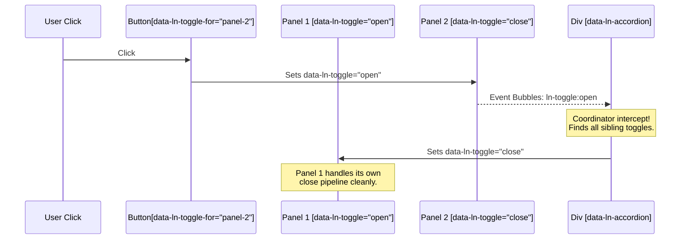

# The Coordinator Doctrine

In `ln-ashlar`, the **Coordinator** is an architectural pattern that acts as the decoupled "brain" of a multi-component layout or data flow. 

Instead of building massive, monophonic components that try to own state, layout, user interaction, and data transport all at once, `ln-ashlar` decomposes systems into lightweight, independent **primitives** (like toggles, caches, and forms) and glues them together using **Coordinators**.

---

## 🧭 Core Philosophy

The Coordinator Doctrine is guided by five non-negotiable rules:

### 1. The DOM is the Contract
A coordinator does not maintain private JavaScript state (e.g. `this.isOpen = true` or `this.activeStep = 3`). The state is written directly into the DOM as standard HTML attributes (e.g. `data-ln-toggle="open"` or `class="active"`). The HTML attribute is the sole source of truth.

### 2. Read via Events, Write via Attributes
A coordinator interacts with its child elements through decoupled channels:
* **Inbound (Reading):** The coordinator listens for standard, bubbled events emitted by its children (e.g., `ln-toggle:open`, `ln-form:submit`).
* **Outbound (Writing):** The coordinator acts on other elements purely by writing HTML attributes back to them (e.g., setting `data-ln-toggle="close"` on a sibling). It **never** calls internal instance methods directly.

### 3. Absolute Testability & Inspectability
Because all state transitions are reflected as attribute mutations in the DOM, you can test and debug the entire layout by manually changing attributes in your browser's Developer Tools or running automated testing scripts. Setting `data-ln-toggle="open"` in DevTools behaves exactly the same as clicking the physical trigger button.

### 4. Children Only — the Subtree Is the Boundary
A coordinator coordinates **its own descendants and nothing else**. Its listeners bind to its host element, never to `document`. It resolves targets with `this.dom.querySelector()`, never `document.querySelector()`. Outside its own subtree a coordinator does not exist and does not look.

There is no page-wide fallback. A coordinator that cannot resolve a target inside its host does nothing — it never guesses by grabbing the first matching element on the page. A fallback such as `document.querySelector('[data-ln-table]')` silently turns every unrelated component on the page into an accidental input: a search box filtering a sidebar menu ends up driving a data table it has no relationship with.

This boundary is what makes coordinators composable. Ten coordinators of the same type on one page each see only their own children, and there is no shared state to leak between them.

### 5. ID Binding Is Point-to-Point
When one component is bound to another by id — `data-ln-search-for="<targetId>"`, `data-ln-modal-for="<modalId>"`, `data-ln-filter="<tableId>"` — it communicates with **that target and only that target**. It is not a broadcast.

Such components dispatch their event **on the target element**, not on themselves. Delivery therefore depends on where the *target* lives, not where the trigger lives. A search input in a sidebar may legitimately drive a table inside a coordinator: the event originates on the table, which is the coordinator's own child, so rule 4 is satisfied without the input being a descendant of anything.

The corollary binds the listening side. An event merely bubbling past is not permission to act on it. A coordinator acts only when the event's target is one of its own children.

### Sanctioned Exceptions

Rule 4 admits exceptions, but only where the behaviour genuinely is not coordination. A page-level keyboard shortcut, or a fan-out helper that must reach any matching element wherever it lives, has no host whose subtree could contain its work — scoping it would not make it correct, it would make it useless.

Two such exceptions ship today: `ln-ui-coordinator`, which listens at `document` because its triggers are anywhere on the page and its targets are addressed by id, and `ln-table-coordinator`'s `/` focus shortcut, which is a page affordance rather than coordination between a host and its children.

What makes them sanctioned rather than sloppy is that they are named. An exception must be deliberate, documented where it lives, and justified by the impossibility of scoping — not by convenience. A `document` listener that *could* have been bound to a host is a defect, whatever it is called.

### The Target Decides

Rules 4 and 5 together mean an id-bound event has exactly one addressee, and what happens next depends entirely on what that addressee is capable of. `ln-search` illustrates the full range: it dispatches a **cancelable** `ln-search:change` on its target, then applies its own default DOM show/hide only if nothing cancelled it.

| Target | What happens |
|---|---|
| Inert DOM — a `<nav>` menu | Nothing cancels. `ln-search` hides non-matching children via `data-ln-search-hide`. |
| A component with an opinion — an SSR `ln-table` | The table intercepts the event **on itself**, calls `preventDefault()`, and runs its own in-memory filter so its active sort and footer counts stay coherent. |
| A data-driven `ln-table` | Its parent coordinator intercepts, calls `preventDefault()`, and translates the term into a data request. |

One protocol, three outcomes, no special-casing anywhere. The cancelable gate is precisely what allows a dumb target and a smart target to be driven by the same component — and it is why a component must never cancel an event on behalf of a target it does not own.

---

## 🎭 The Two Flavours of Coordinators

Coordinators in `ln-ashlar` operate at both the **Presentation (UI) Layer** and the **Data Layer**.

### A. Presentation Layer Coordinators (UI)
These are visual components designed to coordinate layout primitives. They are lightweight, completely headless (they don't generate HTML or inject raw styles), and purely orchestrate.

#### 1. `ln-accordion` (Orchestrating Sibling Toggles)
* **Children:** Multiple independent panels, each carrying a standard `data-ln-toggle` primitive.
* **The Rule:** Only one panel can be open at a time.
* **Flow:** 
  1. A panel opens and bubbles an `ln-toggle:open` event.
  2. `ln-accordion` catches the bubbled event.
  3. It scans its scoped subtree for sibling toggles, and writes `data-ln-toggle="close"` to all other open panels.
  4. The closed toggles run their own individual close lifecycles (persistence updates, trigger ARIA updates, class removals).


```mermaid
sequenceDiagram
    participant User as User Click
    participant Trigger as Button[data-ln-toggle-for="panel-2"]
    participant Sibling as Panel 1 [data-ln-toggle="open"]
    participant Target as Panel 2 [data-ln-toggle="close"]
    participant Accordion as Div [data-ln-accordion]
    
    User->>Trigger: Click
    Trigger->>Target: Sets data-ln-toggle="open"
    Target-->>Accordion: Event Bubbles: ln-toggle:open
    Note over Accordion: Coordinator intercept!<br/>Finds all sibling toggles.
    Accordion->>Sibling: Sets data-ln-toggle="close"
    Note over Sibling: Panel 1 handles its own<br/>close pipeline cleanly.
```

#### 2. `ln-dropdown` (Orchestrating Teleportation & Positioning)
* **Children:** A single trigger button and a standard `data-ln-toggle` menu.
* **The Rule:** The menu must float precisely below the trigger without being clipped by parent overflow containers.
* **Flow:**
  1. The menu opens and bubbles `ln-toggle:open`.
  2. `ln-dropdown` catches it, teleports the menu element to `<body>` to escape parent `overflow: hidden` restrictions, and sets `position: fixed`.
  3. It measures the trigger and places the menu right-aligned beneath it.
  4. It listens for viewport resizes and outside clicks to safely write `data-ln-toggle="close"` back to the menu when needed.

#### 3. `ln-ui-coordinator` (Bridging Hash Navigation, Fill, AJAX, and Submit)
* **Children:** acts on targets across the page with dictionary scoped to `[data-ln-ui-coordinator]`.
* **The Rule:** a modal must open, get its form filled, auto-close on
  successful AJAX submit, and toast response messages — without `ln-modal`,
  `ln-fill`, `ln-ajax`, or `ln-toast` knowing about each other.
* **Flow:**
  1. A modal is opened autonomously via its `[data-ln-modal-for]` trigger or via an `<a href="#modalId:42">` hash
     anchor. When `ln-modal:open` bubbles, the coordinator syncs the URL hash
     via `hashSet` (preserving foreign segments) and dispatches `ln-fill:request` if a parameterized segment is present.
  2. On `ln-ajax:success` bubbling from the form, it
     dispatches `ln-toast:enqueue` if a response message is present, cleans the URL hash (`hashSet(modal.id, null)` so the modal never reopens on reload),
     dispatches `ln-modal:request-close`, and resets modal forms.
  3. On `ln-ajax:error`, it dispatches error toast notifications and keeps the
     modal open so inline validation errors remain visible.

See also: [Hash-state doctrine](hash-state.md) — the cross-cutting rules for namespace ownership, foreign-segment preservation, and anchor interception that make hash-param coordinators like `ln-ui-coordinator` safe to compose.

---

### B. Data Layer Coordinators
These are non-visual components designed to decouple client-side local database caches from network transport APIs.

#### `data-ln-data-coordinator` (The 3-Tier Sync Orchestrator)
* **Children:** A local IndexedDB cache database (`data-ln-data-store`) and a transport gateway connector (`data-ln-rest-connector` or `data-ln-websocket-connector`).
* **The Rule:** Decouple schema cache from endpoints.
* **Flow:**
  1. `ln-data-coordinator` claims the native form submission (or coordinator request event).
  2. The coordinator performs an **optimistic write** to the store (`ln-data-store:request-create`), which fans out `ln-data-store:created` to immediate table views.
  3. The parent `data-ln-data-coordinator` passes the local record through an Ingress/Egress data mapper (to sanitize and shape the payload), and invokes the transport connector to write to the server.
  4. Once resolved, the coordinator feeds the server's authoritative response back to the local database via `ln-data-store:request-update` (rekey).

---

## 🛠️ Developer Guide: Building a Custom Coordinator

When you build complex features in your project, **never** mix custom logic directly into the reusable library primitives. Instead, write a custom, project-specific coordinator.

### Scenario: A Multi-Step Form Wizard (`[data-ln-wizard]`)
We want to create a form wizard where only one step is visible at a time. The wizard has "Next" and "Previous" buttons. Each step panel is managed by a standard `data-ln-toggle` primitive.

#### Step 1: The Declarative HTML Markup
```html
<div data-ln-wizard data-ln-wizard-active-step="1">
    
    <!-- Step Panels (Independent primitives) -->
    <div id="step-1" data-ln-toggle="open" class="wizard-step">
        <h4>Step 1: Account Information</h4>
        <input type="text" placeholder="Username" required>
    </div>
    
    <div id="step-2" data-ln-toggle="close" class="wizard-step">
        <h4>Step 2: Profile Settings</h4>
        <input type="text" placeholder="Full Name">
    </div>
    
    <div id="step-3" data-ln-toggle="close" class="wizard-step">
        <h4>Step 3: Confirmation</h4>
        <p>Review and submit your details.</p>
    </div>

    <!-- Wizard Controls -->
    <div class="wizard-actions">
        <button type="button" data-ln-wizard-action="prev" disabled>Back</button>
        <button type="button" data-ln-wizard-action="next">Next Step</button>
    </div>
</div>
```

#### Step 2: The Coordinator JavaScript Logic
Write a clean, Vanilla ES component that registers under the `ln-core` component registry.

```javascript
import { registerComponent, dispatch } from '../ln-core';

(function () {
	const DOM_SELECTOR = 'data-ln-wizard';
	const DOM_ATTRIBUTE = 'lnWizard';

	if (window[DOM_ATTRIBUTE] !== undefined) return;

	function _component(dom) {
		this.dom = dom;
		this.steps = Array.from(dom.querySelectorAll('.wizard-step'));
		this.prevBtn = dom.querySelector('[data-ln-wizard-action="prev"]');
		this.nextBtn = dom.querySelector('[data-ln-wizard-action="next"]');
		
		const self = this;

		// ─── Event handler: Listen to control clicks ───
		this._onControlClick = function (e) {
			const actionBtn = e.target.closest('[data-ln-wizard-action]');
			if (!actionBtn) return;

			const action = actionBtn.getAttribute('data-ln-wizard-action');
			const activeIndex = parseInt(self.dom.getAttribute('data-ln-wizard-active-step')) - 1;
			
			let nextIndex = activeIndex;
			if (action === 'next' && activeIndex < self.steps.length - 1) {
				nextIndex++;
			} else if (action === 'prev' && activeIndex > 0) {
				nextIndex--;
			}

			if (nextIndex !== activeIndex) {
				self.goToStep(nextIndex + 1);
			}
		};

		this.dom.addEventListener('click', this._onControlClick);
		this.syncControls();

		return this;
	}

	// ─── Coordinator action: Transition steps purely via attribute writes ───
	_component.prototype.goToStep = function (stepNumber) {
		const targetIndex = stepNumber - 1;
		if (targetIndex < 0 || targetIndex >= this.steps.length) return;

		// 1. Write state back to coordinator attribute
		this.dom.setAttribute('data-ln-wizard-active-step', stepNumber);

		// 2. Coordinate transitions on step panels via standard toggle attributes
		this.steps.forEach((stepEl, idx) => {
			const shouldOpen = idx === targetIndex;
			stepEl.setAttribute('data-ln-toggle', shouldOpen ? 'open' : 'close');
		});

		// 3. Update action buttons state
		this.syncControls();

		// 4. Emit a unified event notifying the parent application of the transition
		dispatch(this.dom, 'ln-wizard:change', { activeStep: stepNumber });
	};

	// ─── Sync controls based on DOM attributes ───
	_component.prototype.syncControls = function () {
		const activeStep = parseInt(this.dom.getAttribute('data-ln-wizard-active-step')) || 1;
		
		if (this.prevBtn) {
			this.prevBtn.disabled = activeStep === 1;
		}
		if (this.nextBtn) {
			if (activeStep === this.steps.length) {
				this.nextBtn.textContent = 'Finish';
				this.nextBtn.setAttribute('data-ln-wizard-action', 'submit');
			} else {
				this.nextBtn.textContent = 'Next Step';
				this.nextBtn.setAttribute('data-ln-wizard-action', 'next');
			}
		}
	};

	// ─── Teardown ───
	_component.prototype.destroy = function () {
		if (!this.dom[DOM_ATTRIBUTE]) return;
		this.dom.removeEventListener('click', this._onControlClick);
		delete this.dom[DOM_ATTRIBUTE];
	};

	// Register with Core
	registerComponent(DOM_SELECTOR, DOM_ATTRIBUTE, _component, 'ln-wizard');
})();
```

---

## Normalize Reused Surfaces at the Open Boundary

A modal, drawer, or inline editor persists in the DOM and is reused across many records. Unlike a per-render row it accumulates residual state. Re-establish a known state every time it's shown — at the **open boundary**, never on the cancelable close.

**Default: declarative trigger** — for click-triggered fills from table rows or
inline buttons, `data-ln-fill-form` + `data-ln-fill-*` attributes on the trigger
require no coordinator at all (see [`components/ln-fill/README.md`](../../components/ln-fill/README.md)).

**Coordinator pattern** — use `ln-modal:before-open` + `lnFill` when the fill is
programmatic and not click-triggered (e.g. a store conflict handler, an import
workflow, or a deep-link pre-fill). Pattern: on `ln-modal:before-open`, call
`window.lnCore.lnFill(modalEl, record)`. For the hash-param deep-link case specifically,
the shipped generic `ln-ui-coordinator` handles this automatically (source:
`components/ln-ui-coordinator/src/ln-ui-coordinator.js`); the manual
`before-open` + `lnFill` pattern remains valid for non-hash programmatic fills.
Pass `record` to fill; pass `null` to reset. The helper fans out to all `[data-ln-form]`
and `[data-ln-fillable]` descendants — coordinator never calls `lnForm.reset()` /
`lnForm.fill()` directly.

Reset-first is load-bearing: `ln-form`'s `ln-fill` handler calls `this.reset()` when
`detail` is `null`, so without a null call a prior record's fields linger (field-leak).

**State placement:**

- **Mode → DOM** (`data-ln-modal-mode` attribute). DOM is the single source of truth per the coordinator doctrine.
- **Record → JS** (`pendingRecord` variable). Consume-once: read into a local, null it immediately in the `before-open` handler.
- **No `editMode` boolean** — the record's presence IS the mode.

```js
modalEl.addEventListener('ln-modal:before-open', () => {
	const record = pendingRecord;
	pendingRecord = null;

	// lnFill fans out to all [data-ln-form] and [data-ln-fillable] descendants.
	// null → reset/clear; record → fill. Coordinator never calls form methods directly.
	window.lnCore.lnFill(modalEl, record);
	modalEl.dataset.lnModalMode = record ? 'edit' : 'new';
});
```

See the mode-toggle markup and coordinator wiring in [`components/ln-modal/README.md §7`](../../components/ln-modal/README.md).

---

## ⚡ Route & Feature Coordinators: The Authentic Ashlar Pattern

In `ln-ashlar`, page and route coordinators are **authentic Layer 2 Ashlar components**. They are not loose script tags with global `document.addEventListener` listeners, nor are they heavy pseudo-classes with manual `mount()`/`unmount()` glue code.

Instead, they strictly adhere to core Ashlar component doctrines:
1. **Self-Registration via `registerComponent`**: Automatically discovered and instantiated by the kernel's shared `MutationObserver` whenever their host element (`data-ln-tenant-editor`, `data-ln-tenants`) enters the DOM.
2. **Automatic Lifecycle Teardown (`destroy`)**: Automatically destroyed by `ln-core`'s childList observer when the route leaves and the element is removed.
3. **Declared Attribute Contracts (`ATTRIBUTES`)**: State and configuration live on DOM attributes (`data-ln-tenant-editor-store="tenants"`), backed by `defineAttrs` and `attrSpec`.
4. **Subtree Boundary (Rule 4)**: The coordinator attaches listeners to `this.dom` (e.g. `this.dom.addEventListener('ln-table:row-action')`) and queries only within its own subtree.
5. **Aware of Children & Bridges Them**: It resolves child components (`this.form`, `this.titleEl`, `this.pkgSelect`, `this.table`) and connects them via standard CustomEvents (`ln-fill`, `ln-data-coordinator:request-delete`, `ln-toast:enqueue`).

#### Canonical Example: The Tenant Coordinators (`tenants.js` & `tenant-editor.js`)

Below are the two standard coordinator patterns in `ln-ashlar`:

##### 1. Lean Declarative Event Mediator (`tenants.js`)
When a view's markup is already driven by standard Ashlar primitives (`data-ln-table`, `data-ln-modal`, `data-ln-data-coordinator`), the coordinator is authored as a lightweight IIFE mediator (~20–40 lines). It has zero classes, zero router dependencies, and only forwards events:

```javascript
(function () {
	'use strict';

	// 1. Table row action: forward single row deletion to data coordinator
	document.addEventListener('ln-table:row-action', function (e) {
		const d = e.detail;
		if (!d || d.table !== 'tenants' || d.action !== 'delete') return;

		const targetId = Number(d.id || (d.record && d.record.id));
		if (!targetId) return;

		const coord = document.getElementById('tenants-coordinator');
		if (coord) {
			coord.dispatchEvent(new CustomEvent('ln-data-coordinator:request-delete', {
				detail: { id: targetId }
			}));
		}
	});

	// 2. Toolbar action: forward bulk deletion to data coordinator
	document.addEventListener('click', function (e) {
		const btn = e.target.closest('#bulk-delete-tenants');
		if (!btn) return;

		const table = document.getElementById('tenants-table');
		const ids = Array.from((table && table.lnTable && table.lnTable.selectedIds) || []).map(Number);
		if (!ids.length) return;

		const coord = document.getElementById('tenants-coordinator');
		if (coord) {
			coord.dispatchEvent(new CustomEvent('ln-data-coordinator:request-bulk-delete', {
				detail: { ids: ids }
			}));
		}
	});

	// 3. React to store creation: close modal
	document.addEventListener('ln-data-store:created', function (e) {
		if (e.detail && e.detail.store && e.detail.store !== 'tenants') return;
		const modal = document.getElementById('tenant-modal');
		if (modal) modal.setAttribute('data-ln-modal', 'close');
	});
})();
```

##### 2. Autonomous Route Coordinator (`tenant-editor.js`)
When a view requires instance-scoped lifecycle upon being mounted into a route outlet, it is registered as a component via `registerComponent`. It obeys the **Zero Router Coupling** and **Autonomous Data Population** rules:

```javascript
(function () {
	'use strict';

	const DOM_SELECTOR = 'data-docuflow-tenant-editor';
	const DOM_ATTRIBUTE = 'docuflowTenantEditor';

	if (window[DOM_ATTRIBUTE] !== undefined) return;

	function DocuflowTenantEditor(dom) {
		this.dom = dom;
		this.dom[DOM_ATTRIBUTE] = this;

		// 1. Zero router coupling: extract parameters from native location
		const match = window.location.pathname.match(/\/tenants\/(\d+)/);
		this.tenantId = match ? Number(match[1]) : null;

		this._bindEvents();
		this.loadRecord();
	}

	// 2. Autonomous form population: one line via lnFill; coordinator ignores internal form controls
	DocuflowTenantEditor.prototype.loadRecord = function () {
		const store = document.getElementById('tenants').lnDataStore;
		store.getById(this.tenantId).then(record => {
			if (record) window.lnCore.lnFill(this.dom, record);
		});
	};

	DocuflowTenantEditor.prototype._bindEvents = function () {
		const storeEl = document.getElementById('tenants');

		this._onStoreSync = () => this.loadRecord();
		storeEl.addEventListener('ln-data-store:synced', this._onStoreSync);
		storeEl.addEventListener('ln-data-store:ready', this._onStoreSync);

		this._onStoreUpdated = (e) => {
			if (e.detail && e.detail.store === 'tenants') {
				window.dispatchEvent(new CustomEvent('ln-toast:enqueue', {
					detail: { type: 'success', title: 'Tenant updated', message: 'Tenant saved successfully' }
				}));
			}
		};
		document.addEventListener('ln-data-store:updated', this._onStoreUpdated);
	};

	DocuflowTenantEditor.prototype.destroy = function () {
		const storeEl = document.getElementById('tenants');
		if (storeEl) {
			storeEl.removeEventListener('ln-data-store:synced', this._onStoreSync);
			storeEl.removeEventListener('ln-data-store:ready', this._onStoreSync);
		}
		document.removeEventListener('ln-data-store:updated', this._onStoreUpdated);
		delete this.dom[DOM_ATTRIBUTE];
	};

	window[DOM_ATTRIBUTE] = DocuflowTenantEditor;

	// Automatically mounted and destroyed by ln-core MutationObserver when route renders/unmounts
	if (window.lnCore && window.lnCore.registerComponent) {
		window.lnCore.registerComponent(DOM_SELECTOR, DOM_ATTRIBUTE, DocuflowTenantEditor, 'docuflow-tenant-editor');
	}
})();
```

---

## 📝 Best Practices Checklist for Coordinators

When writing your own custom coordinators, adhere to this checklist to ensure stability and compatibility:

* **[ ] Never import children:** A presentation coordinator must remain oblivious to the internal implementation of its children. Listen to bubbled events, and write attributes.
* **[ ] Bind to your host, not to `document`:** Attach listeners to `this.dom`, so events reach you only by bubbling up through your own subtree. A `document`-level listener sees every component on the page and makes the coordinator a page-wide singleton by accident.
* **[ ] Scan your subtree only:** Never query the global `document.querySelectorAll()` inside a coordinator. Use `this.dom.querySelectorAll()` to ensure that multiple instances of your coordinator on the same page never conflict.
* **[ ] Never fall back to the page:** If a target cannot be resolved inside your host, do nothing. Guessing with `document.querySelector('[data-ln-x]')` picks the first match on the page and silently binds you to a component you have no relationship with.
* **[ ] Check the event target before acting:** An event that bubbles through your host is not necessarily addressed to you. Confirm `e.target` is one of your children before intercepting or cancelling it.
* **[ ] Clean up thoroughly:** In the `destroy()` method, remove all event listeners added to parent wrappers or global surfaces (like `window` or `document`), and drop all internal references to prevent memory leaks.
* **[ ] Support dynamic markup:** Expect elements to be added or removed dynamically. If you cache elements, ensure you handle dynamic insertions (typically via the component's MutationObserver hook) or re-evaluate selectors on user actions.
