# Data flow architecture

> Source of truth for how data moves through ln-ashlar — from the
> backend, into the local cache, through forms, into renderers. This
> document precedes any code changes that touch the data pipeline.
> Component READMEs reference this file; they do NOT redefine
> architecture in their own copy.

> **Audience.** Laravel developers consuming ln-ashlar in a Blade-rendered
> admin panel. You know how Blade and Eloquent work; you have not
> necessarily thought about offline-first sync, optimistic writes, or
> client-side query engines. This document assumes that baseline.

---

## 1. Why this document exists

ln-ashlar's data layer is **not** a typical request/response library.
It is a local-first, offline-tolerant, declaratively-bound query and
sync engine. Four distinct layers cooperate, each with a tightly
scoped responsibility. The temptation when working in any one layer
is to reach into the others — that is what this document exists to
prevent.

Get the layer boundaries wrong and you produce code where:

- the page coordinator owns sorting (which belongs to `ln-store`),
- a renderer talks directly to `fetch` (which belongs to the submit layer),
- forms know about IndexedDB (which belongs to the data layer),
- or a component re-queries the DOM at runtime to find subscribers
  (which is forbidden — see §11).

When in doubt, find the layer in §3 and re-read its responsibilities.
The right answer is almost always "a layer you weren't thinking about
already owns this."

---

## 2. The four layers (one-line each)

| # | Layer        | Component(s)                            | Owns                                      |
|---|--------------|-----------------------------------------|-------------------------------------------|
| 1 | **Data**     | `ln-store`                              | Local cache, query engine, sync state     |
| 2 | **Submit**   | `ln-form`, `ln-confirm`, `ln-http`      | Serialization, validation gate, transport |
| 3 | **Render**   | `ln-data-table` and other future renderers | Visual presentation of records         |
| 4 | **Validate** | `ln-validate`                           | Field-level validity + server error display |

A request flows: **Submit → Data → Render**. A successful pipeline
never skips a layer, and no layer reaches around its neighbour. The
remainder of this document defines exactly what each layer owns and
exactly how they connect.

---

## 3. Layer responsibilities

### 3.1 Data layer — `ln-store`

**Owns:**

- IndexedDB-backed local cache, keyed by record id.
- Full-load + delta-sync from the configured endpoint.
- Query engine: `getAll(options)`, `getById`, `count`, `aggregate`,
  with sort / filter / search / limit applied **client-side over the
  cache**.
- Optimistic write pipeline: local upsert with `_pending: true`,
  network attempt, reconcile or revert or queue.
- Pending queue (IndexedDB-backed, FIFO per record), retry with
  exponential backoff, drain on `online` event.
- Fan-out of `ln-store:change` to registered renderers when records
  mutate.
- Lifecycle events: `ln-store:ready`, `ln-store:loaded`,
  `ln-store:synced`, `ln-store:offline`, `ln-store:error`,
  `ln-store:reconciled`, `ln-store:sync-conflict`,
  `ln-store:sync-failed`, `ln-store:pending-count-change`,
  `ln-store:quota-exceeded`.

**Does NOT own:**

- The DOM presentation of records — that is the render layer.
- Form serialization or validation — that is the submit layer.
- Any user-facing toasts, modals, or error UI — that is consumer
  coordinator code.
- Page-level sort/filter UI — `ln-store` accepts sort/filter
  parameters in `getAll()`, but the UI controls that produce them
  (column header clicks, filter dropdowns) are render-layer concerns
  that translate user intent into store query options.

**Sorting belongs here, not in the page coordinator.** A renderer
asks the store for "all documents sorted by `created_at` desc" via
`getAll({ sort: 'created_at', order: 'desc' })`. The store's query
engine does the sort over the cached records. The coordinator's job
is at most to translate a column-header click into that query
options object.

### 3.2 Submit layer — `ln-form`, `ln-confirm`, `ln-http`

**Owns:**

- Form serialization (`ln-core/serializeForm`).
- Submit gating: `ln-form` blocks submission unless every
  `data-ln-validate` field is valid.
- Native form attributes (`action`, `method`) become the request
  contract — no JS configuration required.
- Two-click confirm UX for destructive actions (`ln-confirm` arms
  a button on first click, executes on second).
- HTTP transport (`ln-http` is a service-style component that
  consumes `ln-http:request` events and dispatches `ln-http:success`
  / `ln-http:error`). For Phase A, `ln-store` calls `fetch` directly
  rather than dispatching `ln-http:request` — see §13.

**Does NOT own:**

- Local cache state. The form does not know about IndexedDB.
- Optimistic record application. The form fires
  `ln-form:submit`; the data layer decides what to do with the payload.
- Sort / filter / search inputs. Forms with `data-ln-form-auto`
  serialize their fields and dispatch — the consuming component
  (a filter coordinator or `ln-store`) interprets them.

### 3.3 Render layer — `ln-data-table` and future renderers

**Owns:**

- Cloning a `<template>` per record, filling it via
  `data-ln-cell="field"` / `data-ln-cell-attr="field:attr"`.
- Virtual scrolling for large result sets (`ln-data-table` does this
  internally with RAF batching).
- Empty state, loading state, error state templates.
- Translation of UI events (column click → sort intent, search input
  → search intent) into payloads the data layer can consume.

**Does NOT own:**

- The data itself. The renderer is stateless about records — it
  receives a fresh array on every `ln-store:change` and draws
  whatever it gets.
- The query engine. Sorting is done by the data layer; the renderer
  just asks for the result.
- Network calls.

### 3.4 Validate layer — `ln-validate`

**Owns:**

- Field-level validity tracking via the native Constraint Validation
  API plus custom rules.
- `ln-validate:valid` / `ln-validate:invalid` events that
  `ln-form` listens to for submit-button gating.
- Display of field-level error messages from a list inside the
  field's structural wrapper.
- Custom error injection via `ln-validate:set-custom` (used by
  `ln-form:error` consumers — see §6.3).

**Does NOT own:**

- Form submission, serialization, or transport.
- Knowledge of records or stores.

---

## 4. Component bindings — declarative attribute wiring

A consumer connects layers using native HTML attributes. There is no
JavaScript glue beyond the IIFE components themselves.

### 4.1 Form bound to a store

```html
<form data-ln-form
      data-ln-store-form="documents"
      action="/api/documents"
      method="POST">
	<div class="form-element">
		<label for="title">Title</label>
		<input type="text" id="title" name="title" required data-ln-validate>
	</div>

	<div class="form-actions">
		<button type="button" data-ln-modal-close>Cancel</button>
		<button type="submit">Save</button>
	</div>
</form>

<div data-ln-store="documents"
     data-ln-store-endpoint="/api/documents">
</div>
```

What happens:

1. `ln-form` upgrades the `<form>` and attaches a native `submit`
   listener.
2. `ln-store` runs a document-scoped `MutationObserver` watching for
   `data-ln-store-form` (see §11). It finds this form and adds it to
   the **form bindings registry** for the `"documents"` store.
3. On submit, `ln-form` validates and dispatches `ln-form:submit` with
   `{ data, endpoint, method, formEl }`.
4. The store's registered listener fires, runs the optimistic
   pipeline, and (on success) dispatches `ln-form:success` back on
   the same form element so the consumer can close the modal.

### 4.2 Renderer bound to a store

```html
<table data-ln-data-table data-ln-store-source="documents">
	<thead>
		<tr>
			<th data-ln-sort="title">Title</th>
			<th data-ln-sort="created_at">Created</th>
		</tr>
	</thead>
	<tbody></tbody>

	<template data-ln-template="row">
		<tr>
			<td data-ln-cell="title"></td>
			<td data-ln-cell="created_at"></td>
		</tr>
	</template>
</table>
```

What happens:

1. `ln-data-table` upgrades the `<table>`.
2. `ln-store` finds the matching `data-ln-store-source` and adds the
   table to the **renderer bindings registry** for `"documents"`.
3. If the store is already loaded, the store immediately dispatches
   `ln-store:change` on this `<table>` with the current records and
   `source: 'initial'`.
4. From here on, every record mutation in the store fans out
   `ln-store:change` to this element (and to every other registered
   renderer for `"documents"`).

### 4.3 Coordinator — what's left for the consumer to write

"Coordinator" here means the **page-level** flavor — the
consumer-written shim that wires data-flow components together on a
specific page. Library-shipped coordinators (e.g. `ln-accordion`)
are a separate concern; see the [glossary entry](#14-glossary).

In the canonical case, **nothing**. Both bindings are declarative.
The consumer writes zero JavaScript glue.

A coordinator only appears when behaviour is genuinely consumer-specific
— e.g. translating one component's event into the protocol another
component expects. Even when it does appear, it stays small (a few
lines, no logic). A canonical example will be added back once the
data-table protocol stabilizes.

A coordinator with logic in it (more than a translation shim) is a
warning sign — see §10.1.

---

## 5. The optimistic + offline write pipeline

This is the heart of the data layer. It is what makes ln-ashlar
local-first.

### 5.1 State diagram

```mermaid
stateDiagram-v2
    [*] --> FormSubmit: user clicks Save
    FormSubmit --> Validate: ln-form intercepts
    Validate --> [*]: invalid (block, show errors)
    Validate --> Optimistic: valid

    Optimistic --> CacheWritten: _putRecord with _pending:true
    CacheWritten --> FanOut: dispatch ln-store:change<br/>source='create'|'update'|'delete'
    FanOut --> FormSuccess: dispatch ln-form:success<br/>(modal closes)
    FormSuccess --> NetworkAttempt: navigator.onLine?

    NetworkAttempt --> Online: yes
    NetworkAttempt --> Queued: no

    Online --> Fetch
    Fetch --> 2xx: response.status < 400
    Fetch --> 4xx: 400 <= status < 500
    Fetch --> 5xx: status >= 500
    Fetch --> NetworkErr: fetch reject

    2xx --> Reconcile: server overrides<br/>swap tmp_id → real id<br/>_pending=false
    Reconcile --> ReconcileFanOut: dispatch ln-store:reconciled<br/>+ ln-store:synced<br/>+ ln-store:change source='reconcile'
    ReconcileFanOut --> [*]

    4xx --> Revert: restore from snapshot
    Revert --> RevertFanOut: dispatch ln-form:error<br/>+ ln-store:change source='revert'
    RevertFanOut --> [*]

    5xx --> Queued
    NetworkErr --> Queued
    Queued --> PendingCount: dispatch<br/>ln-store:pending-count-change

    PendingCount --> [*]: wait for online

    [*] --> Drain: window 'online' event
    Drain --> ReplayChain: per recordId, FIFO
    ReplayChain --> Replay2xx: success
    ReplayChain --> Replay4xx: conflict
    ReplayChain --> Replay5xx: retry
    Replay2xx --> Reconcile
    Replay4xx --> Conflict: dispatch ln-store:sync-conflict<br/>(form is gone; consumer chooses UX)
    Replay5xx --> Backoff: 2s, 5s, 15s, 1min, 5min
    Backoff --> ReplayChain: attempts++
    Backoff --> Exhausted: attempts >= MAX
    Exhausted --> SyncFailed: dispatch ln-store:sync-failed
```



### 5.2 ASCII fallback

```
            ┌────────────┐
   user ──> │ form submit│ ──> ln-form validates ──> serialize
            └────────────┘
                  │
                  ▼  ln-form:submit { data, endpoint, method, formEl }
            ┌────────────┐
            │  ln-store  │ ──> _putRecord (IndexedDB) with _pending:true
            │ (optimistic│ ──> dispatch ln-form:success on formEl
            │  pipeline) │ ──> fan out ln-store:change to renderers
            └────────────┘
                  │
        ┌─────────┼──────────┬──────────┐
        ▼         ▼          ▼          ▼
   navigator   2xx server  4xx server  5xx / fetch reject
   .onLine                                  / offline
   = false        │           │              │
        │         │           │              │
        ▼         ▼           ▼              ▼
   _enqueue   reconcile    revert from    _enqueue
   (no try)               snapshot        (retry later)
        │         │           │              │
        ▼         ▼           ▼              ▼
   pending-   ln-store:    ln-form:error  pending-
   count-     reconciled   on formEl      count-
   change                  (validate      change
                           shows errors)
```

### 5.3 Event names — exact reference

| Event                              | Dispatched on   | When                                                         | Detail                                                                  |
|------------------------------------|-----------------|--------------------------------------------------------------|-------------------------------------------------------------------------|
| `ln-form:submit`                   | `<form>`        | User submits valid form                                      | `{ data, endpoint, method, formEl }`                                    |
| `ln-form:success`                  | `<form>`        | Optimistic write succeeded (cache + fan-out done)            | `{ record, action, tempId? }`                                           |
| `ln-form:error`                    | `<form>`        | 4xx returned during initial submit                           | `{ errors }` — `ln-validate` consumes                                   |
| `ln-store:change`                  | each renderer   | Records were mutated or sync completed                       | `{ store, records, source }` — `source ∈ initial\|create\|update\|delete\|reconcile\|revert\|sync` |
| `ln-store:reconciled`              | store element   | A specific record was confirmed by server                    | `{ store, record\|null, recordId, tempId?, action }`                    |
| `ln-store:synced`                  | store element   | A sync operation completed (full or delta or write)          | `{ store, added, deleted, changed }`                                    |
| `ln-store:pending-count-change`    | store element   | Queue size changed                                           | `{ store, count }`                                                      |
| `ln-store:sync-conflict`           | store element   | 4xx during queue drain (not initial submit)                  | `{ store, recordId, chain }`                                            |
| `ln-store:sync-failed`             | store element   | Queue entry exhausted retries on 5xx                         | `{ store, recordId, entry }`                                            |
| `ln-store:ready`                   | store element   | Cache loaded (from IndexedDB or full-load)                   | existing — see store README                                             |
| `ln-store:loaded` / `:offline` / `:error` / `:quota-exceeded` | store element / `document` | Lifecycle | existing — see store README          |

> **`ln-form:success` and `ln-form:error` do not exist in the current
> `ln-form` source.** They are introduced in Phase A, dispatched by
> `ln-store` on the `formEl` it received in `ln-form:submit.detail`.
> `ln-form` itself does not need to know about them — it only owns the
> submit dispatch.

---

## 6. Form-side response surface

The form is the user's anchor for the action. Once the optimistic
write happens, the modal can close. Once the server confirms or
rejects, the form-side surface (`ln-form:success` / `ln-form:error`)
fires — but only for the **initial** submit, not for queue drains
where the form may no longer exist.

### 6.1 Closing the modal on success

```html
<div class="ln-modal" data-ln-modal id="document-modal">
	<form data-ln-form
	      data-ln-store-form="documents"
	      action="/api/documents"
	      method="POST">
		<!-- ... -->
	</form>
</div>

<script>
	const modal = document.getElementById('document-modal');
	const form = modal.querySelector('form');
	form.addEventListener('ln-form:success', () => {
		modal.lnModal.close();
		form.lnForm.reset();
	});
</script>
```

### 6.2 Showing field-level errors on 4xx

`ln-store` dispatches `ln-form:error` with `{ errors }` shaped as
`{ fieldName: ['msg', 'msg'] }`. `ln-validate` listens for this
event on the form and applies each entry to the matching field via
`ln-validate:set-custom`.

> **`ln-validate` does NOT yet listen for `ln-form:error`.** Adding
> the listener is part of Phase A. The validate component already
> exposes `ln-validate:set-custom` as the injection point — Phase A
> only needs to wire `ln-form:error → ln-validate:set-custom`.

### 6.3 Initial submit 4xx vs queue drain 4xx — they are different

The two scenarios produce semantically different events because the
form may no longer be in the DOM:

| Scenario | Form state | Event fired | Consumer responsibility |
|----------|-----------|-------------|--------------------------|
| 4xx on initial submit (online) | Form still open | `ln-form:error` on `formEl` | `ln-validate` paints field errors; user fixes and resubmits |
| 4xx during queue drain (offline → online) | Form long gone | `ln-store:sync-conflict` on store element | Consumer chooses UX (re-open form prefilled, toast, hard-revert) |

Library does not pick the conflict UX. Library only fires the event.

---

## 7. Backend contract

> ln-ashlar is the client. The backend is whatever the consumer
> (Laravel, Slim, Express, anything that speaks JSON over HTTP) puts
> behind the configured endpoint. This section describes what
> ln-ashlar **expects from the backend**.

### 7.1 Record shape — primitive cells vs labelled cells

Two cell flavours are valid in a record. A renderer treats them
uniformly via `record[field]?.label ?? record[field]`:

```json
{
	"id": 42,
	"title": "Q3 Financial Report",
	"created_at": "2026-04-15T10:30:00Z",
	"author": { "value": 7, "label": "Alex Chen" },
	"department": { "value": 3, "label": "Finance" },
	"status": "published",
	"synced_at": "2026-04-15T10:30:01Z"
}
```

- `title`, `created_at`, `status` — **primitive cells** (string, date
  string, enum string). Renderer reads as-is.
- `author`, `department` — **labelled cells** with `{ value, label }`.
  Renderer reads `.label` for display, sort and filter use `.label`,
  serialization for the form sends `.value`.

This dual shape exists because the backend often joins reference
tables (departments, users) and the client should display the
human-readable label without a second lookup. The data layer treats
the cell as opaque; only the render and submit layers know about the
two flavours.

> **Phase A keeps it simple.** The current `ln-data-table._fillRow`
> only handles primitive cells (lines 866–873 of `ln-data-table.js`).
> Phase B extends `data-ln-cell` and the sort/filter/search engines
> to dot-notation paths and `{ value, label }` extraction. See §13.

### 7.2 Endpoint conventions

| Operation        | Method | URL                    | Request body                                                          | Response (success)         |
|------------------|--------|------------------------|-----------------------------------------------------------------------|----------------------------|
| Initial full load| GET    | `/api/<resource>`      | —                                                                     | `{ data: [...records], synced_at: "..." }` |
| Delta sync       | GET    | `/api/<resource>?since=<ISO>` | —                                                              | `{ data: [...changed], deleted: [...ids], synced_at: "..." }` |
| Create           | POST   | `/api/<resource>`      | serialized form, no `id`                                              | full record with server `id` |
| Update           | PUT    | `/api/<resource>/<id>` | serialized form including `id`                                        | full record (overrides client) |
| Delete           | DELETE | `/api/<resource>/<id>` | —                                                                     | `204 No Content` or empty body |

> The `endpoint` URL passed in `ln-form:submit.detail` is `form.action`
> verbatim. For PUT and DELETE, `ln-store` appends `/${recordId}` to
> the form's action URL. The form's `action` attribute therefore
> describes the **collection** URL, never the per-record URL.

### 7.3 Error response shape (4xx)

```json
{
	"errors": {
		"title": ["The title field is required."],
		"due_date": ["Must be in the future."]
	}
}
```

The top-level key may be `errors` or the raw response may itself be
the error map — `ln-store._revert` accepts either. Laravel's default
422 validation response satisfies this contract directly.

### 7.4 `synced_at`, `_pending`, `tmp_*` ids

| Field | Origin | Purpose |
|-------|--------|---------|
| `synced_at` | Server | ISO timestamp of last server-side sync. Stored on the record; used by the next delta-sync `?since=<synced_at>` query. |
| `_pending` | Client | Boolean. `true` while the record is optimistic (cache only) or queued (offline write). `false` after server reconcile. Renderers may visually distinguish (e.g. greyed row). |
| `_tempId` | Client | Set on optimistic POST records. The temp id (`tmp_<uuid>`) is the record's `id` until reconcile. After reconcile, the temp id is removed and the real server id replaces it. |
| `_deleted` | Client | Set in fan-out detail only — never persisted. Renderers see `{ id, _deleted: true }` and remove the row by id. |

Backend does not see `_pending`, `_tempId`, or `_deleted` — those are
client-only synchronization markers.

### 7.5 ID conventions

- POST creates → `ln-store` generates `tmp_<uuid>` client-side. The
  record is inserted into the cache under that id. On 2xx reconcile,
  the temp record is removed and the server record is inserted under
  its real id.
- PUT and DELETE → the form's serialized payload must contain `id`
  (typically a hidden `<input type="hidden" name="id" value="...">`).
- Server is the authoritative source of ids. Never trust client temp
  ids on the server side.

---

## 8. Template syntax — `{{ }}` vs `data-ln-cell`

ln-ashlar has two complementary text-substitution patterns. Pick by
location and lifecycle:

### 8.1 `{{ field }}` — text-node placeholder

Used when the substitution lives **inside text content**, not at an
element boundary. Implemented in `ln-core/helpers.js:101-114` via
`fillTemplate(clone, data)`. Walks text nodes and applies the regex
`/\{\{\s*(\w+)\s*\}\}/g`.

```html
<template data-ln-template="row">
	<tr>
		<td>Created {{ created_at }} by {{ author }}</td>
	</tr>
</template>
```

Use when:

- The substituted value is concatenated with surrounding text inside
  a single text node.
- The whole text node is interpolated text and you'd rather not wrap
  it in a `<span>` just to host a `data-ln-cell`.

### 8.2 `data-ln-cell="field"` — element anchor

Used when the substitution **fills the element's whole text content**
or **drives an attribute**. Implemented in `ln-data-table.js:866-873`
(text) and `:876-889` (attributes).

```html
<template data-ln-template="row">
	<tr>
		<td data-ln-cell="title"></td>
		<td><a data-ln-cell="title" data-ln-cell-attr="id:href"></a></td>
	</tr>
</template>
```

Use when:

- The element exists primarily to host the field value.
- You also need to set attributes from the same record (`href`,
  `data-id`, `aria-label`).

### 8.3 Decision matrix

| Need                                       | Use                            |
|--------------------------------------------|--------------------------------|
| Value is the whole text content of an element | `data-ln-cell="field"`       |
| Value is concatenated with literal text inline | `{{ field }}` in text node  |
| Value drives an attribute                  | `data-ln-cell-attr="field:attr"` |
| Both text and attribute on same element    | `data-ln-cell` + `data-ln-cell-attr` |

> **Phase B will extend both for nested keys.** Current `\{\{\s*(\w+)\s*\}\}`
> only matches flat keys; `data-ln-cell="department.label"` is not
> resolved either. Phase B unifies both behind a path-aware resolver
> so `{{ department.label }}` and `data-ln-cell="department.label"` both
> work, and `record[field]?.label ?? record[field]` is the primitive-
> vs-labelled-cell fallback.

---

## 9. Canonical wiring snippets

### 9.1 Form bound to store (no JS)

```html
<form data-ln-form
      data-ln-store-form="documents"
      action="/api/documents"
      method="POST">
	<div class="form-element">
		<label for="title">Title</label>
		<input type="text" id="title" name="title" required data-ln-validate>
	</div>
	<div class="form-actions">
		<button type="button" data-ln-modal-close>Cancel</button>
		<button type="submit">Save</button>
	</div>
</form>
```

### 9.2 Renderer bound to store (no JS)

```html
<table data-ln-data-table data-ln-store-source="documents">
	<thead><tr>
		<th data-ln-sort="title">Title</th>
		<th data-ln-sort="created_at">Created</th>
	</tr></thead>
	<tbody></tbody>

	<template data-ln-template="row">
		<tr>
			<td data-ln-cell="title"></td>
			<td data-ln-cell="created_at"></td>
		</tr>
	</template>
</table>
```

### 9.3 Backend record with mixed cells

```json
{
	"id": 42,
	"title": "Q3 Report",
	"author": { "value": 7, "label": "Alex Chen" },
	"created_at": "2026-04-15T10:30:00Z",
	"synced_at": "2026-04-15T10:30:01Z"
}
```

### 9.4 Endpoint contract — Laravel example

```php
// routes/api.php
Route::get('/api/documents',          [DocumentController::class, 'index']);   // full + ?since=
Route::post('/api/documents',         [DocumentController::class, 'store']);
Route::put('/api/documents/{id}',     [DocumentController::class, 'update']);
Route::delete('/api/documents/{id}',  [DocumentController::class, 'destroy']);
```

```php
// DocumentController@index
public function index(Request $request) {
	$since = $request->query('since');
	$query = Document::query();
	if ($since) {
		return [
			'data'      => $query->where('updated_at', '>', $since)->get()->map(fn($d) => $this->transform($d)),
			'deleted'   => Tombstone::where('deleted_at', '>', $since)->pluck('record_id'),
			'synced_at' => now()->toIso8601String(),
		];
	}
	return [
		'data'      => $query->get()->map(fn($d) => $this->transform($d)),
		'synced_at' => now()->toIso8601String(),
	];
}

// $this->transform produces records with { value, label } cells where appropriate:
private function transform(Document $d): array {
	return [
		'id'         => $d->id,
		'title'      => $d->title,
		'author'     => ['value' => $d->author_id,     'label' => $d->author->name],
		'department' => ['value' => $d->department_id, 'label' => $d->department->name],
		'created_at' => $d->created_at->toIso8601String(),
		'synced_at'  => $d->updated_at->toIso8601String(),
	];
}
```

### 9.5 The "thinnest acceptable coordinator"

If you find yourself writing more than this in a coordinator, stop
and check whether you are duplicating a layer's responsibility:

```html
<!-- Phase A bridge (will move into ln-data-table in Phase B): -->
<script>
	const t = document.querySelector('[data-ln-store-source="documents"]');
	t.addEventListener('ln-store:change', e => {
		t.dispatchEvent(new CustomEvent('ln-data-table:set-data',
			{ detail: { records: e.detail.records } }));
	});
</script>
```

Two lines is the ceiling, not the goal. The goal is **zero**.

---

## 10. What this architecture rejects

The decisions below are non-negotiable. They exist because we have
already lived with the alternative and it produced bugs we don't
want to re-pay for.

### 10.1 Coordinator with logic

```html
<!-- REJECTED -->
<script>
	storeEl.addEventListener('ln-store:ready', () => {
		const records = storeEl.lnStore.getAll();
		const sorted  = records.sort((a, b) => a.created_at < b.created_at ? 1 : -1);
		const filtered = sorted.filter(r => r.status === 'published');
		tableEl.dispatchEvent(new CustomEvent('ln-data-table:set-data',
			{ detail: { records: filtered } }));
	});
</script>
```

Sorting and filtering are **data-layer responsibilities**. The query
engine in `ln-store` does both efficiently over the cache. A
coordinator that runs `Array.prototype.sort` is reaching across the
layer boundary.

```html
<!-- ACCEPTED -->
<table data-ln-store-source="documents"
       data-ln-store-source-options='{"sort":"created_at","order":"desc","filter":{"status":"published"}}'>
	<!-- The renderer asks the store for the right slice. -->
</table>
```

(The exact attribute for query-options encoding is a Phase B detail.
Phase A keeps the renderer receiving the full set.)

### 10.2 `ln-store` making POST/PUT/DELETE directly via `addEventListener('ln-store:request-*')`

```javascript
// REJECTED — current pre-Phase-A code:
self.dom.addEventListener('ln-store:request-create', self._handlers.create);
self.dom.addEventListener('ln-store:request-update', self._handlers.update);
// ...
```

The store accepting `request-create` events from anywhere is an
unbounded coupling surface. Any consumer can dispatch the event from
anywhere; the store has no idea where the data came from, no
validation context, and no form to surface errors back to.

Phase A removes these listeners entirely. The form is the only
canonical write trigger. For programmatic writes (import flows, etc.),
the public methods `upsert(data, options)`, `remove(id)`,
`merge(records)` exist on the store instance — explicit, typed, and
return a Promise.

### 10.3 `document.querySelectorAll` outside one-time initialization

```javascript
// REJECTED
function _fanOut(storeName, records) {
	const renderers = document.querySelectorAll('[data-ln-store-source="' + storeName + '"]');
	renderers.forEach(el => el.dispatchEvent(new CustomEvent('ln-store:change', {...})));
}
```

A runtime DOM scan on every record mutation is O(n) over the entire
document. With hundreds of records and dozens of renderers, the
performance cost is real. More importantly, it leaks the renderer-
discovery responsibility everywhere — every place that wants to
notify renderers has to know how to find them.

```javascript
// ACCEPTED
const _renderersByStore = {};                      // storeName → Set<element>

// Init time: scan once.
_scanBindings(document.body);

// MutationObserver: maintain Set as elements are added / removed.
function _attachRenderer(el) { _renderersByStore[name].add(el); }
function _detachRenderer(el) { _renderersByStore[name].delete(el); }

// Runtime fan-out: iterate the Set, never the DOM.
function _fanOut(storeName, records) {
	const set = _renderersByStore[storeName];
	if (!set) return;
	set.forEach(el => el.dispatchEvent(new CustomEvent('ln-store:change', { detail: { records } })));
}
```

The same pattern applies to forms (`_formBindings: WeakMap<form,
{storeName, listener}>`). The `MutationObserver` is the only piece
that ever queries the DOM by attribute — at runtime, we iterate
in-memory Sets.

### 10.4 Global capture-phase listeners (`document.addEventListener('ln-form:submit', ..., true)`)

```javascript
// REJECTED
document.addEventListener('ln-form:submit', e => {
	const formEl = e.target;
	const storeName = formEl.getAttribute('data-ln-store-form');
	if (storeName) _handleFormSubmit(storeName, e.detail);
}, true);
```

Capture-phase document listeners create invisible coupling. A form
deep in the DOM has no idea its submit event is being intercepted by
a global listener; the listener has no idea which forms are bound
unless it inspects each one. Debugging a missed event becomes "search
the entire codebase for global listeners on this event."

Explicit per-form binding via `MutationObserver`-maintained registries
makes the wiring inspectable: every bound form has a known listener,
known store, and the `_formBindings.has(form)` predicate answers "is
this form bound?" deterministically.

### 10.5 Renderers calling `getAll` on `ln-store:ready`

```javascript
// REJECTED
storeEl.addEventListener('ln-store:ready', () => {
	storeEl.lnStore.getAll({ sort: 'created_at' }).then(records => {
		tableEl.dispatchEvent(new CustomEvent('ln-data-table:set-data', { detail: { records } }));
	});
});
```

The renderer doing its own initial fetch creates two problems:

1. **Race conditions.** If the renderer mounts after `ln-store:ready`
   has already fired, the listener never runs and the renderer stays
   empty.
2. **Inverted ownership.** The renderer is now responsible for
   knowing the store's lifecycle, knowing about `getAll` options,
   and translating a sync event into a draw call. That is the data
   layer reaching into the render layer through the consumer.

The right pattern: **the renderer subscribes by attribute, the data
layer pushes records on subscription, on every mutation, and on every
sync.** The renderer is reactive to a stream, not a puller of state.

### 10.6 Forms touching IndexedDB or knowing about `_pending`

```javascript
// REJECTED
form.addEventListener('submit', e => {
	const data = serializeForm(form);
	openDB().then(db => db.put('documents', { ...data, _pending: true }));
});
```

The form does not know about the cache. The form serializes and
dispatches. The data layer decides whether to apply optimistically,
queue, retry. Crossing this boundary makes it impossible to swap the
data layer (e.g. for a websocket-pushed stream) without rewriting
every form.

### 10.7 Validation done in JS at submit time

```javascript
// REJECTED
form.addEventListener('submit', e => {
	if (!form.querySelector('[name="title"]').value) {
		showToast('Title required');
		e.preventDefault();
	}
});
```

`ln-validate` already owns this via the Constraint Validation API
plus declarative `data-ln-validate-*` attributes. Hand-rolled checks
in JS produce inconsistent UX (different error styling, different
focus behaviour) and can't be reflected in the submit-button gating
that `ln-form` does automatically.

---

## 11. The `MutationObserver` discipline

Every cross-component wiring in ln-ashlar is mediated by **one**
`MutationObserver`-maintained registry. The pattern is:

1. **Init scan.** On script load (after `<body>` exists), walk the
   document once with `querySelectorAll('[data-ln-foo]')`. Add each
   match to an in-memory Set or Map.
2. **Observer maintains the registry.** A single
   `MutationObserver({ childList: true, subtree: true, attributes:
   true, attributeFilter: ['data-ln-foo'] })` watches `documentElement`.
   On `childList` add → scan added subtree. On `childList` remove →
   look up element in registry, detach. On `attributes` change →
   detach + reattach with new value.
3. **Runtime work iterates the registry.** No `querySelectorAll` after
   init scan.

This is how `data-ln-store-form` and `data-ln-store-source` are
implemented. It is also how `registerComponent` (ln-core) handles
component upgrade. The pattern is uniform across the library.

```javascript
const _renderersByStore = {};
const _rendererBindings = new WeakMap();

function _scanBindings(root) {
	const els = root.querySelectorAll('[data-ln-store-source]');
	for (let i = 0; i < els.length; i++) _attachRenderer(els[i]);
}

function _attachRenderer(el) {
	if (_rendererBindings.has(el)) return;
	const storeName = el.getAttribute('data-ln-store-source');
	_rendererBindings.set(el, { storeName });
	if (!_renderersByStore[storeName]) _renderersByStore[storeName] = new Set();
	_renderersByStore[storeName].add(el);
}

function _detachRenderer(el) {
	const binding = _rendererBindings.get(el);
	if (!binding) return;
	_renderersByStore[binding.storeName].delete(el);
	_rendererBindings.delete(el);
}

const observer = new MutationObserver(mutations => {
	for (const m of mutations) {
		if (m.type === 'childList') {
			for (const node of m.addedNodes)   if (node.nodeType === 1) _scanBindings(node);
			for (const node of m.removedNodes) if (node.nodeType === 1) _detachRenderer(node);
		} else if (m.type === 'attributes') {
			_detachRenderer(m.target);
			if (m.target.hasAttribute('data-ln-store-source')) _attachRenderer(m.target);
		}
	}
});
observer.observe(document.documentElement, {
	childList: true, subtree: true,
	attributes: true,
	attributeFilter: ['data-ln-store-source']
});
_scanBindings(document.body);  // init
```

The form-binding registry is identical in shape, just with a different
attribute name and an extra `addEventListener` on attach.

---

## 12. Public APIs at a glance

### 12.1 `ln-store` instance — `el.lnStore`

| Method | Type | Description |
|--------|------|-------------|
| `getAll(options)` | query | `options: { sort, order, filter, search, limit }`. Returns `Promise<Array>`. |
| `getById(id)` | query | Returns `Promise<Object \| null>`. |
| `count(filters)` | query | Returns `Promise<Number>`. |
| `aggregate(field, fn)` | query | Returns `Promise<Number>`. |
| `forceSync()` | sync | Triggers immediate delta sync. |
| `fullReload()` | sync | Clears cache and re-fetches full set. |
| `upsert(data, options?)` | write | Optimistic POST or PUT. `options.method` overrides; defaults to PUT if `data.id`, else POST. |
| `remove(id)` | write | Optimistic DELETE. |
| `merge(records)` | write | Bulk local upsert (no network). For server-pushed updates. |
| `pendingCount()` | query | Returns `Promise<Number>` — current queue size. |
| `drainPending()` | sync | Manual queue drain trigger. |
| `destroy()` | lifecycle | Detaches listeners and bindings. |

### 12.2 `ln-form` instance — `el.lnForm`

| Method | Description |
|--------|-------------|
| `submit()` | Programmatic submit (validates, serializes, dispatches `ln-form:submit`). |
| `fill(data)` | Populate form fields from a plain object. Triggers `input`/`change` so `ln-validate` re-validates. |
| `reset()` | Native reset + `ln-validate` reset. |
| `isValid` | Boolean getter. |
| `destroy()` | Detach listeners. |

### 12.3 `ln-validate` events

| Event | Direction | Detail |
|-------|-----------|--------|
| `ln-validate:valid` / `:invalid` | up | `{ field, message? }` |
| `ln-validate:set-custom` | down | `{ field, message }` — inject server error |
| `ln-validate:clear-custom` | down | `{ field }` — clear server error |

---

## 13. What this document defers to Phase B

The following are explicitly **out of scope** for Phase A. They are
mentioned here so the data-flow story is complete; the implementation
plan is in the Phase B document (to be written after Phase A lands).

1. **Nested-key resolution in `{{ }}`.** Current regex `\{\{\s*(\w+)\s*\}\}`
   is flat-key-only. Phase B extends to `\{\{\s*([\w.]+)\s*\}\}` and
   adds a path resolver in `fillTemplate`.
2. **Nested-key resolution in `data-ln-cell`.** `data-ln-cell="department.label"`
   should resolve `record.department.label`. Phase B extends
   `_fillRow` in `ln-data-table.js`.
3. **`{ value, label }` cell awareness in sort/filter/search.** Phase B
   teaches the query engine to extract `.label` for string ops and
   `.value` for equality / range ops, with a fallback to the
   primitive when the cell is not a labelled cell.
4. **Renderer-side `record[field]?.label ?? record[field]` resolution.**
   Once nested keys land, a labelled cell rendered through `data-ln-cell="author"`
   should display `record.author.label`, not `[object Object]`.
5. **`data-ln-store-transform` hook.** Optional consumer-supplied
   normalization for third-party APIs whose record shape doesn't
   match the contract (`{ value, label }` cells, `synced_at`, etc.).
6. **`ln-data-table` reading `ln-store:change` natively.** Phase A
   keeps the page-level translation shim; Phase B moves the listener
   into `ln-data-table` so the shim disappears.
7. **`ln-store` routing writes through `ln-http`.** Phase A has
   `ln-store` calling `fetch` directly. Phase B may consolidate
   transport so all HTTP traffic flows through the `ln-http` service
   (uniform request/response logging, retry, auth headers).
8. **Coalesced fan-out.** Phase A fans out one `ln-store:change` per
   write. Phase B may batch microtask-bounded writes into a single
   fan-out for renderers that benefit from batched updates.
9. **Cross-tab queue handoff.** Phase A queues are tab-isolated via
   `sessionStorage`-backed `_tabId`. Orphan queues from closed tabs
   are leaked. Phase B (or later) may add `BroadcastChannel`-based
   handoff.
10. **`expected_version` optimistic concurrency.** Phase A treats
    version conflicts as plain 4xx (server returns 409 → revert).
    Phase B may add explicit version semantics if real consumer
    pressure surfaces.

---

## 14. Glossary

| Term | Definition |
|------|------------|
| **Coordinator** | A component or script that listens for events on one element and writes attributes (or dispatches events) on another, never calling instance methods directly. Two flavors: page-level coordinators are consumer-written shims that bridge data-flow components (typical: translating `ln-store:change` to a renderer's protocol — see §4.3); library-shipped coordinators ship inside ln-ashlar and encapsulate a reusable cross-component rule (e.g. `ln-accordion` listens for `ln-toggle:open` and writes `data-ln-toggle="close"` on siblings). |
| **Store** | An `ln-store` instance bound to a single resource (e.g. `documents`). One element, one cache, one queue. |
| **Renderer** | Any element with `data-ln-store-source="<storeName>"`. Receives `ln-store:change` events. |
| **Form binding** | Attaching `data-ln-store-form="<storeName>"` to a `<form>` so its `ln-form:submit` is routed to the store. |
| **Optimistic upsert** | Writing to the local cache before the server confirms. The record carries `_pending: true` until reconcile. |
| **Reconcile** | Replacing an optimistic record with the server's authoritative response. For POST, swaps `tmp_<uuid>` for the server id. |
| **Revert** | Restoring the cache from the pre-write snapshot when the server rejects the write (4xx). |
| **Queue** | The `_pending_queue` IndexedDB store holding write entries that couldn't reach the server (offline / 5xx). |
| **Drain** | Replaying queue entries in FIFO order per record when connectivity returns. |
| **Conflict** | A 4xx response **during queue drain** (vs initial submit). The form is gone; the store dispatches `ln-store:sync-conflict` and the consumer chooses UX. |
| **Tab id** | Per-tab UUID kept in `sessionStorage`. Tags queue entries so two tabs of the same store don't drain each other's queue. |
| **Primitive cell** | A record field whose value is a string, number, or date (rendered as-is). |
| **Labelled cell** | A record field with shape `{ value, label }`. Renderer displays `.label`; submit serializes `.value`. |

---

## 15. Reading order for new contributors

If you have just been onboarded:

1. **§2** — what the four layers are.
2. **§3** — what each layer owns (and does NOT own).
3. **§4** — how to wire a form and a renderer to a store with zero JS.
4. **§5** — the optimistic + offline pipeline (the only complex part).
5. **§10** — what NOT to do, and why.
6. **§7** — the backend contract (only when you are writing the API).
7. The component README for the specific component you are touching
   (links back here for architectural context).

Layers 2 and 5 are the parts you reread when you get stuck. Layer 10
is the part you read every time you find yourself about to write a
`document.querySelectorAll` or a coordinator with logic in it.
