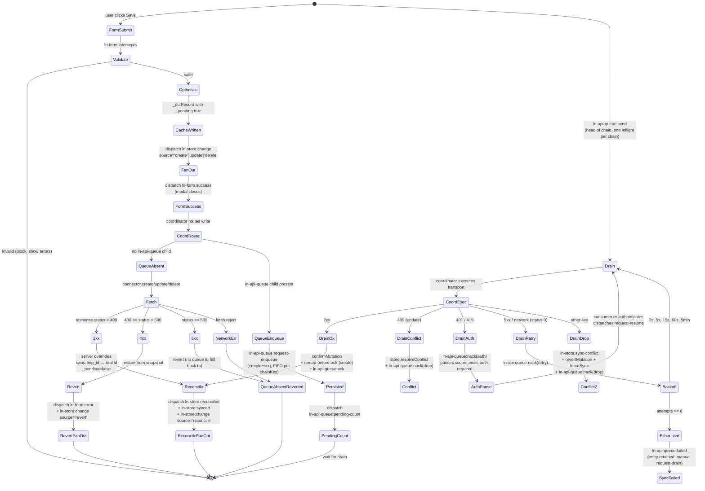

# Data flow architecture

> Cross-component philosophy for how data moves through ln-ashlar.
> Component-specific attributes, events, payloads, and APIs live in each
> component's `README.md` and `docs/js/{component}.md`. This document is
> the rules that span them.

---

## 1. The four concerns

Components separate by concern:

| # | Concern  | Component(s)                                | Owns                                       |
|---|----------|---------------------------------------------|--------------------------------------------|
| 1 | Data     | `ln-store`                                  | Local cache, query engine, sync state      |
| 2 | Render   | `ln-table`, `ln-upload`, future renderers | Visual presentation of records          |
| 3 | Submit   | `ln-form`, `ln-confirm`, `ln-http`          | Form serialization, validation gate, transport |
| 4 | Validate | `ln-validate`                               | Field-level validity + error display       |

**The rule.** Each concern owns its scope. Other concerns ask via events,
never reach in.

Two flows cross the concerns:

- **Read.** Store loads from cache or syncs from server, fans out
  `ln-store:change` to subscribed renderers. The renderer draws.
- **Write.** Form serializes and dispatches `ln-form:submit`. Store
  applies optimistic write, fans out, posts to server. Server confirms
  (reconcile) or rejects (revert + form-side error).

What this rules out:

- A renderer talking to `fetch` directly (transport is the submit
  concern).
- A form writing to IndexedDB (cache is the data concern).
- A coordinator running `Array.prototype.sort` over records (the
  query engine is the data concern — see §2.1).
- A component re-querying the DOM at runtime to find subscribers
  (the registry is the discovery concern — see §6).

---

## 2. Concern responsibilities

### 2.1 Data — `ln-store`

**Owns.** IndexedDB-backed local cache. Full-load and delta sync from
the configured endpoint. Query engine — `getAll(options)`, `getById`,
`count`, `aggregate` — with sort / filter / search / limit applied
**client-side over the cache**. Optimistic write pipeline (cache mutate
with `_pending: true`, network attempt, reconcile or revert). Fan-out of
`ln-store:change` to registered renderers. The store itself holds **no**
persistent write queue — it is a pure cache. When a write can't reach the
server, the offline outbox is owned by the standalone `ln-api-queue`
component (its own IndexedDB database), and `ln-data-coordinator` drives the
FIFO-per-chain drain with exponential backoff (see §3).

**Does NOT own.** DOM presentation. Form serialization. User-facing
toasts or modals. The UI controls that produce sort/filter inputs.

**Intent vs execution.** UI components like `ln-table-sort`,
`ln-filter`, and `ln-search` produce **intent** — which column to sort
by, which filter to apply, what to search for. They do not compute
over records. The store consumes the intent via `getAll()` options
and runs the actual query against the cache. The split is general:
intent is a UI concern, execution is a data concern.

### 2.2 Render — `ln-table` and other renderers

**Owns.** Cloning a `<template>` per record and filling it via
`data-ln-table-cell-attr` and `{{ field }}` text-node substitution — see §5.
Virtual scrolling for large sets. Empty,
loading, and error templates. Translation of UI events (column click
→ sort intent, search input → search intent) into payloads the data
layer can consume.

**Does NOT own.** The data itself — the renderer is stateless about
records and receives a fresh array on every `ln-store:change`. The
query engine. Network calls.

The renderer subscribes by attribute (`data-ln-store-source="<storeName>"`).
The store pushes records on subscription, on every mutation, and on
every sync. **The renderer is reactive to a stream, not a puller of
state.**

### 2.3 Submit — `ln-form`, `ln-confirm`, `ln-http`

**Owns.** Form serialization (via `serializeForm` in `ln-core`).
Submit gating — `ln-form` blocks submission until every
`data-ln-validate` field is valid. Native form attributes (`action`,
`method`) become the request contract — no JS configuration. Two-click
confirm UX for destructive actions (`ln-confirm` arms on first click,
executes on second). HTTP transport (`ln-http` is a service-style
component that consumes `ln-http:request` events and dispatches
`ln-http:success` / `ln-http:error`).

**Does NOT own.** Local cache state. Optimistic record application —
the form fires `ln-form:submit`; the data layer decides what to do
with the payload. Sort / filter / search input interpretation — auto-
submitting forms serialize and dispatch; the consuming component
interprets the payload.

### 2.4 Validate — `ln-validate`

**Owns.** Field-level validity tracking via the native Constraint
Validation API plus custom rules. `ln-validate:valid` /
`ln-validate:invalid` events for submit-button gating. Field-level
error message display. Custom error injection from server responses
via `ln-validate:set-custom`.

**Does NOT own.** Form submission, serialization, transport. Knowledge
of records or stores.

---

## 3. The optimistic + offline write pipeline

This is the heart of the data layer. It is what makes ln-ashlar
local-first.



**Happy path.** Form submits. `ln-form` validates and dispatches
`ln-form:submit`. Store writes to cache with `_pending: true` and fans
out to renderers immediately. The coordinator routes the write: if no
`ln-api-queue` child exists it calls the connector directly (queue-absent
path, unchanged from before the queue existed); if a queue child exists it
enqueues instead of calling the connector immediately. 2xx reconciles —
server response overrides the optimistic record, `_pending` flips to
`false`, a `tmp_<uuid>` swaps for the real server id. Fan out again.
Form-side success fires.

**Initial 4xx (form still open, queue-absent path).** Server returns an
error map. Store reverts the cache from the pre-write snapshot. Store
dispatches `ln-form:error` on the form element. `ln-validate` paints
field-level errors. User fixes and resubmits.

**Offline / 5xx (queue present).** The coordinator enqueues into
`ln-api-queue`'s own IndexedDB outbox (`ln_api_queue`), FIFO per
`(scope, chainKey)`, one inflight entry per chain. Cache stays optimistic
— the user sees their write. The queue emits `ln-api-queue:send` for the
head entry; the coordinator executes the transport. 2xx reconciles and the
coordinator dispatches `request-remap` **before** `ack` on a create success
(so a queued sibling update re-targets the real id before its chain
advances). A 409 on update resolves the conflict then drops the entry. A
401/419 pauses the scope (`auth-required`) until the consumer dispatches
`request-resume` — it does not revert the optimistic write. Other 4xx
reverts, re-syncs, and drops the entry (`ln-store:sync-conflict`). 5xx /
network errors retry with backoff `2s, 5s, 15s, 60s, 5min`; after 8 attempts
the entry is marked `failed` and retained for manual `request-drain`.

The user-facing UI never blocks waiting for the network. Optimistic
writes render immediately; the queue is the safety net for offline
writes; the form-side error event is the safety net for 4xx during
initial submit.

For exact event names, payload shapes, and timing, see the
[ln-data-store README](../../js/ln-data-store/README.md),
[ln-data-coordinator README](../../js/ln-data-coordinator/README.md), and
[ln-api-queue README](../../js/ln-api-queue/README.md).

---

## 4. What this architecture rejects

The decisions below are non-negotiable. They exist because we have
already lived with the alternative.

### 4.1 Sort / filter / search computed outside the store

```js
// REJECTED
const records  = storeEl.lnStore.getAll();
const sorted   = records.sort((a, b) => a.created_at < b.created_at ? 1 : -1);
const filtered = sorted.filter(r => r.status === 'published');
tableEl.dispatchEvent(new CustomEvent('ln-table:set-data',
    { detail: { records: filtered } }));
```

The query engine in `ln-store` runs sort / filter / search efficiently
over the cache. UI components produce **intent** (which column, what
filter); the store does the **execution**. Anyone running
`Array.prototype.sort` or `.filter` over records is reaching across
the boundary.

```html
<!-- ACCEPTED -->
<table data-ln-store-source="documents"
       data-ln-store-source-options='{"sort":{"field":"created_at","direction":"desc"},"filter":{"status":"published"}}'>
</table>
```

### 4.2 Stores accepting writes from anywhere

```js
// REJECTED — global capture-phase or document-level command bus
self.dom.addEventListener('ln-store:request-create', self._handlers.create);
document.addEventListener('ln-form:submit', e => { /* match by attribute */ }, true);
```

Two shapes of the same problem. The store accepting `request-*` events
from anywhere, or a global capture-phase listener intercepting form
submits, both create unbounded coupling: any consumer dispatching from
anywhere, no validation context, no form to surface errors back to.
Debugging a missed event becomes "search the entire codebase for
global listeners on this event."

The form is the canonical write trigger. Per-form binding via the
MutationObserver-maintained registry (§6) makes the wiring inspectable.
For programmatic writes (imports, scripts), use the explicit instance
methods on the store: `upsert(data)`, `remove(id)`, `merge(records)`.

### 4.3 Runtime `document.querySelectorAll` outside one-time init

```js
// REJECTED
function _fanOut(storeName, records) {
    const renderers = document.querySelectorAll('[data-ln-store-source="' + storeName + '"]');
    renderers.forEach(el => el.dispatchEvent(new CustomEvent('ln-store:change', {...})));
}
```

A DOM scan on every record mutation is O(n) over the entire document.
With hundreds of records and dozens of renderers, the cost is real —
but the deeper issue is that it leaks renderer-discovery responsibility
everywhere. **One init scan + one MutationObserver maintaining an
in-memory registry. Runtime work iterates the registry, never the DOM.**
See §6.

### 4.4 Renderers fetching their own initial data

```js
// REJECTED
storeEl.addEventListener('ln-store:ready', () => {
    storeEl.lnStore.getAll({ sort: 'created_at' }).then(records => {
        tableEl.dispatchEvent(new CustomEvent('ln-table:set-data',
            { detail: { records } }));
    });
});
```

Two problems stack:

1. **Race condition.** If the renderer mounts after `ln-store:ready`
   has already fired, the listener never runs and the renderer stays
   empty.
2. **Inverted ownership.** The renderer is now responsible for
   knowing the store's lifecycle, knowing about `getAll` options, and
   translating sync into a draw call. The data layer is reaching into
   the render layer through the consumer.

The renderer subscribes by attribute, the data layer pushes records on
subscription, on every mutation, and on every sync. **Reactive to a
stream, not a puller of state.**

### 4.5 Forms touching IndexedDB or knowing about `_pending`

```js
// REJECTED
form.addEventListener('submit', e => {
    const data = serializeForm(form);
    openDB().then(db => db.put('documents', { ...data, _pending: true }));
});
```

The form serializes and dispatches. The data layer decides whether to
apply optimistically, queue, retry. Crossing this boundary makes it
impossible to swap the data layer (e.g. for a websocket-pushed stream)
without rewriting every form.

### 4.6 Validation done in JS at submit time

```js
// REJECTED
form.addEventListener('submit', e => {
    if (!form.querySelector('[name="title"]').value) {
        showToast('Title required');
        e.preventDefault();
    }
});
```

`ln-validate` already owns this via the Constraint Validation API plus
declarative `data-ln-validate-*` attributes. Hand-rolled JS checks
produce inconsistent UX (different error styling, different focus
behaviour) and can't be reflected in the submit-button gating that
`ln-form` does automatically.

---

## 5. Template syntax — `{{ }}` vs `data-ln-table-cell-attr` vs `data-ln-field`

ln-ashlar has three data-to-DOM mechanisms. They look similar in markup but
belong to **two different systems with different owners and lifecycles** —
mixing them up produces silent no-ops, not errors. The deciding question is
never *"text or element?"* — it is:

> **Who fills this element, and when?**

- **A renderer fills it once, at clone time** (`ln-table` rows, `renderList`'s
  clone pass) → `{{ field }}` for text, `data-ln-table-cell-attr` for
  attributes.
- **Your component code fills it, on every update** (an explicit
  `fill(root, data)` call) → `data-ln-field` / `data-ln-attr` /
  `data-ln-show` / `data-ln-class`.

### 5.1 `{{ field }}` — one-shot text stamp at clone time

Processed by `fillTemplate(clone, data)` (`ln-core/helpers.js`). Walks text
nodes, replaces `{{ field }}` with `record[field]`, and **consumes the
placeholder** — the element can never re-update from data afterwards. Runs at
clone time inside renderer pipelines (`ln-table` rows, `renderList`'s clone
pass); never runs on live DOM updates.

Use for all static text content inside cloned templates.

### 5.2 `data-ln-table-cell-attr="field:attr"` — one-shot attribute stamp

Processed by the renderer (`ln-table` `_fillRow`) once per cloned row. Sets
`el.setAttribute(attr, record[field])`. The attribute-mapping twin of `{{ }}`
— same owner, same lifecycle.

### 5.3 `data-ln-field` — re-runnable binding, requires an explicit `fill()` caller

**Not a template syntax.** `data-ln-field` (with `data-ln-attr`,
`data-ln-show`, `data-ln-class`) is processed only by `fill(root, data)` —
and nothing calls `fill()` automatically. It works exactly where component
code explicitly calls `fill()` and re-calls it on updates (e.g. `ln-filter`,
`ln-options`, a `renderList` `fillFn`, modal prefill).

The render pipelines that process `{{ }}` **never call `fill()`**: a
`data-ln-field` inside an `ln-table` row template is inert — present in the
DOM, read by nobody, silently ignored.

### 5.4 Decision matrix

| Need | Use | Processed by | Lifecycle |
| --- | --- | --- | --- |
| Text content inside a cloned template (table row, list item) | `{{ field }}` | `fillTemplate()` | once, at clone |
| Attribute on an element inside a cloned row | `data-ln-table-cell-attr="field:attr"` | renderer (`_fillRow`) | once, at clone |
| Text / attribute / visibility on an element your code re-fills on updates | `data-ln-field` (+ `data-ln-attr` / `data-ln-show` / `data-ln-class`) with an explicit `fill()` call | `fill()` | every `fill()` call |

### 5.5 The trap — `data-ln-field` inside a row template

```html
<!-- ❌ WRONG — inert. ln-table runs fillTemplate() + cell-attr only;
     fill() never runs here, so data-ln-field is read by nobody. -->
<template data-ln-template="products-row">
	<tr data-ln-table-row>
		<td data-ln-field="title"></td>   <!-- stays empty, no error -->
	</tr>
</template>

<!-- ✅ RIGHT -->
<template data-ln-template="products-row">
	<tr data-ln-table-row>
		<td>{{ title }}</td>
		<td><a data-ln-table-cell-attr="url:href">{{ name }}</a></td>
	</tr>
</template>
```

Litmus test: *is this element born from a `<template>` clone filled by a
renderer?* → `{{ }}` / `data-ln-table-cell-attr`. *Does my own code call
`fill()` on it?* → `data-ln-field`.

### 5.6 The `name` attribute — bidirectional form-binding key

For form data the `name` attribute binds both directions: `serializeForm` reads **out**, `populateForm`/`lnForm.fill` write **in**. Matching is strictly flat — `el.name === top-level record key`, no nested paths. Extra record keys are ignored; missing keys are NOT cleared (hence reset-before-fill — see [coordinator doctrine](coordinator.md)).

Shape adaptation (nested server responses, renamed fields, ISO dates) happens **once at the store boundary** via `registerDataMapper(name, { ingress, egress })` on `ln-data-coordinator` — never at the fill call-site.

Custom controls participate transparently: `ln-number` and `ln-date` move `name` to a hidden input and intercept its `.value`.

**Exceptions:**

- **`ln-editor`** (contenteditable) — `lnForm.fill` sets the backing textarea, not the surface. Dispatch `ln-editor:set-content` after fill to sync the visual editor.
- **`ln-options`** (async select) — value is lost if options arrive after fill. Restore on `ln-options:set-data`.

### 5.7 `lnFill` — event-driven region fill

**When to use.** A modal (or any reused surface) contains both a `[data-ln-form]`
and display-only elements with `[data-ln-fillable]` (e.g. a title heading). The
default is the **declarative trigger** (`data-ln-fill-form` + `data-ln-fill-*`)
for click-driven fills. Use `window.lnCore.lnFill(container, record)` directly
only for programmatic / store-driven fills that are not click-triggered.

#### Helper

```js
window.lnCore.lnFill(container, record)
// Dispatches `ln-fill` at the container itself when it matches
// [data-ln-form] or [data-ln-fillable], then at every such descendant.
// record = null → fillables reset/clear themselves.
```

Source: `js/ln-core/helpers.js` L159–172.

#### Event

`ln-fill` — `CustomEvent`, `detail = record | null`, `bubbles: true`. Fillables
self-handle; nothing else needs to listen.

#### Two fillable kinds (this release)

| Element | Attribute | On `ln-fill` | Guarded? |
|---|---|---|---|
| `<form>` | `data-ln-form` | `detail ? this.fill(detail) : this.reset()` | Yes — `if (e.target !== self.dom) return` |
| Any display element | `data-ln-fillable` | `detail ? fill(el, detail) : clear [data-ln-field] textContent` | Delegated document listener — matches by `e.target` |

#### Container-self inclusion

`lnFill(formEl, record)` also dispatches `ln-fill` at `formEl` itself when it
matches `[data-ln-form]` or `[data-ln-fillable]`. This means passing the form
element directly (as `ln-fill` declarative trigger does) works correctly — the
form's own `ln-fill` handler fires. Source: `js/ln-core/helpers.js` L164–165.

#### Guard rule (important for future fillable authors)

A fillable that listens for `ln-fill` on its **own** element AND can contain
nested fillables MUST guard `if (e.target !== self) return;` — otherwise a
bubbled `ln-fill` from a descendant fillable double-triggers it. This is why
`ln-form` has the guard when `[data-ln-fillable]` lives inside `<form data-ln-form>`.

#### Declarative trigger layer (`ln-fill` module)

The `ln-fill` module (`js/ln-fill/`) adds a document-level click listener. On
click of `[data-ln-fill-form="<id>"]`, it:

1. Reads all `data-ln-fill-<key>` attributes from the trigger's `dataset`.
   The browser camelCases them: `data-ln-fill-event-id` → key `eventId`.
2. Strips the reserved suffixes `form` and `store`.
3. Calls `window.lnCore.lnFill(form, record)` — or `lnFill(form, null)` when
   no payload keys are present.
4. Does NOT call `e.preventDefault()` — coexists with `data-ln-modal-for` on
   the same button.

Source: `js/ln-fill/src/ln-fill.js`.

Declarative trigger is the **default** for click-triggered fills, including
ln-table row templates — `fillTemplate()` now interpolates `{{ key }}` in
attribute values, so `data-ln-fill-event-id="{{ id }}"` stamps correctly at
clone time.

#### When to use which layer

| Situation | Use |
|---|---|
| Click-triggered fill (table row, inline button) | `data-ln-fill-form` + `data-ln-fill-*` |
| Programmatic / store-event-driven fill | `window.lnCore.lnFill(container, record)` in coordinator |
| Fill a form + display regions in one call | `lnFill(container, record)` (either layer) |
| Fill only a form programmatically | `form.lnForm.fill(record)` / `form.lnForm.reset()` |
| Fill only a display region | `fill(el, record)` (§5.3) |
| Table row at clone time | `{{ field }}` (§5.1) |

#### Back-compat

`ln-form:fill` and `ln-form:reset` events still work (aliases). `ln-fill` is
the canonical convention for new code.

#### Canonical example — declarative trigger (ln-table row)

```html
<template data-ln-template="events-row">
    <tr data-ln-table-row>
        <td>{{ title }}</td>
        <td>
            <ul>
                <li>
                    <button
                        data-ln-modal-for="event-modal"
                        data-ln-fill-form="event-form"
                        data-ln-fill-event-id="{{ id }}"
                        data-ln-fill-title="{{ title }}"
                        aria-label="Edit"
                    >
                        <svg class="ln-icon" aria-hidden="true"><use href="#ln-edit"></use></svg>
                    </button>
                </li>
            </ul>
        </td>
    </tr>
</template>

<dialog class="ln-modal" data-ln-modal data-ln-modal-mode="new"
     id="event-modal" aria-labelledby="event-modal-title">
    <form id="event-form" data-ln-form>
        <header>
            <h3 id="event-modal-title" data-ln-fillable>
                <span data-ln-modal-when="new">New event</span>
                <span data-ln-modal-when="edit">Edit — <span data-ln-field="title"></span></span>
            </h3>
            <button type="button" data-ln-modal-close aria-label="Close">
                <svg class="ln-icon" aria-hidden="true"><use href="#ln-x"></use></svg>
            </button>
        </header>
        <main>
            <input type="hidden" name="eventId">
            <div class="form-element">
                <label for="title">Title</label>
                <input id="title" name="title">
            </div>
        </main>
        <footer>
            <button type="button" data-ln-modal-close>Cancel</button>
            <button type="submit">Save</button>
        </footer>
    </form>
</dialog>
```

No coordinator JS needed. The button click is handled by two independent
document listeners: `ln-modal` opens the modal and sets `data-ln-modal-mode`;
`ln-fill` fills the form.

#### Canonical example — coordinator (programmatic / store-driven)

```js
// Used when the fill is NOT click-triggered (e.g. store conflict resolution,
// import workflow, deep-link pre-fill). Source pattern: demo/admin/.../store-usecase.html
let pendingRecord = null;

document.addEventListener('ln-table:row-action', function (e) {
    if (e.detail.table !== 'events' || e.detail.action !== 'edit') return;
    pendingRecord = e.detail.record;
    modalEl.setAttribute('data-ln-modal', 'open');
});

modalEl.addEventListener('ln-modal:before-open', function () {
    const record = pendingRecord;
    pendingRecord = null; // consume-once

    // lnFill fans out: null → form resets + fillables clear; record → fill all.
    window.lnCore.lnFill(modalEl, record);
    modalEl.dataset.lnModalMode = record ? 'edit' : 'new';
});
```

---

## 6. The MutationObserver discipline

Every cross-component wiring in ln-ashlar is mediated by **one**
MutationObserver-maintained registry. This is the foundation: it is
how components find each other without runtime DOM scans.

The pattern:

1. **Init scan.** On script load (after `<body>` exists), walk the
   document once with `querySelectorAll('[data-ln-foo]')`. Add each
   match to an in-memory Set, Map, or WeakMap.
2. **Observer maintains the registry.** A single `MutationObserver`
   watches `documentElement` for `childList` changes and the relevant
   attribute. On add → scan added subtree, attach. On remove → look up
   element in registry, detach. On attribute change → detach + reattach
   with the new value.
3. **Runtime work iterates the registry.** No `querySelectorAll`
   after the init scan.

Uniform across the library — `data-ln-store-form`,
`data-ln-store-source`, `registerComponent`, the form-binding registry,
the renderer-binding registry. The observer is the only piece that
ever queries the DOM by attribute.

```js
// Skeleton — actual implementations live per component
const _bindings = new WeakMap();   // element → metadata
const _byKey    = {};              // key (e.g. storeName) → Set<element>

function _scan(root) { /* querySelectorAll once, attach each match */ }
function _attach(el) { /* add to _bindings + _byKey */ }
function _detach(el) { /* remove from both */ }

new MutationObserver(mutations => {
    for (const m of mutations) {
        if (m.type === 'childList') {
            for (const node of m.addedNodes)   if (node.nodeType === 1) _scan(node);
            for (const node of m.removedNodes) if (node.nodeType === 1) _detach(node);
        } else if (m.type === 'attributes') {
            _detach(m.target);
            if (m.target.hasAttribute('data-ln-foo')) _attach(m.target);
        }
    }
}).observe(document.documentElement, {
    childList: true, subtree: true,
    attributes: true, attributeFilter: ['data-ln-foo']
});

_scan(document.body);  // init
```

---

## 7. Glossary

| Term | Definition |
|------|------------|
| **Coordinator** | A component or script that listens for events on one element and writes attributes (or dispatches events) on another, never calling instance methods directly. Two flavours — page-level (consumer-written shim that bridges data-flow components) and library-shipped (encapsulates a reusable cross-component rule, e.g. `ln-accordion`). For details, see the [Coordinator Doctrine](coordinator.md). |
| **Store** | An `ln-data-store` instance bound to a single resource. One element, one cache. It is a pure cache — it holds no write queue of its own. |
| **Renderer** | Any element with `data-ln-store-source="<storeName>"`. Receives `ln-store:change` events. |
| **Form binding** | `data-ln-store-form="<storeName>"` on a `<form>` routes its `ln-form:submit` to the named store. |
| **Intent** | A UI component's output describing what the user wants — sort by column X descending, filter by status, search for "foo". Produced by `ln-table-sort`, `ln-filter`, `ln-search`; consumed by the store via `getAll()` options. |
| **Optimistic upsert** | Writing to the local cache before the server confirms. The record carries `_pending: true` until reconcile. |
| **Reconcile** | Replacing an optimistic record with the server's authoritative response. For POST, swaps `tmp_<uuid>` for the server id via a coordinator-driven `ln-api-queue:request-remap` (queued path) or direct `confirmMutation` (queue-absent path). |
| **Revert** | Restoring the cache from the pre-write snapshot when the server rejects (4xx during initial submit, or a non-409/non-auth 4xx during queued drain). |
| **Queue** | The standalone `ln-api-queue` component — its own IndexedDB database (`ln_api_queue`), separate from the store's cache. Holds entries that couldn't reach the server (offline / 5xx), FIFO per `(scope, chainKey)`, one inflight per chain. The coordinator executes transport on its `ln-api-queue:send` command and drives ack/nack. |
| **Drain** | The queue replaying its head entry per chain (`ln-api-queue:send`) when idle and not paused; the coordinator executes the actual transport call. |
| **Auth pause** | A 401/419 response during queue drain pauses that scope (`ln-api-queue:paused` + `auth-required`) without reverting the optimistic write. Resumes only on an explicit `ln-api-queue:request-resume` dispatch after the consumer re-authenticates. |
| **Conflict** | A 4xx response **during queue drain** (vs initial submit). The form is gone; for a 409 on update the store resolves the conflict via `resolveConflict`, for other 4xx it reverts and re-syncs via `forceSync`; either way the store dispatches `ln-store:sync-conflict` and the consumer chooses the UX. |
| **Primitive cell** | A record field whose value is a string, number, or date (rendered as-is). |
| **Labelled cell** | A record field with shape `{ value, label }`. Renderer displays `.label`; submit serializes `.value`. |
