```mermaid
stateDiagram-v2
    [*] --> FormSubmit: user clicks Save
    FormSubmit --> Validate: ln-form intercepts
    Validate --> [*]: invalid (block, show errors)
    Validate --> Optimistic: valid

    Optimistic --> CacheWritten: _putRecord with _pending:true
    CacheWritten --> FanOut: dispatch ln-store:change<br/>source='create'|'update'|'delete'
    FanOut --> FormSuccess: dispatch ln-form:success<br/>(modal closes)
    FormSuccess --> NetworkAttempt: navigator.onLine?

    NetworkAttempt --> Online: yes
    NetworkAttempt --> Queued: no

    Online --> Fetch
    Fetch --> 2xx: response.status < 400
    Fetch --> 4xx: 400 <= status < 500
    Fetch --> 5xx: status >= 500
    Fetch --> NetworkErr: fetch reject

    2xx --> Reconcile: server overrides<br/>swap tmp_id → real id<br/>_pending=false
    Reconcile --> ReconcileFanOut: dispatch ln-store:reconciled<br/>+ ln-store:synced<br/>+ ln-store:change source='reconcile'
    ReconcileFanOut --> [*]

    4xx --> Revert: restore from snapshot
    Revert --> RevertFanOut: dispatch ln-form:error<br/>+ ln-store:change source='revert'
    RevertFanOut --> [*]

    5xx --> Queued
    NetworkErr --> Queued
    Queued --> PendingCount: dispatch<br/>ln-store:pending-count-change

    PendingCount --> [*]: wait for online

    [*] --> Drain: window 'online' event
    Drain --> ReplayChain: per recordId, FIFO
    ReplayChain --> Replay2xx: success
    ReplayChain --> Replay4xx: conflict
    ReplayChain --> Replay5xx: retry
    Replay2xx --> Reconcile
    Replay4xx --> Conflict: dispatch ln-store:sync-conflict<br/>(form is gone; consumer chooses UX)
    Replay5xx --> Backoff: 2s, 5s, 15s, 1min, 5min
    Backoff --> ReplayChain: attempts++
    Backoff --> Exhausted: attempts >= MAX
    Exhausted --> SyncFailed: dispatch ln-store:sync-failed
```

# Data flow architecture

> Cross-component philosophy for how data moves through ln-ashlar.
> Component-specific attributes, events, payloads, and APIs live in each
> component's `README.md` and `docs/js/{component}.md`. This document is
> the rules that span them.

---

## 1. The four concerns

Components separate by concern:

| # | Concern  | Component(s)                                | Owns                                       |
|---|----------|---------------------------------------------|--------------------------------------------|
| 1 | Data     | `ln-store`                                  | Local cache, query engine, sync state      |
| 2 | Render   | `ln-data-table`, `ln-upload`, future renderers | Visual presentation of records          |
| 3 | Submit   | `ln-form`, `ln-confirm`, `ln-http`          | Form serialization, validation gate, transport |
| 4 | Validate | `ln-validate`                               | Field-level validity + error display       |

**The rule.** Each concern owns its scope. Other concerns ask via events,
never reach in.

Two flows cross the concerns:

- **Read.** Store loads from cache or syncs from server, fans out
  `ln-store:change` to subscribed renderers. The renderer draws.
- **Write.** Form serializes and dispatches `ln-form:submit`. Store
  applies optimistic write, fans out, posts to server. Server confirms
  (reconcile) or rejects (revert + form-side error).

What this rules out:

- A renderer talking to `fetch` directly (transport is the submit
  concern).
- A form writing to IndexedDB (cache is the data concern).
- A coordinator running `Array.prototype.sort` over records (the
  query engine is the data concern — see §2.1).
- A component re-querying the DOM at runtime to find subscribers
  (the registry is the discovery concern — see §6).

---

## 2. Concern responsibilities

### 2.1 Data — `ln-store`

**Owns.** IndexedDB-backed local cache. Full-load and delta sync from
the configured endpoint. Query engine — `getAll(options)`, `getById`,
`count`, `aggregate` — with sort / filter / search / limit applied
**client-side over the cache**. Optimistic write pipeline (cache mutate
with `_pending: true`, network attempt, reconcile or revert or queue).
FIFO-per-record pending queue with exponential backoff. Fan-out of
`ln-store:change` to registered renderers.

**Does NOT own.** DOM presentation. Form serialization. User-facing
toasts or modals. The UI controls that produce sort/filter inputs.

**Intent vs execution.** UI components like `ln-table-sort`,
`ln-filter`, and `ln-search` produce **intent** — which column to sort
by, which filter to apply, what to search for. They do not compute
over records. The store consumes the intent via `getAll()` options
and runs the actual query against the cache. The split is general:
intent is a UI concern, execution is a data concern.

### 2.2 Render — `ln-data-table` and other renderers

**Owns.** Cloning a `<template>` per record and filling it via
`data-ln-cell` / `data-ln-cell-attr` (and `{{ field }}` text-node
substitution — see §5). Virtual scrolling for large sets. Empty,
loading, and error templates. Translation of UI events (column click
→ sort intent, search input → search intent) into payloads the data
layer can consume.

**Does NOT own.** The data itself — the renderer is stateless about
records and receives a fresh array on every `ln-store:change`. The
query engine. Network calls.

The renderer subscribes by attribute (`data-ln-store-source="<storeName>"`).
The store pushes records on subscription, on every mutation, and on
every sync. **The renderer is reactive to a stream, not a puller of
state.**

### 2.3 Submit — `ln-form`, `ln-confirm`, `ln-http`

**Owns.** Form serialization (via `serializeForm` in `ln-core`).
Submit gating — `ln-form` blocks submission until every
`data-ln-validate` field is valid. Native form attributes (`action`,
`method`) become the request contract — no JS configuration. Two-click
confirm UX for destructive actions (`ln-confirm` arms on first click,
executes on second). HTTP transport (`ln-http` is a service-style
component that consumes `ln-http:request` events and dispatches
`ln-http:success` / `ln-http:error`).

**Does NOT own.** Local cache state. Optimistic record application —
the form fires `ln-form:submit`; the data layer decides what to do
with the payload. Sort / filter / search input interpretation — auto-
submitting forms serialize and dispatch; the consuming component
interprets the payload.

### 2.4 Validate — `ln-validate`

**Owns.** Field-level validity tracking via the native Constraint
Validation API plus custom rules. `ln-validate:valid` /
`ln-validate:invalid` events for submit-button gating. Field-level
error message display. Custom error injection from server responses
via `ln-validate:set-custom`.

**Does NOT own.** Form submission, serialization, transport. Knowledge
of records or stores.

---

## 3. The optimistic + offline write pipeline

This is the heart of the data layer. It is what makes ln-ashlar
local-first.



**Happy path.** Form submits. `ln-form` validates and dispatches
`ln-form:submit`. Store writes to cache with `_pending: true` and fans
out to renderers immediately. Store calls `fetch`. 2xx reconciles —
server response overrides the optimistic record, `_pending` flips to
`false`, a `tmp_<uuid>` swaps for the real server id. Fan out again.
Form-side success fires.

**Initial 4xx (form still open).** Server returns an error map. Store
reverts the cache from the pre-write snapshot. Store dispatches
`ln-form:error` on the form element. `ln-validate` paints field-level
errors. User fixes and resubmits.

**Offline / 5xx (queue).** Store enqueues into the pending-writes
IndexedDB store with FIFO-per-record ordering. Cache stays optimistic
— the user sees their write. On the `online` event, store drains the
queue with exponential backoff. 2xx reconciles. 4xx during drain
becomes `ln-store:sync-conflict` (the form is gone — the consumer
chooses the UX: re-open prefilled, toast, hard-revert). Retries
exhausted on 5xx becomes `ln-store:sync-failed`.

The user-facing UI never blocks waiting for the network. Optimistic
writes render immediately; the queue is the safety net for offline
writes; the form-side error event is the safety net for 4xx during
initial submit.

For exact event names, payload shapes, and timing, see the
[ln-store README](../../js/ln-store/README.md).

---

## 4. What this architecture rejects

The decisions below are non-negotiable. They exist because we have
already lived with the alternative.

### 4.1 Sort / filter / search computed outside the store

```js
// REJECTED
const records  = storeEl.lnStore.getAll();
const sorted   = records.sort((a, b) => a.created_at < b.created_at ? 1 : -1);
const filtered = sorted.filter(r => r.status === 'published');
tableEl.dispatchEvent(new CustomEvent('ln-data-table:set-data',
    { detail: { records: filtered } }));
```

The query engine in `ln-store` runs sort / filter / search efficiently
over the cache. UI components produce **intent** (which column, what
filter); the store does the **execution**. Anyone running
`Array.prototype.sort` or `.filter` over records is reaching across
the boundary.

```html
<!-- ACCEPTED -->
<table data-ln-store-source="documents"
       data-ln-store-source-options='{"sort":{"field":"created_at","direction":"desc"},"filter":{"status":"published"}}'>
</table>
```

### 4.2 Stores accepting writes from anywhere

```js
// REJECTED — global capture-phase or document-level command bus
self.dom.addEventListener('ln-store:request-create', self._handlers.create);
document.addEventListener('ln-form:submit', e => { /* match by attribute */ }, true);
```

Two shapes of the same problem. The store accepting `request-*` events
from anywhere, or a global capture-phase listener intercepting form
submits, both create unbounded coupling: any consumer dispatching from
anywhere, no validation context, no form to surface errors back to.
Debugging a missed event becomes "search the entire codebase for
global listeners on this event."

The form is the canonical write trigger. Per-form binding via the
MutationObserver-maintained registry (§6) makes the wiring inspectable.
For programmatic writes (imports, scripts), use the explicit instance
methods on the store: `upsert(data)`, `remove(id)`, `merge(records)`.

### 4.3 Runtime `document.querySelectorAll` outside one-time init

```js
// REJECTED
function _fanOut(storeName, records) {
    const renderers = document.querySelectorAll('[data-ln-store-source="' + storeName + '"]');
    renderers.forEach(el => el.dispatchEvent(new CustomEvent('ln-store:change', {...})));
}
```

A DOM scan on every record mutation is O(n) over the entire document.
With hundreds of records and dozens of renderers, the cost is real —
but the deeper issue is that it leaks renderer-discovery responsibility
everywhere. **One init scan + one MutationObserver maintaining an
in-memory registry. Runtime work iterates the registry, never the DOM.**
See §6.

### 4.4 Renderers fetching their own initial data

```js
// REJECTED
storeEl.addEventListener('ln-store:ready', () => {
    storeEl.lnStore.getAll({ sort: 'created_at' }).then(records => {
        tableEl.dispatchEvent(new CustomEvent('ln-data-table:set-data',
            { detail: { records } }));
    });
});
```

Two problems stack:

1. **Race condition.** If the renderer mounts after `ln-store:ready`
   has already fired, the listener never runs and the renderer stays
   empty.
2. **Inverted ownership.** The renderer is now responsible for
   knowing the store's lifecycle, knowing about `getAll` options, and
   translating sync into a draw call. The data layer is reaching into
   the render layer through the consumer.

The renderer subscribes by attribute, the data layer pushes records on
subscription, on every mutation, and on every sync. **Reactive to a
stream, not a puller of state.**

### 4.5 Forms touching IndexedDB or knowing about `_pending`

```js
// REJECTED
form.addEventListener('submit', e => {
    const data = serializeForm(form);
    openDB().then(db => db.put('documents', { ...data, _pending: true }));
});
```

The form serializes and dispatches. The data layer decides whether to
apply optimistically, queue, retry. Crossing this boundary makes it
impossible to swap the data layer (e.g. for a websocket-pushed stream)
without rewriting every form.

### 4.6 Validation done in JS at submit time

```js
// REJECTED
form.addEventListener('submit', e => {
    if (!form.querySelector('[name="title"]').value) {
        showToast('Title required');
        e.preventDefault();
    }
});
```

`ln-validate` already owns this via the Constraint Validation API plus
declarative `data-ln-validate-*` attributes. Hand-rolled JS checks
produce inconsistent UX (different error styling, different focus
behaviour) and can't be reflected in the submit-button gating that
`ln-form` does automatically.

---

## 5. Template syntax — `{{ }}` vs `data-ln-cell`

ln-ashlar has two complementary text-substitution patterns, shared
across renderers (`ln-data-table`, `ln-upload`, `ln-filter`,
`ln-translations`, future list / card renderers). Pick by location and
lifecycle.

### 5.1 `{{ field }}` — text-node placeholder

For substitution that lives **inside text content**, not at an element
boundary. Implemented in `ln-core/helpers.js` via `fillTemplate(clone,
data)`. Walks text nodes and applies the regex.

```html
<template data-ln-template="row">
    <tr><td>Created {{ created_at }} by {{ author }}</td></tr>
</template>
```

Use when the substituted value is concatenated with surrounding
literal text inside a single text node, and you'd rather not wrap it
in a `<span>` just to host a `data-ln-cell`.

### 5.2 `data-ln-cell="field"` — element anchor

For substitution that **fills the element's whole text content** or
**drives an attribute**. Implemented in renderer components.

```html
<template data-ln-template="row">
    <tr>
        <td data-ln-cell="title"></td>
        <td><a data-ln-cell="title" data-ln-cell-attr="id:href"></a></td>
    </tr>
</template>
```

Use when the element exists primarily to host the field value,
especially when you also need to set attributes from the same record.

### 5.3 Decision matrix

| Need                                          | Use                              |
|-----------------------------------------------|----------------------------------|
| Value is the whole text content of an element | `data-ln-cell="field"`           |
| Value is concatenated with literal text inline| `{{ field }}` in text node       |
| Value drives an attribute                     | `data-ln-cell-attr="field:attr"` |
| Both text and attribute on same element       | `data-ln-cell` + `data-ln-cell-attr` |

---

## 6. The MutationObserver discipline

Every cross-component wiring in ln-ashlar is mediated by **one**
MutationObserver-maintained registry. This is the foundation: it is
how components find each other without runtime DOM scans.

The pattern:

1. **Init scan.** On script load (after `<body>` exists), walk the
   document once with `querySelectorAll('[data-ln-foo]')`. Add each
   match to an in-memory Set, Map, or WeakMap.
2. **Observer maintains the registry.** A single `MutationObserver`
   watches `documentElement` for `childList` changes and the relevant
   attribute. On add → scan added subtree, attach. On remove → look up
   element in registry, detach. On attribute change → detach + reattach
   with the new value.
3. **Runtime work iterates the registry.** No `querySelectorAll`
   after the init scan.

Uniform across the library — `data-ln-store-form`,
`data-ln-store-source`, `registerComponent`, the form-binding registry,
the renderer-binding registry. The observer is the only piece that
ever queries the DOM by attribute.

```js
// Skeleton — actual implementations live per component
const _bindings = new WeakMap();   // element → metadata
const _byKey    = {};              // key (e.g. storeName) → Set<element>

function _scan(root) { /* querySelectorAll once, attach each match */ }
function _attach(el) { /* add to _bindings + _byKey */ }
function _detach(el) { /* remove from both */ }

new MutationObserver(mutations => {
    for (const m of mutations) {
        if (m.type === 'childList') {
            for (const node of m.addedNodes)   if (node.nodeType === 1) _scan(node);
            for (const node of m.removedNodes) if (node.nodeType === 1) _detach(node);
        } else if (m.type === 'attributes') {
            _detach(m.target);
            if (m.target.hasAttribute('data-ln-foo')) _attach(m.target);
        }
    }
}).observe(document.documentElement, {
    childList: true, subtree: true,
    attributes: true, attributeFilter: ['data-ln-foo']
});

_scan(document.body);  // init
```

---

## 7. Glossary

| Term | Definition |
|------|------------|
| **Coordinator** | A component or script that listens for events on one element and writes attributes (or dispatches events) on another, never calling instance methods directly. Two flavours — page-level (consumer-written shim that bridges data-flow components) and library-shipped (encapsulates a reusable cross-component rule, e.g. `ln-accordion`). |
| **Store** | An `ln-store` instance bound to a single resource. One element, one cache, one queue. |
| **Renderer** | Any element with `data-ln-store-source="<storeName>"`. Receives `ln-store:change` events. |
| **Form binding** | `data-ln-store-form="<storeName>"` on a `<form>` routes its `ln-form:submit` to the named store. |
| **Intent** | A UI component's output describing what the user wants — sort by column X descending, filter by status, search for "foo". Produced by `ln-table-sort`, `ln-filter`, `ln-search`; consumed by the store via `getAll()` options. |
| **Optimistic upsert** | Writing to the local cache before the server confirms. The record carries `_pending: true` until reconcile. |
| **Reconcile** | Replacing an optimistic record with the server's authoritative response. For POST, swaps `tmp_<uuid>` for the server id. |
| **Revert** | Restoring the cache from the pre-write snapshot when the server rejects (4xx during initial submit). |
| **Queue** | The pending-writes IndexedDB store holding entries that couldn't reach the server (offline / 5xx). |
| **Drain** | Replaying queue entries in FIFO order per record when connectivity returns. |
| **Conflict** | A 4xx response **during queue drain** (vs initial submit). The form is gone; the store dispatches `ln-store:sync-conflict` and the consumer chooses the UX. |
| **Primitive cell** | A record field whose value is a string, number, or date (rendered as-is). |
| **Labelled cell** | A record field with shape `{ value, label }`. Renderer displays `.label`; submit serializes `.value`. |
