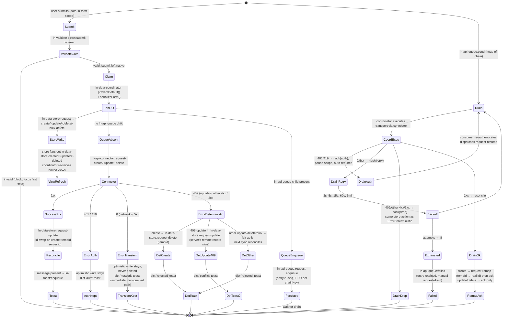

# Data flow architecture

> Cross-component philosophy for how data moves through ln-ashlar.
> Component-specific attributes, events, payloads, and APIs live in each
> component's `README.md` and `docs/js/{component}.md`. This document is
> the rules that span them.

---

## 1. The four concerns

Components separate by concern:

| # | Concern  | Component(s)                                                                        | Owns                                                                                                             |
|---|----------|--------------------------------------------------------------------------------------|-------------------------------------------------------------------------------------------------------------------|
| 1 | Data     | `ln-data-store`, `ln-data-coordinator`, `ln-*-connector`, `ln-api-queue` (optional)   | Local cache, query engine, remote sync, and the write fan-out that dispatches to cache + transport in parallel   |
| 2 | Render   | `ln-table`, `ln-list`, other renderers                                               | Visual presentation of records, bound to a store via the coordinator's view-binder attributes                    |
| 3 | Submit   | `ln-form`, `ln-confirm`, `ln-http`                                                    | Form population, RESTful action rewriting, native serialization contract, HTTP transport service, two-click confirm |
| 4 | Validate | `ln-validate`                                                                         | Field-level validity + error display + submit gate                                                                |

**The rule.** Each concern owns its scope. Other concerns ask via events,
never reach in.

Two flows cross the concerns:

- **Read.** A renderer binds to a store by name (`data-ln-table-store`,
  `data-ln-list-store`, `data-ln-options`, `data-ln-stat`) and dispatches its
  own `request-data` intent. The coordinator that owns the matching store
  resolves it against the store's query engine and delivers
  `ln-{kind}:set-data`. The renderer draws.
- **Write.** A scoped form (`data-ln-form-scope`) — or a coordinator-
  namespaced `request-create`/`-update`/`-delete`/`-bulk-delete` event for
  non-form writes — reaches `ln-data-coordinator`, which claims it,
  serializes it, and fans out in parallel: an optimistic write to the store,
  and, independently, a transport call to the connector or the offline
  queue. The server's response reconciles the cache with an ordinary update
  event — there is no separate confirm/revert step.

What this rules out:

- A renderer talking to `fetch` directly (transport is the coordinator/
  connector's job).
- A form serializing itself or writing to the cache (claiming and
  dispatching the write is `ln-data-coordinator`'s job — see §4.5).
- Application code running `Array.prototype.sort` over records fetched from
  a store (the query engine is the data concern — see §2.1).
- The store scanning the DOM at runtime to find its renderers (it only fans
  out on its own element — see §4.3 for what the coordinator's view-binder
  does instead).

---

## 2. Concern responsibilities

### 2.1 Data — `ln-data-store` + `ln-data-coordinator`

**Owns.** `ln-data-store`: an IndexedDB-backed local cache per resource,
declared with `data-ln-data-store="<name>"`. Query engine — `getAll(options)`,
`getById`, `count`, `aggregate` — with sort / filter / search / limit applied
**client-side over the cache**. Optimistic writes on
`ln-data-store:request-create` / `-update` / `-delete` / `-bulk-delete` — the
record lands in IndexedDB immediately and the store fans out
`ln-data-store:created` / `-updated` / `-deleted` on its own element (no DOM scan
— see §4.3). A pending create carries only a `_temp_<uuid>` id; there is no
`_pending` flag.

`ln-data-coordinator`: the mediator. Claims scoped form submits
(`data-ln-form-scope`) or coordinator-namespaced request events, serializes
and maps the payload, and fans out from one synchronous handler to the store
(local write) and, independently, to the transport layer (`ln-*-connector`
directly, or `ln-api-queue`'s outbox when present). Reconciles server
responses with an ordinary `ln-data-store:request-update` (id-swap on create — no
separate confirm/revert method). Delivers live data to bound view components
— see §2.2.

**Does NOT own.** DOM presentation. Form serialization shape decisions
beyond the native `action`/`method` contract. The UI controls that produce
sort/filter/search input (intent).

**Intent vs execution.** UI components like `ln-table-sort`, `ln-filter`,
and `ln-search` produce **intent** — which column to sort by, which filter
to apply, what to search for — via `ln-table:request-data` /
`ln-list:request-data`. The coordinator resolves the request against its
owned store's `getAll()` and delivers the result; the store runs the actual
query against the cache. The split is general: intent is a UI concern,
execution is a data concern.

### 2.2 Render — `ln-table`, `ln-list`, and other renderers

**Owns.** Cloning a `<template>` per record and filling it via
`data-ln-table-cell-attr` and `{{ field }}` text-node substitution — see §5.
Virtual scrolling for large sets. Empty, loading, and error templates.
Translation of UI events (column click → sort intent, search input → search
intent) into an `ln-table:request-data` / `ln-list:request-data` payload.

**Does NOT own.** The data itself — the renderer is stateless about records
and receives a fresh array on every `ln-{kind}:set-data`. The query engine.
Network calls.

A renderer binds to a coordinator-owned store by attribute —
`data-ln-table-store="<storeName>"` on `[data-ln-table]`, or
`data-ln-list-store="<storeName>"` on `[data-ln-list]`. On mount, and on
every sort/filter/search change, the renderer dispatches
`ln-table:request-data` / `ln-list:request-data` at itself; the coordinator
whose child store matches `<storeName>` (guarded by an ownership check, so
multiple coordinators on one page never cross-serve) resolves the query and
dispatches `ln-{kind}:set-data` — or `ln-{kind}:set-loading` while the store
hasn't finished loading yet. The same binder vocabulary covers
`data-ln-options="<storeName>"` on a `<select>` (served via
`ln-options:set-data`) and `data-ln-stat="<storeName>"` on any inline
element (served via `ln-stat:set-count`). **The renderer is reactive to a
stream, not a puller of state.**

### 2.3 Submit — `ln-form`, `ln-confirm`, `ln-http`

**Owns.** Form population (`ln-form.fill` / `.reset`, triggered by `ln-fill`
— see §5.7). RESTful action rewriting for edit mode
(`data-ln-form-action-edit`, `_method` spoofing). Native form attributes
(`action`, `method`) are the request contract — no JS configuration.
Two-click confirm UX for destructive actions (`ln-confirm` arms on first
click, executes on second). HTTP transport as a standalone service
(`ln-http` consumes `ln-http:request` events and dispatches
`ln-http:success` / `ln-http:error` — independent of the data-layer
connectors in §2.1).

**Does NOT own.** Local cache state. Serialization or dispatch of the write
— `ln-form` never intercepts submit and never calls `serializeForm`; that is
`ln-data-coordinator`'s job once a valid submit bubbles to it (`ln-validate`
owns blocking the invalid case — see §2.4). Sort / filter / search input
interpretation.

### 2.4 Validate — `ln-validate`

**Owns.** Field-level validity tracking via the native Constraint Validation
API (`required`, `pattern`, `minlength`, etc.) plus custom server-error
injection via `ln-validate:set-custom`. The submit gate: the first
`data-ln-validate` field on a form injects `novalidate` and attaches the
form's own `submit` listener — on every method, GET included — which
dispatches `ln-validate:request-validate` to collect invalid fields; if any
exist it blocks submission and focuses the first one. A valid submit is left
native for `ln-data-coordinator` (or plain HTML) to claim next. Field-level
error message display (`data-ln-validate-errors` / `data-ln-validate-error`).

**Does NOT own.** Form submission claiming, serialization, transport.
Knowledge of records or stores.

---

## 3. The write pipeline

Every write reaches `ln-data-coordinator`, which fans it out to the local
cache and the transport layer **in parallel from one synchronous handler** —
neither branch is gated on the other. This is the heart of the data layer:
it is what makes ln-ashlar local-first.



**Happy path.** A scoped form submits (`data-ln-form-scope`, method `POST` /
`PUT` / `PATCH`). `ln-validate`'s own submit listener runs first and blocks
only if a field is invalid; a valid submit is left native and bubbles to
`document`, where `ln-data-coordinator` claims it with `preventDefault()`,
resolves the effective method, and serializes the form itself. The
coordinator fans out from one synchronous handler: it dispatches
`ln-data-store:request-create` (or `-update` / `-delete` / `-bulk-delete`) to its
child store — the record is written to IndexedDB immediately and the store
fans out `ln-data-store:created` on its own element, refreshing every bound view
— and, independently, routes the payload to the transport layer: directly
to the connector (`ln-api-connector:request-create`) if no `ln-api-queue`
child exists, or into the queue's outbox (`ln-api-queue:request-enqueue`) if
one does.

On a 2xx response the coordinator reconciles with an **ordinary**
`ln-data-store:request-update` — for a create, the target `id` is the `tempId`
and the incoming `data.id` is the real server id, which the store detects as
an id-swap and rekeys automatically. There is no separate confirm/reconcile
method. If the server's response envelope carries a `message`, the
coordinator enqueues it verbatim via `ln-toast:enqueue`; no `message` means
no toast.

**A store-only coordinator** (no connector, no queue child) is a first-class
configuration: the fan-out stops after the local dispatch, no network call
is made, and the record simply keeps its `_temp_`-prefixed id until a
connector is added.

**Error reconciliation.** Every non-2xx connector response is classified
into exactly one of three buckets by status — never a fourth "unknown"
bucket:

| Bucket | Status | Store action | Toast |
|---|---|---|---|
| Auth | 401 / 419 | none — optimistic write stays | dictionary `auth` key |
| Transient | 0 (network) / 5xx | none — optimistic write stays, never deleted | dictionary `network` key (queued: only after retries exhaust; non-queued: immediately) |
| Deterministic | 409 (update) / other 4xx / 3xx | 409 update: ordinary `ln-data-store:request-update` with the server's `remote` record (server wins). Create: `ln-data-store:request-delete` for the temp id. Other update/delete/bulk: left as-is, next sync reconciles. | dictionary `conflict` (409 update) or `rejected` (everything else) key |

An optimistic write is only ever removed by an explicit server rejection
(create 4xx) or a genuine `ln-data-store:request-delete` — never by a
retry-exhausted network error. There is no `ln-data-store:sync-conflict` event
and no `forceSync()` error backstop.

**Offline / queued path.** When a `[data-ln-api-queue]` child is present,
every fan-out write routes through it instead of calling the connector
directly. Entries drain FIFO per `(scope, chainKey)`, one inflight entry per
chain. The queue emits `ln-api-queue:send` for the head entry; the
coordinator executes the transport and reports the outcome back via
`ack` / `nack`. On a create success the coordinator dispatches
`ln-api-queue:request-remap` (tempId → real id) **before** `ack`, so a
queued sibling update re-targets the real id before its own chain entry
advances. A `401` / `419` pauses the scope (`nack {reason:'auth'}`,
`auth-required`) without touching the optimistic write, resuming only on an
explicit `ln-api-queue:request-resume`. Transient errors retry with backoff
`2s, 5s, 15s, 60s, 5min`; after 8 attempts the entry is marked `failed` and
retained for a manual `ln-api-queue:request-drain`. Deterministic errors
always `nack {reason:'drop'}` — never retried.

The user-facing UI never blocks waiting for the network. Every error toast
is authored once per coordinator instance as a markup dictionary
(`data-ln-data-coordinator-dict`) — text is never hardcoded in JS; a missing
key is silent.

For exact event names, payload shapes, and timing, see the
[ln-data-store README](../../js/ln-data-store/README.md),
[ln-data-coordinator README](../../js/ln-data-coordinator/README.md), and
[ln-api-queue README](../../js/ln-api-queue/README.md).

---

## 4. What this architecture rejects

The decisions below are non-negotiable. They exist because we have
already lived with the alternative.

### 4.1 Sort / filter / search computed outside the store

```js
// REJECTED
const records  = await storeEl.lnDataStore.getAll();
const sorted   = records.data.sort((a, b) => a.created_at < b.created_at ? 1 : -1);
const filtered = sorted.filter(r => r.status === 'published');
tableEl.dispatchEvent(new CustomEvent('ln-table:set-data',
    { detail: { data: filtered } }));
```

The query engine in `ln-data-store` runs sort / filter / search efficiently
over the cache. UI components produce **intent** (which column, what
filter); the store does the **execution**. Anyone running
`Array.prototype.sort` or `.filter` over records is reaching across
the boundary.

```html
<!-- ACCEPTED -->
<section data-ln-table="documents" data-ln-table-store="documents">
	<!-- data-ln-table-col-sort / data-ln-filter / data-ln-search on the
	     toolbar controls produce the intent; ln-table dispatches
	     ln-table:request-data with { sort, filters, search } and the
	     owning ln-data-coordinator resolves it via store.getAll(options). -->
</section>
```

### 4.2 Stores accepting writes from anywhere

```js
// REJECTED — global capture-phase or document-level command bus
self.dom.addEventListener('ln-data-store:request-create', self._handlers.create);
document.addEventListener('submit', e => { /* match by attribute, capture phase */ }, true);
```

Two shapes of the same problem. The store accepting `request-*` events
from anywhere, or a capture-phase submit listener that runs before
`ln-validate`'s own gate, both create unbounded coupling: any consumer
dispatching from anywhere, no validation context, no form to surface errors
back to. Debugging a missed event becomes "search the entire codebase for
global listeners on this event."

The scoped form is the canonical write trigger — `ln-data-coordinator`
listens on `document` at the **bubble** phase only, so `ln-validate`'s own
submit gate always runs first (see §2.4). `data-ln-form-scope` matches a
form to its coordinator by name (or by DOM containment when the scope is
empty); an unmatched scope falls through as an ordinary native submit, no
console warning. For programmatic writes (imports, scripts), dispatch the
coordinator-namespaced events directly:
`ln-data-coordinator:request-create` / `-update` / `-delete` /
`-bulk-delete`.

### 4.3 Runtime `document.querySelectorAll` outside one-time init

```js
// REJECTED — the store itself scanning the DOM for its subscribers
// inside its own mutation handler
function _dispatchChange(storeName, records) {
    const renderers = document.querySelectorAll('[data-ln-store-target="' + storeName + '"]');
    renderers.forEach(el => el.dispatchEvent(new CustomEvent('change', { detail: { records } })));
}
```

`ln-data-store` never does this — it fans out `ln-data-store:created` /
`-updated` / `-deleted` on its own element only, and knows nothing about
renderers. Re-serving bound views is `ln-data-coordinator`'s job: on those
same store-level notifications it queries
`[data-ln-table-store],[data-ln-list-store],[data-ln-options],[data-ln-stat]`
once, filters to the elements whose store name matches its own child
(`_ownsStore()`), and re-runs each one's last query. This still avoids the
O(n)-per-record cost the rejected pattern above has — the scan runs once
per store-level event (a handful of times per user action, never once per
record or per keystroke), and only within the coordinator that actually
owns the mutated store.

### 4.4 Renderers fetching their own initial data

```js
// REJECTED
storeEl.addEventListener('ln-data-store:ready', () => {
    storeEl.lnDataStore.getAll({ sort: 'created_at' }).then(records => {
        tableEl.dispatchEvent(new CustomEvent('ln-table:set-data',
            { detail: { data: records.data } }));
    });
});
```

Two problems stack:

1. **Race condition.** If the renderer mounts after `ln-data-store:ready`
   has already fired, the listener never runs and the renderer stays
   empty.
2. **Inverted ownership.** The renderer is now responsible for
   knowing the store's lifecycle, knowing about `getAll` options, and
   translating sync into a draw call. The data layer is reaching into
   the render layer through the consumer.

The renderer binds by attribute (`data-ln-table-store`, `data-ln-list-store`)
and dispatches its own `request-data` on mount; the owning coordinator
answers with `ln-{kind}:set-data` on subscription, on every mutation, and
on every sync. **Reactive to a stream, not a puller of state.**

### 4.5 Forms touching IndexedDB or knowing about the cache

```js
// REJECTED
form.addEventListener('submit', e => {
    const data = serializeForm(form);
    openDB().then(db => db.put('documents', data));
});
```

`ln-form` never listens for `submit` and never calls `serializeForm`. A
scoped form (`data-ln-form-scope`) leaves its own submit native;
`ln-data-coordinator` claims it at the `document` bubble phase, serializes
it, and decides whether to write optimistically, queue, or retry. The form
has no concept of temp ids or IndexedDB — crossing this boundary would make
it impossible to swap the data layer (e.g. for a websocket-pushed stream)
without rewriting every form.

### 4.6 Validation done in JS at submit time

```js
// REJECTED
form.addEventListener('submit', e => {
    if (!form.querySelector('[name="title"]').value) {
        showToast('Title required');
        e.preventDefault();
    }
});
```

`ln-validate` already owns this via the native Constraint Validation API
(`required`, `pattern`, `minlength`, etc.) plus the `data-ln-validate` flag
that registers a field into the submit gate. Hand-rolled JS checks produce
inconsistent UX (different error styling, different focus behaviour) and
bypass the gate `ln-validate` installs automatically (`novalidate`
injection + `ln-validate:request-validate` collection) —
`ln-data-coordinator` never runs its own validation; it only ever sees a
submit that already passed the gate.

---

## 5. Template syntax — `{{ }}` vs `data-ln-table-cell-attr` vs `data-ln-field`

ln-ashlar has three data-to-DOM mechanisms. They look similar in markup but
belong to **two different systems with different owners and lifecycles** —
mixing them up produces silent no-ops, not errors. The deciding question is
never *"text or element?"* — it is:

> **Who fills this element, and when?**

- **A renderer fills it once, at clone time** (`ln-table` rows, `renderList`'s
  clone pass) → `{{ field }}` for text, `data-ln-table-cell-attr` for
  attributes.
- **Your component code fills it, on every update** (an explicit
  `fill(root, data)` call) → `data-ln-field` / `data-ln-attr` /
  `data-ln-show` / `data-ln-class`.

### 5.1 `{{ field }}` — one-shot text stamp at clone time

Processed by `fillTemplate(clone, data)` (`ln-core/helpers.js`). Walks text
nodes, replaces `{{ field }}` with `record[field]`, and **consumes the
placeholder** — the element can never re-update from data afterwards. Runs at
clone time inside renderer pipelines (`ln-table` rows, `renderList`'s clone
pass); never runs on live DOM updates.

Use for all static text content inside cloned templates.

### 5.2 `data-ln-table-cell-attr="field:attr"` — one-shot attribute stamp

Processed by the renderer (`ln-table` `_fillRow`) once per cloned row. Sets
`el.setAttribute(attr, record[field])`. The attribute-mapping twin of `{{ }}`
— same owner, same lifecycle.

### 5.3 `data-ln-field` — re-runnable binding, requires an explicit `fill()` caller

**Not a template syntax.** `data-ln-field` (with `data-ln-attr`,
`data-ln-show`, `data-ln-class`) is processed only by `fill(root, data)` —
and nothing calls `fill()` automatically. It works exactly where component
code explicitly calls `fill()` and re-calls it on updates (e.g. `ln-filter`,
`ln-options`, a `renderList` `fillFn`, modal prefill).

The render pipelines that process `{{ }}` **never call `fill()`**: a
`data-ln-field` inside an `ln-table` row template is inert — present in the
DOM, read by nobody, silently ignored.

### 5.4 Decision matrix

| Need | Use | Processed by | Lifecycle |
| --- | --- | --- | --- |
| Text content inside a cloned template (table row, list item) | `{{ field }}` | `fillTemplate()` | once, at clone |
| Attribute on an element inside a cloned row | `data-ln-table-cell-attr="field:attr"` | renderer (`_fillRow`) | once, at clone |
| Text / attribute / visibility on an element your code re-fills on updates | `data-ln-field` (+ `data-ln-attr` / `data-ln-show` / `data-ln-class`) with an explicit `fill()` call | `fill()` | every `fill()` call |

### 5.5 The trap — `data-ln-field` inside a row template

```html
<!-- ❌ WRONG — inert. ln-table runs fillTemplate() + cell-attr only;
     fill() never runs here, so data-ln-field is read by nobody. -->
<template data-ln-template="products-row">
	<tr data-ln-table-row>
		<td data-ln-field="title"></td>   <!-- stays empty, no error -->
	</tr>
</template>

<!-- ✅ RIGHT -->
<template data-ln-template="products-row">
	<tr data-ln-table-row>
		<td>{{ title }}</td>
		<td><a data-ln-table-cell-attr="url:href">{{ name }}</a></td>
	</tr>
</template>
```

Litmus test: *is this element born from a `<template>` clone filled by a
renderer?* → `{{ }}` / `data-ln-table-cell-attr`. *Does my own code call
`fill()` on it?* → `data-ln-field`.

### 5.6 The `name` attribute — bidirectional form-binding key

For form data the `name` attribute binds both directions: `serializeForm` reads **out**, `populateForm`/`lnForm.fill` write **in**. Matching is strictly flat — `el.name === top-level record key`, no nested paths. Extra record keys are ignored; missing keys are NOT cleared (hence reset-before-fill — see [coordinator doctrine](coordinator.md)).

Shape adaptation (nested server responses, renamed fields, ISO dates) happens **once at the store boundary** via `registerDataMapper(name, { ingress, egress })` on `ln-data-coordinator` — never at the fill call-site.

Custom controls participate transparently: `ln-number` and `ln-date` move `name` to a hidden input and intercept its `.value`.

**Exceptions:**

- **`ln-editor`** (contenteditable) — `lnForm.fill` sets the backing textarea, not the surface. Dispatch `ln-editor:set-content` after fill to sync the visual editor.
- **`ln-options`** (async select) — value is lost if options arrive after fill. Restore on `ln-options:set-data`.

### 5.7 `lnFill` — event-driven region fill

**When to use.** A modal (or any reused surface) contains both a `[data-ln-form]`
and display-only elements with `[data-ln-fillable]` (e.g. a title heading). The
default is the **declarative trigger** (`data-ln-fill-form` + `data-ln-fill-*`)
for click-driven fills. Use `window.lnCore.lnFill(container, record)` directly
only for programmatic / store-driven fills that are not click-triggered.

#### Helper

```js
window.lnCore.lnFill(container, record)
// Dispatches `ln-fill` at the container itself when it matches
// [data-ln-form] or [data-ln-fillable], then at every such descendant.
// record = null → fillables reset/clear themselves.
```

Source: `js/ln-core/helpers.js` L159–172.

#### Event

`ln-fill` — `CustomEvent`, `detail = record | null`, `bubbles: true`. Fillables
self-handle; nothing else needs to listen.

#### Two fillable kinds (this release)

| Element | Attribute | On `ln-fill` | Guarded? |
|---|---|---|---|
| `<form>` | `data-ln-form` | `detail ? this.fill(detail) : this.reset()` | Yes — `if (e.target !== self.dom) return` |
| Any display element | `data-ln-fillable` | `detail ? fill(el, detail) : clear [data-ln-field] textContent` | Delegated document listener — matches by `e.target` |

#### Container-self inclusion

`lnFill(formEl, record)` also dispatches `ln-fill` at `formEl` itself when it
matches `[data-ln-form]` or `[data-ln-fillable]`. This means passing the form
element directly (as `ln-fill` declarative trigger does) works correctly — the
form's own `ln-fill` handler fires. Source: `js/ln-core/helpers.js` L164–165.

#### Guard rule (important for future fillable authors)

A fillable that listens for `ln-fill` on its **own** element AND can contain
nested fillables MUST guard `if (e.target !== self) return;` — otherwise a
bubbled `ln-fill` from a descendant fillable double-triggers it. This is why
`ln-form` has the guard when `[data-ln-fillable]` lives inside `<form data-ln-form>`.

#### Declarative trigger layer (`ln-fill` module)

The `ln-fill` module (`js/ln-fill/`) adds a document-level click listener. On
click of `[data-ln-fill-form="<id>"]`, it:

1. Reads all `data-ln-fill-<key>` attributes from the trigger's `dataset`.
   The browser camelCases them: `data-ln-fill-event-id` → key `eventId`.
2. Strips the reserved suffixes `form` and `store`.
3. Calls `window.lnCore.lnFill(form, record)` — or `lnFill(form, null)` when
   no payload keys are present.
4. Does NOT call `e.preventDefault()` — coexists with `data-ln-modal-for` on
   the same button.

Source: `js/ln-fill/src/ln-fill.js`.

Declarative trigger is the **default** for click-triggered fills, including
ln-table row templates — `fillTemplate()` now interpolates `{{ key }}` in
attribute values, so `data-ln-fill-event-id="{{ id }}"` stamps correctly at
clone time.

#### When to use which layer

| Situation | Use |
|---|---|
| Click-triggered fill (table row, inline button) | `data-ln-fill-form` + `data-ln-fill-*` |
| Programmatic / store-event-driven fill | `window.lnCore.lnFill(container, record)` in coordinator |
| Fill a form + display regions in one call | `lnFill(container, record)` (either layer) |
| Fill only a form programmatically | `form.lnForm.fill(record)` / `form.lnForm.reset()` |
| Fill only a display region | `fill(el, record)` (§5.3) |
| Table row at clone time | `{{ field }}` (§5.1) |

#### Back-compat

`ln-form:fill` and `ln-form:reset` events still work (aliases). `ln-fill` is
the canonical convention for new code.

#### Canonical example — declarative trigger (ln-table row)

```html
<template data-ln-template="events-row">
    <tr data-ln-table-row>
        <td>{{ title }}</td>
        <td>
            <ul>
                <li>
                    <button
                        data-ln-modal-for="event-modal"
                        data-ln-fill-form="event-form"
                        data-ln-fill-event-id="{{ id }}"
                        data-ln-fill-title="{{ title }}"
                        aria-label="Edit"
                    >
                        <svg class="ln-icon" aria-hidden="true"><use href="#ln-edit"></use></svg>
                    </button>
                </li>
            </ul>
        </td>
    </tr>
</template>

<dialog class="ln-modal" data-ln-modal data-ln-modal-mode="new"
     id="event-modal" aria-labelledby="event-modal-title">
    <form id="event-form" data-ln-form>
        <header>
            <h3 id="event-modal-title" data-ln-fillable>
                <span data-ln-modal-when="new">New event</span>
                <span data-ln-modal-when="edit">Edit — <span data-ln-field="title"></span></span>
            </h3>
            <button type="button" data-ln-modal-close aria-label="Close">
                <svg class="ln-icon" aria-hidden="true"><use href="#ln-x"></use></svg>
            </button>
        </header>
        <main>
            <input type="hidden" name="eventId">
            <div class="form-element">
                <label for="title">Title</label>
                <input id="title" name="title">
            </div>
        </main>
        <footer>
            <button type="button" data-ln-modal-close>Cancel</button>
            <button type="submit">Save</button>
        </footer>
    </form>
</dialog>
```

No coordinator JS needed. The button click is handled by two independent
document listeners: `ln-modal` opens the modal and sets `data-ln-modal-mode`;
`ln-fill` fills the form.

#### Canonical example — coordinator (programmatic / store-driven)

```js
// Used when the fill is NOT click-triggered (e.g. store conflict resolution,
// import workflow, deep-link pre-fill). Source pattern: demo/admin/.../store-usecase.html
let pendingRecord = null;

document.addEventListener('ln-table:row-action', function (e) {
    if (e.detail.table !== 'events' || e.detail.action !== 'edit') return;
    pendingRecord = e.detail.record;
    modalEl.setAttribute('data-ln-modal', 'open');
});

modalEl.addEventListener('ln-modal:before-open', function () {
    const record = pendingRecord;
    pendingRecord = null; // consume-once

    // lnFill fans out: null → form resets + fillables clear; record → fill all.
    window.lnCore.lnFill(modalEl, record);
    modalEl.dataset.lnModalMode = record ? 'edit' : 'new';
});
```

---

## 6. The MutationObserver discipline

Every cross-component wiring in ln-ashlar is mediated by **one**
MutationObserver-maintained registry. This is the foundation: it is
how components find each other without runtime DOM scans.

The pattern:

1. **Init scan.** On script load (after `<body>` exists), walk the
   document once with `querySelectorAll('[data-ln-foo]')`. Add each
   match to an in-memory Set, Map, or WeakMap.
2. **Observer maintains the registry.** A single `MutationObserver`
   watches `documentElement` for `childList` changes and the relevant
   attribute. On add → scan added subtree, attach. On remove → look up
   element in registry, detach. On attribute change → detach + reattach
   with the new value.
3. **Runtime work iterates the registry.** No `querySelectorAll`
   after the init scan.

Uniform across the library — `data-ln-modal-for`, `data-ln-popover-for`,
`data-ln-search`, `registerComponent`. The observer is the only piece that
ever queries the DOM by attribute.

```js
// Skeleton — actual implementations live per component
const _bindings = new WeakMap();   // element → metadata
const _byKey    = {};              // key (e.g. storeName) → Set<element>

function _scan(root) { /* querySelectorAll once, attach each match */ }
function _attach(el) { /* add to _bindings + _byKey */ }
function _detach(el) { /* remove from both */ }

new MutationObserver(mutations => {
    for (const m of mutations) {
        if (m.type === 'childList') {
            for (const node of m.addedNodes)   if (node.nodeType === 1) _scan(node);
            for (const node of m.removedNodes) if (node.nodeType === 1) _detach(node);
        } else if (m.type === 'attributes') {
            _detach(m.target);
            if (m.target.hasAttribute('data-ln-foo')) _attach(m.target);
        }
    }
}).observe(document.documentElement, {
    childList: true, subtree: true,
    attributes: true, attributeFilter: ['data-ln-foo']
});

_scan(document.body);  // init
```

---

## 7. Glossary

| Term | Definition |
|------|------------|
| **Coordinator** | A component or script that listens for events on one element and writes attributes (or dispatches events) on another, never calling instance methods directly. Two flavours — page-level (consumer-written shim that bridges data-flow components) and library-shipped (encapsulates a reusable cross-component rule, e.g. `ln-accordion`, or the data layer's own `ln-data-coordinator`). For details, see the [Coordinator Doctrine](coordinator.md). |
| **Store** | An `ln-data-store` instance (`data-ln-data-store="<name>"`) bound to a single resource. One element, one cache. It is a pure cache — it holds no write queue of its own; the optional offline outbox lives in `ln-api-queue`. |
| **Renderer** | Any element with `data-ln-table-store`, `data-ln-list-store`, `data-ln-options`, or `data-ln-stat`. Receives `ln-{kind}:set-data` / `:set-loading` (or `:set-count` for stats) from the coordinator that owns the matching store. |
| **Scoped form** | `data-ln-form-scope="<name>"` on a `<form>` matches it to the `data-ln-data-coordinator` of the same name (or, when empty, to the nearest containing coordinator). The coordinator claims its native submit at the `document` bubble phase, after `ln-validate`'s own gate has already run. |
| **Intent** | A UI component's output describing what the user wants — sort by column X descending, filter by status, search for "foo". Produced by `ln-table-sort`, `ln-filter`, `ln-search`; delivered via `request-data`, consumed by the coordinator through the owning store's `getAll()` options. |
| **Optimistic write** | Writing to the local cache before the server confirms. There is no `_pending` flag — a create's only marker is its `_temp_<uuid>` id, held until the server response arrives. |
| **Reconcile** | Replacing a `_temp_<uuid>` with the server's authoritative id via an **ordinary** `ln-data-store:request-update` (the store detects the id mismatch and rekeys). There is no separate `confirmMutation` — reconciliation reuses the same update event a normal edit would dispatch. |
| **Error bucket** | The three-way classification of a non-2xx connector response: **auth** (401/419 — pauses the queue scope, optimistic write stays), **transient** (status `0` / 5xx — optimistic write stays, retried with backoff on the queued path), **deterministic** (409 on update, or any other 4xx/3xx — create is deleted, 409 update takes the server's `remote` record, everything else is left for the next sync). Drives both the store action and the queue's ack/nack identically on the queued and non-queued paths. |
| **Queue** | The standalone `ln-api-queue` component — its own IndexedDB database (`ln_api_queue`), separate from the store's cache. Holds entries that couldn't reach the server (offline / 5xx), FIFO per `(scope, chainKey)`, one inflight per chain. The coordinator executes transport on its `ln-api-queue:send` command and drives ack/nack. |
| **Drain** | The queue replaying its head entry per chain (`ln-api-queue:send`) when idle and not paused; the coordinator executes the actual transport call. |
| **Auth pause** | A 401/419 response during queue drain pauses that scope (`ln-api-queue:paused` + `auth-required`) without touching the optimistic write. Resumes only on an explicit `ln-api-queue:request-resume` dispatch after the consumer re-authenticates. |
| **Conflict** | A 409 response on an update (initial submit or queue drain). The coordinator forces the server's `remote` record into the cache via an ordinary `ln-data-store:request-update` (server wins); on the queued path the entry is `nack`'d with reason `'drop'`. |
| **Primitive cell** | A record field whose value is a string, number, or date (rendered as-is). |
| **Labelled cell** | A record field with shape `{ value, label }`. Renderer displays `.label`; submit serializes `.value`. |
