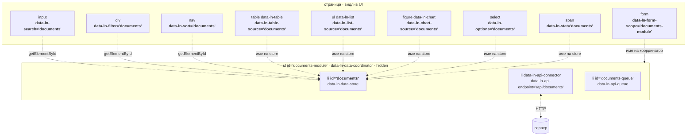

# Data слој — топологија на закачување

Кој елемент на што се закачува. Проток на настани не е предмет на овој документ.

## Дијаграм



## Три начина на закачување

Лесно се мешаат, па вредат да се раздвојат.

**1. `id`-то на store-от.** Таргет за `data-ln-search`, `data-ln-filter` и
`data-ln-sort` (сите три го наоѓаат со `getElementById`), и вредност во
`data-ln-table-source`, `data-ln-list-source`, `data-ln-chart-source`,
`data-ln-options` и `data-ln-stat`.

**2. `id`-то на координаторот.** Таргет само за именуван `data-ln-form-scope`.
Празен `data-ln-form-scope` не е референца туку содржување — координаторот
проверува дали формата е DOM потомок.

**3. Содржување.** Ги врзува трите деца — store, конектор, редица. Ниту едно од
нив не се именува меѓусебно; координаторот ги наоѓа со `querySelector` во
својот поддрвник.

## Минимален склоп

```html
<ul id="documents-module" data-ln-data-coordinator hidden>
	<li id="documents" data-ln-data-store
	    data-ln-data-store-search-fields="title,owner"></li>
	<li data-ln-api-connector data-ln-api-endpoint="/api/documents"></li>
	<li id="documents-queue" data-ln-api-queue></li>
</ul>

<label class="search">
	<svg class="ln-icon" aria-hidden="true"><use href="#ln-icon-search"></use></svg>
	<input type="search" placeholder="Search..." data-ln-search-for="documents" data-ln-search-debounce="0">
	<button type="button" data-ln-search-clear aria-label="Clear search">
		<svg class="ln-icon" aria-hidden="true"><use href="#ln-icon-x"></use></svg>
	</button>
</label>

<nav data-ln-sort="documents">
	<button type="button" data-ln-sort-field="title">...</button>
</nav>

<table data-ln-table
       data-ln-table-source="documents">
	…
</table>
```

## Решено — `-source` како единствен атрибут

Двојноста на `-source` и `-store` е целосно отстранета во корист на `-source`.
Самите view компоненти го користат `data-ln-*-source` како индикатор дека се data-driven, а координаторот го користи за поврзување и рефреш на прикази. Ова овозможува чиста и поедноставена декларативна конфигурација.

Конфигурацијата на лизгачкиот прозорец (sliding window) за виртуелизација сега е целосно префрлена на store-от преку атрибутите:
`data-ln-data-store-window` (големина на прозорецот) и `data-ln-data-store-window-page` (големина на страницата).
