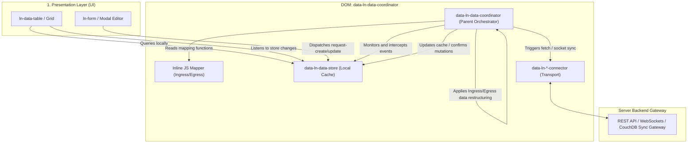

# Data Store & Coordinator Architecture Reference

This document outlines the core architecture of the 3-Tier Local-First Data Layer in `ln-ashlar`. It defines how data storage, transport, and schema mapping are decoupled and orchestrated using the **`ln-ashlar` Coordinator Doctrine**.

In this model, a parent **Data Coordinator Component (`data-ln-data-coordinator`)** wraps its child components—a pure **Storage Cache (`data-ln-data-store`)** and a **Transport Gateway (`data-ln-*-connector`)**—and coordinates the entire data lifecycle.

---

## 🧭 The Decoupled 3-Tier Hierarchy (DOM-Tree View)

Below is the visual structure representing how elements are nested in the DOM, isolating storage and transport concerns under the parent coordinator.

```
┌────────────────────────────────────────────────────────────────────────┐
│  DOM: <div data-ln-data-coordinator="documents">                       │
│                                                                        │
│  [COORDINATOR (Parent Brain)]                                          │
│  - Traverses and monitors its DOM children                             │
│  - Captures optimistic writes & request-sync events                    │
│  - Executes JS Ingress/Egress data restructuring                       │
│                                                                        │
│     ┌────────────────────────────────────────────────────────────┐     │
│     │  DOM: <div data-ln-data-store>                             │     │
│     │                                                            │     │
│     │  [STORAGE CACHE DATABASE (Child 1)]                        │     │
│     │  - Standard IndexedDB storage, schemas, & indexes          │     │
│     │  - Pure local queries (filter, sort, search)               │     │
│     │  - Reactive event dispatching to UI tables & lists         │     │
│     │  - ZERO awareness of REST paths, socket URLs, or tokens    │     │
│     └────────────────────────────────────────────────────────────┘     │
│                                                                        │
│     ┌────────────────────────────────────────────────────────────┐     │
│     │  DOM: <div data-ln-rest-connector>                         │     │
│     │                                                            │     │
│     │  [TRANSPORT GATEWAY (Child 2)]                             │     │
│     │  - Manages HTTP headers, base URLs, login tokens, retries  │     │
│     │  - Agnostic of store data schema and Ingress/Egress mappers│     │
│     └────────────────────────────────────────────────────────────┘     │
│                                                                        │
│     ┌────────────────────────────────────────────────────────────┐     │
│     │  DOM: <script type="application/javascript" data-ln-mapper>│     │
│     │                                                            │     │
│     │  [JS MAPPER LOGIC (Child 3)]                               │     │
│     │  - Defines ingress(serverRaw) and egress(localDb)          │     │
│     └────────────────────────────────────────────────────────────┘     │
└────────────────────────────────────────────────────────────────────────┘
```

---

## 1. System Flow Diagram

The diagram below maps how the DOM boundary isolates system flows. The UI presentation components interact only with the local Storage child, while the parent Coordinator wires the Storage cache and Transport gateway together.



---

## 2. Declarative HTML Setup

All transport-specific properties (base URLs, auth tokens, endpoint paths, reconnect configs) are kept strictly inside the **Transport child component**, completely removing connectivity configurations from the parent Coordinator.

### Scenario A: REST API Resource Coordinator
```html
<!-- Parent Coordinator: encapsulates documents domain, no gateway or path attributes -->
<div data-ln-data-coordinator="documents">
     
    <!-- Child 1: Storage Layer (IndexedDB Database Cache - pure and blind) -->
    <div data-ln-data-store 
         data-ln-store-indexes="department,status,updated_at">
    </div>

    <!-- Child 2: Transport Gateway (REST Connector - owns path, base URL, and tokens!) -->
    <div data-ln-rest-connector 
         data-ln-rest-base-url="https://api.livenetworks.com/v1"
         data-ln-rest-path="/documents"
         data-ln-rest-headers='{"Authorization": "Bearer tok_123"}'>
    </div>
</div>
```

### Scenario B: WebSocket Real-Time Coordinator
```html
<div data-ln-data-coordinator="chat-messages">

    <!-- Child 1: Storage Cache -->
    <div data-ln-data-store 
         data-ln-store-indexes="timestamp">
    </div>

    <!-- Child 2: Transport Gateway (WebSocket Connector - owns ws URL, channel, and token!) -->
    <div data-ln-websocket-connector 
         data-ln-websocket-url="wss://api.livenetworks.com/realtime"
         data-ln-websocket-channel="rooms:lobby"
         data-ln-websocket-token="token456">
    </div>
</div>
```

### Scenario C: CouchDB Sync Gateway Coordinator
```html
<div data-ln-data-coordinator="tasks">

    <!-- Child 1: Storage Cache -->
    <div data-ln-data-store 
         data-ln-store-indexes="due_date,priority">
    </div>

    <!-- Child 2: Transport Gateway (CouchDB Sync Connector - owns db details and sync basic auth!) -->
    <div data-ln-couchdb-connector 
         data-ln-couchdb-url="https://couch.livenetworks.com"
         data-ln-couchdb-db="tasks"
         data-ln-couchdb-auth="Basic dXNlcjpwYXNz">
    </div>
</div>
```

---

## 3. Ingress & Egress Data Restructuring (JS Mapper)

To support flexibility, data restructuring is represented by a JavaScript Ingress/Egress contract. Developers can choose between an **inline HTML script mapper** (highly encapsulated) or an **externally registered class** (highly reusable).

### Approach A: Inline JS Script Mapper (Encapsulated in HTML)
Perfect for writing custom data transformations directly on the page without cluttering the codebase with small, one-off mapper files.

```html
<div data-ln-data-coordinator="documents">
    <!-- Cache and REST transport children -->
    <div data-ln-data-store data-ln-store-indexes="department,status"></div>
    <div data-ln-rest-connector data-ln-rest-base-url="/api" data-ln-rest-path="/documents"></div>

    <!-- Nested JS Mapping Logic directly inside the DOM subtree -->
    <script type="application/javascript" data-ln-mapper>
      ({
        // INGRESS: Server Raw -> Local IndexedDB
        ingress(serverRaw) {
          return {
            id: serverRaw.id,
            title: serverRaw.title,
            department: serverRaw.department,
            status: serverRaw.status,
            file_size: serverRaw.file_size_bytes, // rename
            
            // Parse ISO string to Unix timestamp (Number) for IndexedDB sorting
            updated_at: Date.parse(serverRaw.updated_at) / 1000,
            
            // Flatten nested object
            author_name: serverRaw.author?.name || 'System'
          };
        },

        // EGRESS: Local IndexedDB -> Server Raw
        egress(localDb) {
          return {
            title: localDb.title,
            department: localDb.department,
            status: localDb.status,
            file_size_bytes: localDb.file_size,
            
            // Convert Unix timestamp back to ISO string for backend
            updated_at: new Date(localDb.updated_at * 1000).toISOString()
          };
        }
      })
    </script>
</div>
```

### Approach B: External JS-Registered Domain Mappers (Reusability & Custom Coordinators)
Ideal for centralizing core domain entities used across multiple application layouts, or when extending a custom Coordinator subclass.

```javascript
// js/domain/mappers/documents.js
import { registerDataMapper } from '../../ln-core';

registerDataMapper('documents', {
  ingress(serverRaw) {
    return {
      id: serverRaw.id,
      title: serverRaw.title,
      file_size: serverRaw.file_size_bytes,
      updated_at: Date.parse(serverRaw.updated_at) / 1000,
      author_name: serverRaw.author?.name || 'System'
    };
  },
  egress(localDb) {
    return {
      title: localDb.title,
      file_size_bytes: localDb.file_size,
      updated_at: new Date(localDb.updated_at * 1000).toISOString()
    };
  }
});
```

Bound cleanly in HTML via reference:
```html
<div data-ln-data-coordinator="documents" data-ln-data-mapper="documents">
    <div data-ln-data-store data-ln-store-indexes="department,status"></div>
    <div data-ln-rest-connector data-ln-rest-base-url="/api" data-ln-rest-path="/documents"></div>
</div>
```

---

## 4. How the Coordinator Orchestrates the Loop (Illustrative Reference)

*Note: This is an illustrative execution skeleton showing how the Coordinator manages the event loop between the storage and transport child nodes.*

```javascript
// Inside ln-data-coordinator initialization:
function _initCoordinator(self) {
  const storeEl = self.dom.querySelector('[data-ln-data-store]');
  const transportEl = self.dom.querySelector('[data-ln-rest-connector], [data-ln-websocket-connector], [data-ln-couchdb-connector]');
  
  if (!storeEl || !transportEl) return;

  // Resolve the mapper (either inline from script or registered external mapper)
  const mapper = _resolveMapper(self);

  // ─── 1. Intercept Delta Sync Triggers ───
  storeEl.addEventListener('ln-store:request-sync', function(e) {
    const since = e.detail.since;
    
    // Coordinator asks transport to fetch raw delta data
    transportEl.lnConnector.fetchDelta(since).then(function(rawResponse) {
      // Apply INGRESS transformation on server raw data
      const normalizedData = rawResponse.data.map(r => mapper.ingress(r));
      const normalizedDeleted = (rawResponse.deleted || []);

      // Coordinator feeds clean data back to store's database cache
      storeEl.lnStore.applySync(normalizedData, normalizedDeleted, rawResponse.synced_at);
    });
  });

  // ─── 2. Intercept Optimistic Mutations (Write Egress) ───
  storeEl.addEventListener('ln-store:optimistic-created', function(e) {
    const localRecord = e.detail.record;
    
    // Apply EGRESS transformation before sending to server
    const serverPayload = mapper.egress(localRecord);

    transportEl.lnConnector.create(serverPayload)
      .then(function(serverRawResponse) {
        // Run Ingress on the confirmed server response
        const confirmedLocalRecord = mapper.ingress(serverRawResponse);
        
        // Confirm write back in store's database cache
        storeEl.lnStore.confirmMutation(e.detail.tempId, confirmedLocalRecord, 'create');
      })
      .catch(function(err) {
        // Revert write back in store
        storeEl.lnStore.revertMutation(e.detail.tempId, 'create', err);
      });
  });
}

function _resolveMapper(self) {
  // Try inline script first
  const inlineScript = self.dom.querySelector('script[data-ln-mapper]');
  if (inlineScript) {
    try {
      // Evaluate the object expression safely
      return new Function('return ' + inlineScript.textContent.trim())();
    } catch (err) {
      console.error('[ln-data-coordinator] Inline mapper evaluation failed:', err);
    }
  }

  // Fallback to registered external mapper
  const mapperName = self.dom.getAttribute('data-ln-data-mapper');
  if (mapperName) {
    return window.lnCore.getDataMapper(mapperName);
  }

  // Standard no-op mapper fallback
  return { ingress: r => r, egress: r => r };
}
```
