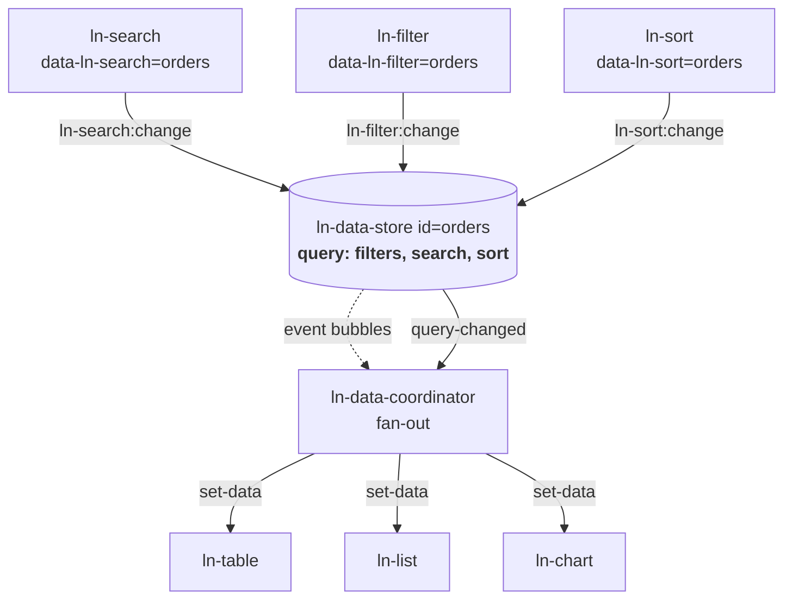
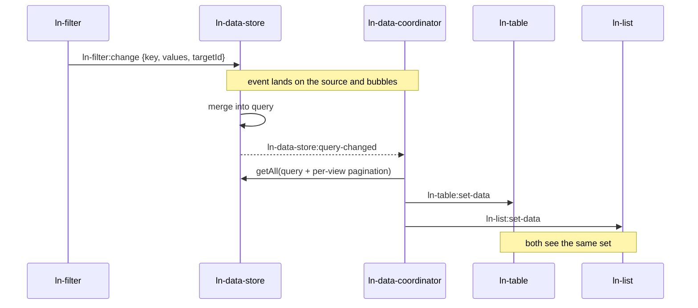

# Shared Query Architecture

How sorting, filtering and searching are owned in the data layer.

**The rule: the data source owns the query. Views render what it emits.**

A `ln-data-store` is not a bag of records plus N private filters held by whoever
happens to be rendering it. It is a single observable record set — already
narrowed and ordered. Views do not query it; they render what it currently
emits, and they express *intent* to change it.

For the storage/transport/mapper split that this builds on, see
[Data Store & Coordinator Architecture](data-store-architecture.md).

---

## Why

Historically each view owned its own query. `ln-table` held private
`currentFilters` / `currentSearch` / `currentSort`, filtered in memory, and
pushed its private query out through `ln-table:request-data`. The coordinator
cached that query **per element**.

The consequence: two consumers of the same source are two independent queries.
A table and a chart over one store cannot agree on what "the current view of the
data" is, and a filter applied in the table is invisible to everything else.

---

## The shape



Search, filter and sort address the **source**, not any single view. One change →
one `getAll` → every bound view refreshed.

---

## One filter click, end to end



`request-data` survives only for **initialization and paging**. Everything else
is push.

---

## Markup

```html
<section id="orders-module" data-ln-data-coordinator>
    <ul id="orders" data-ln-data-store hidden>…</ul>
    <table data-ln-table data-ln-table-source="orders">…</table>
</section>

<label class="search">
    <input type="search" placeholder="Search..." data-ln-search-for="orders" data-ln-search-debounce="0">
    <button type="button" data-ln-search-clear aria-label="Clear search"><svg class="ln-icon"><use href="#ln-icon-x"></use></svg></button>
</label>
<ul data-ln-filter="orders">…</ul>
<nav data-ln-sort="orders">
    <button type="button" data-ln-sort-field="total">Total</button>
</nav>
```

Reads address the **source** (`data-ln-table-source`, `data-ln-list-source`,
`data-ln-chart-source`, `data-ln-options`, `data-ln-stat`,
`data-ln-search-for`, `data-ln-filter`, `data-ln-sort`). Writes address the **coordinator**
(`ln-data-coordinator:request-*`, `data-ln-form-scope`).

---

## What lives where

| Concern | Owner | Why |
|---|---|---|
| `filters`, `search` | source | Record scope is a property of the data, identical for every consumer. |
| `offset`, `limit`, `queryGen` | store / view | Page positions are cached in the store's `window-index` (which owns `queryGen` and invalidation), while each view requests and holds a single active page slice. |
| `sort` | source | Windowed mode forces it: `window-index` maps absolute positions to IDs, so a single mapping can encode only one ordering. A view sorting privately leaves those cached positions in place — `ensure()` finds nothing missing, returns without fetching, and the rows stay in the previous order. The only invalidation is `_windowIndex.reset()`, which fires when the store's own query changes. The control (a `<th>` button, a sidebar) dispatches intent via `ln-sort:change` and nothing more. |

`store.getAll(options)` stays a pure query engine — it does not read the stored
query. The store holds the query; the coordinator composes it with each view's
pagination and passes the result to `getAll`.

---

## Boundaries

- **SSR tables and lists are untouched.** SSR uses separate fields
  (`_searchTerm`, `_columnFilters`) and keeps filtering in memory. Nothing in
  this architecture applies to a table without a source binding.
- **`ln-search` needs no code.** It already resolves its target with
  `getElementById` and dispatches a cancelable event *at* the target, carrying
  `targetId`. When the target is the source, the event lands there and bubbles
  to exactly one coordinator — routing comes from DOM containment.
- **`ln-filter` needs no code.** It dispatches `ln-filter:change` at the target
  source, where it lands directly and bubbles to the owning coordinator — the
  same containment routing `ln-search` relies on.
- **`ln-sort` is new code.** It is a separate component, not an existing one rewritten. It draws its active state/indicator from the store's echo (`ln-data-store:query-changed`) rather than local state, meaning multiple sort controls targeting the same source will remain in sync.
- **`ln-options` is exempt.** Option lists come from the domain (backend enum or
  lookup), never derived from the current record set — a dropdown must not shrink
  because a table is filtered.
- **Remote mode fans out per view.** When the coordinator falls back to a
  connector (store unavailable or not yet loaded), each bound view triggers its
  own connector request for an identical query. Correct, but N calls where 1
  would do.

