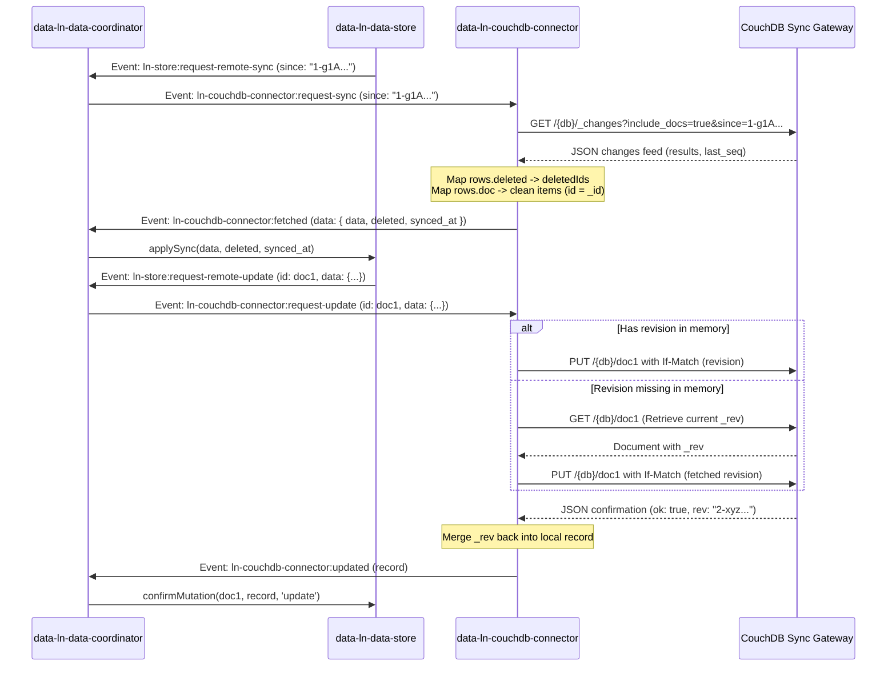

# `data-ln-couchdb-connector` Architecture Reference

This document describes the internal state, protocol mappings, and event lifecycles of the CouchDB Sync Gateway Transport Connector component (`data-ln-couchdb-connector`).

---

## Protocol Lifecycle Mapping

CouchDB and Sync Gateways rely on document-revision protocols (`_rev` identifiers) and a sequencing changes feed (`_changes` feed). This connector bridges standard relational cache actions into CouchDB-compliant REST invocations.

---

## Key Design Patterns

### 1. Zero-Friction Revisions Integration
CouchDB requires the active revision string `_rev` for document modifications and deletions to prevent data overwrites. To make integrations friction-free, the connector:
- Inspects the update payload for `_rev` or `rev`.
- If absent, it proactively fetches the current document state via a fast HTTP `GET` query to resolve the revision before proceeding with the `PUT` or `DELETE` mutation.
- When conflicts (`409 Conflict`) occur on CouchDB, the connector captures the standard error, constructs a `conflictData` payload, and dispatches `ln-couchdb-connector:error` with status `409` to prompt coordinate-level conflict merges.

### 2. Standard ID Translation
CouchDB utilizes `_id` as the primary key. In `ln-ashlar` cache-store databases, records are accessed via the standard `id` field. The CouchDB connector solves this mapping mismatch transparently:
- **Ingress Mapping**: Every document fetched via `_changes` gets mapped so that `id = _id` before forwarding to the Coordinator.
- **Egress Mapping**: Creators and updates automatically map the `id` property to `_id` before uploading payloads to CouchDB database endpoints.

### 3. Bulk Deletes Coordination
To execute bulk deletions safely, the connector first calls standard CouchDB `_all_docs` querying only target document revisions:
1. `POST /{db}/_all_docs` with `{"keys": [id1, id2, ...]}`
2. Filters out errors or missing documents to compile current revisions (`rev`).
3. Formulates a bulk operation array where each doc contains `{ _id: id, _rev: rev, _deleted: true }`.
4. Executes the transaction via `POST /{db}/_bulk_docs`.
