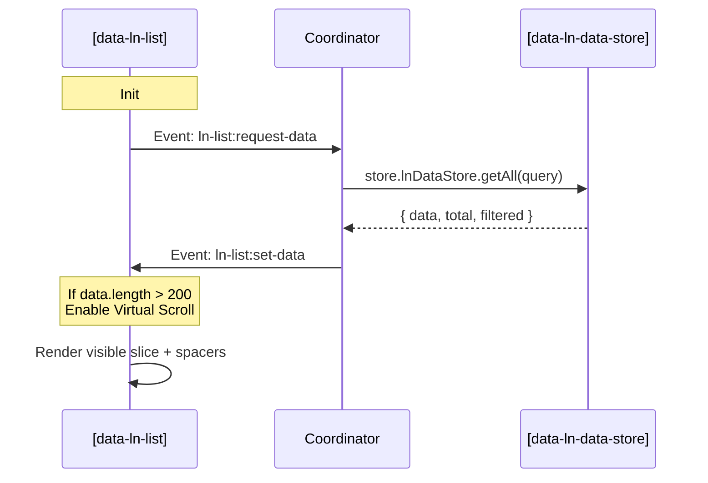

# ln-list — Architecture Reference

This document maps the internal state, rendering lifecycle, and virtual scroll logic of the structure-agnostic `ln-list` presenter component.

---

## 🧭 Design Decisions

Unlike `ln-table` which has rigid grid alignments, header sorting, and col-locking constraints, `ln-list` is designed for free-flowing block items (e.g., dynamic grids, vertical stacks, flex-cards).

### 1. Element Tag Spacers
Virtual scrolling in `ln-list` handles two modes of HTML structural validation automatically:
- If the target container (`[data-ln-list-body]`) is a `<ul>` or `<ol>` element, it generates list-item spacers (`<li class="ln-list__spacer">`) to maintain strict HTML5 standards.
- For all other block elements (`
`, `<section>`), it defaults to division spacers (`
`).

### 2. Composition Over Monolith
`ln-list` communicates strictly using CustomEvents (`ln-list:request-data` and `ln-list:set-data`). This allows the project-specific Coordinator to link it to `ln-data-store` or a standard AJAX endpoint without changes to the presenter script.

---

## ⚡ Lifecycle Diagram

---

## ⚙️ Lifecycle Methods

### `_parseChildren()`
- Parses static children inside `[data-ln-list-body]` to initialize `this._data` cache.
- Excludes `.ln-list__spacer` elements.
- Resolves item height (`this._itemHeight`) by measuring the first child element at mount.

### `_renderVirtual()`
- Determines the active viewport based on the nearest scrollable parent.
- Calculates `start` and `end` indices using item height.
- Mounts top/bottom spacers and clones the template for visible rows using `fillTemplate` and `fill`.
