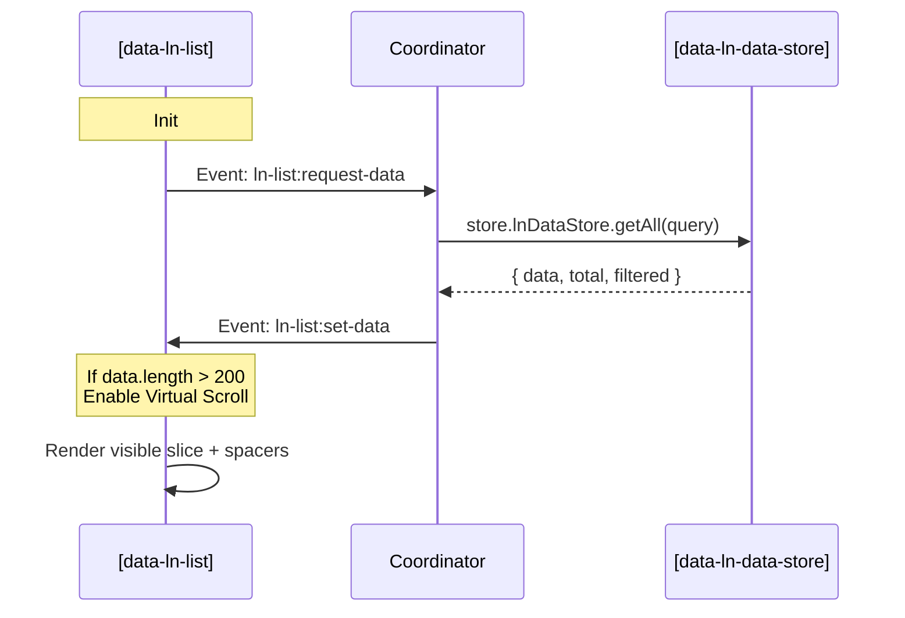

# ln-list — Architecture Reference

This document maps the internal state, rendering lifecycle, and virtual scroll logic of the structure-agnostic `ln-list` presenter component.

---

## 🧭 Design Decisions

Unlike `ln-table` which has rigid grid alignments, header sorting, and col-locking constraints, `ln-list` is designed for free-flowing block items (e.g., dynamic grids, vertical stacks, flex-cards).

### 1. Element Tag Spacers
Virtual scrolling in `ln-list` handles two modes of HTML structural validation automatically:
- If the target container (`[data-ln-list-body]`) is a `<ul>` or `<ol>` element, it generates list-item spacers (`<li class="ln-list__spacer">`) to maintain strict HTML5 standards.
- For all other block elements (`
`, `<section>`), it defaults to division spacers (`
`).

### 2. Composition Over Monolith
`ln-list` communicates strictly using CustomEvents (`ln-list:request-data` and `ln-list:set-data`). This allows the project-specific Coordinator to link it to `ln-data-store` or a standard AJAX endpoint without changes to the presenter script.

### 3. Windowed Server-Side Virtualization
Opt-in via `data-ln-list-window="N"` on a Data-Driven Mode list — mirrors `ln-table`'s windowed path bit-for-bit. The component owns a `ln-core.createWindowCache` instance (`N` sets `windowSize`, default 1000) instead of caching the full dataset. `ln-list:request-data` gains `{ offset, limit, queryGen }`; `ln-list:set-data` echoes `{ offset, queryGen }` back into `cache.ingest()`. Select-all is hidden when `data-ln-list-selectable` and windowed mode are both active — a windowed list cannot select items it has never fetched.

The windowing attributes and windowed mode itself are both live-observable — no re-init required. Mutating `data-ln-list-window-page`, `data-ln-list-window-threshold`, or `data-ln-list-count` reconfigures the live cache via `configure()`/`setGrandTotal()`. Adding `data-ln-list-window` to an initialized, non-windowed, data-driven list enables windowing live, seeding the cache from resident items (honoring `data-ln-list-count` if present, else the resident item count). Removing `data-ln-list-window` disables windowing live: the cache is destroyed and the list issues a fresh full `ln-list:request-data` (no `offset`/`limit`) to repopulate the complete dataset before rendering non-windowed again.

---

## ⚡ Lifecycle Diagram

```mermaid
sequenceDiagram
    participant Presenter as [data-ln-list]
    participant Coordinator
    participant Store as [data-ln-data-store]

    Note over Presenter: Init
    Presenter->>Coordinator: Event: ln-list:request-data
    Coordinator->>Store: store.lnDataStore.getAll(query)
    Store-->>Coordinator: { data, total, filtered }
    Coordinator->>Presenter: Event: ln-list:set-data
    Note over Presenter: If data.length > 200<br/>Enable Virtual Scroll
    Presenter->>Presenter: Render visible slice + spacers
```

---

## ⚙️ Lifecycle Methods

### `_parseChildren()`
- Parses static children inside `[data-ln-list-body]` to initialize `this._data` cache.
- Excludes `.ln-list__spacer` elements.
- Resolves item height (`this._itemHeight`) by measuring the first child element at mount.

### `_renderVirtual()`
- Determines the active viewport based on the nearest scrollable parent.
- Calculates `start` and `end` indices using item height.
- Mounts top/bottom spacers and clones the template for visible rows using `fillTemplate` and `fill`.

### `_renderWindowed()`
- Renders the resident window instead of `this._data` — items outside the cache resolve to blank placeholder spacer elements (no shimmer) until their page arrives.
- Calls `this._cache.ensure(startRow, endRow)` every pass to trigger a debounced fetch for missing rows.
- Mirrors `_renderVirtual()`'s spacer/viewport math; the only difference is the row source (`this._cache.get(i)` vs `this._data[i]`).
