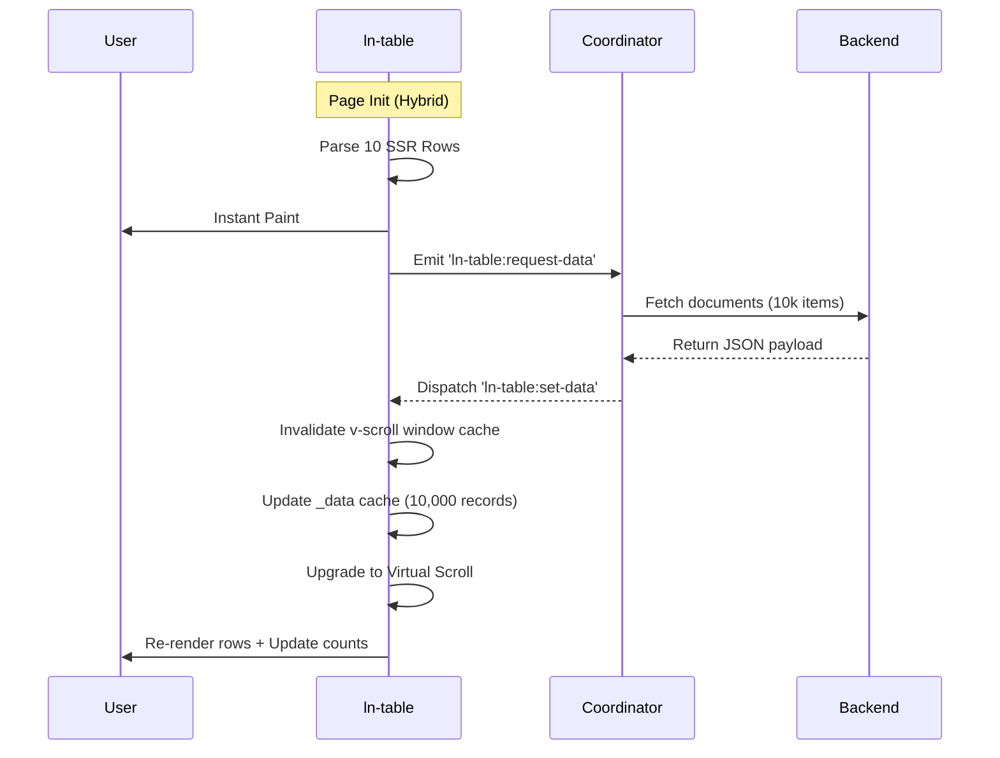

# Unified Table Component

> Architecture documentation for `js/ln-table/ln-table.js`. Companion to the
> consumer-facing README at `js/ln-table/README.md`. This file
> documents internal state, render pipeline, and design decisions for
> library maintainers.

`ln-table` is a unified presenter component supporting two execution modes:
1. **Server-Rendered (SSR) Mode**: Enhances standard, pre-populated HTML tables in-place.
2. **Data-Driven Mode**: Operates as a dynamic presenter engine, cloning templates and rendering datasets on events.

---

## Imports

Helpers imported from `ln-core`:
- `cloneTemplateScoped(root, name, componentTag)` — checks container templates, falls back to document templates.
- `dispatch(el, name, detail)` — bubbling, non-cancelable CustomEvent.
- `fill(el, data)` — populates single attribute/text nodes.
- `fillTemplate(el, data)` — handles `{{ double-curly }}` replacements.
- `registerComponent(selector, attribute, ComponentFn, componentTag)` — global registration.

---

## Execution Modes

The component detects its execution mode in the constructor based on the presence of the `data-ln-table-source` attribute:

```javascript
this.isDataDriven = dom.hasAttribute('data-ln-table-source');
```

### 1. SSR Mode
- Reads initial rows directly from `<tbody>` at bootstrap.
- Caches row structures as static HTML strings inside `_data`.
- Listens to `ln-search:change` (from search inputs), `ln-table:sort` (from sort buttons), and `ln-filter:changed` (from filter boxes) on the wrapper.
- Filters and sorts the cached rows in-memory.

### 2. Data-Driven Mode
- Set `this.isLoaded = false` until the first dataset is loaded.
- Handles background hydration: if `<tbody>` has initial rows, it parses them immediately (Hybrid Mode) for instant local query response.
- Listens to `ln-table:set-data` and `ln-table:set-loading` events.
- Sorts and filters the dynamic records cache client-side.
- Clones and interpolates `<template data-ln-template="{name}-row">` for rendering.
- Manages row selection checkboxes (`data-ln-table-row-select`), select-all checkbox (`data-ln-table-col-select`), and footer counters (`data-ln-table-total`, `data-ln-table-filtered`, `data-ln-table-selected`).
- Intercepts keyboard navigation (arrow keys, Enter to click, Space to select, `/` to focus search).
- Dispatches `ln-table:request-data` on load, sort, filter, search, and clear-all events.

---

## Declarative Attribute Contract

| Attribute | Applied To | Description |
|---|---|---|
| `data-ln-table` | Wrapper | Table name. Serves as component root identifier. |
| `data-ln-table-source` | Wrapper | Opt-in marker for Data-Driven Mode. |
| `data-ln-table-selectable` | Wrapper | Enable checkboxes and row selection. |
| ~~`data-ln-table-search`~~ | — | **Removed.** Drive the search input with `data-ln-search="<tableId>"` — `ln-table` consumes `ln-search:change` in both modes. |
| `data-ln-table-col="field"` | `<th>` | Maps header column to a data record field. |
| `data-ln-value` | `<td>` / item | Raw machine value for sort/filter (read by `ln-core.readValue`). Server-formatted display stays in the element body. See [Core → data-ln-value](core.md#the-data-ln-value-primitive). |
| `data-ln-table-col-sort` | Button | Triggers three-state column sorting. |
| `data-ln-table-col-filter` | Button | Triggers filter dropdown populating. |
| `data-ln-table-col-select` | `<th>` | Header select-all checkbox column. |
| `data-ln-table-row` | `<tr>` | Render template row container click target. |
| `data-ln-table-row-select` | Input | Row selection checkbox target. |
| `data-ln-table-row-action="name"` | Button | Row action triggers (edit, delete). |
| `data-ln-table-clear-all` | Button | Resets search query and filters. |

---

## Event Architecture

### Emitted Events
- `ln-table:ready` `{ total }` — Dispatched after initial parse.
- `ln-table:rendered` `{ table, total, visible }` — Dispatched after rows are drawn.
- `ln-table:request-data` `{ table, sort, filters, search }` — Requests dataset from coordinator.
- `ln-table:row-click` `{ table, id, record }` — Fired when clicking row body.
- `ln-table:row-action` `{ table, id, action, record }` — Fired when clicking row actions.
- `ln-table:select` `{ table, selectedIds, count }` — Fired when row selection updates.
- `ln-table:select-all` `{ table, selected }` — Fired when select-all is toggled.
- `ln-table:empty` `{ term, total }` — Fired when empty state is displayed.

### Listened Events
- `ln-table:set-data` `{ data, total, filtered, filterOptions }` — Feeds dataset to table.
- `ln-table:set-loading` `{ loading }` — Toggles loading state overlay classes.

---

## Lifecycle Diagram



---

## Key Maintenance Decisions

### 1. Hybrid Sync Pipeline
To ensure high performance, hybrid initialization parses initial rows synchronously to support sorting/filtering immediately. When the background sync dispatches `ln-table:set-data`, the scroll offsets are re-evaluated, caching limits are reset (`_vStart = -1`, `_vEnd = -1`), and virtual scrolling is initialized.

### 2. Loading State Dismissal
When a sync event begins, the coordinator dispatches `ln-table:set-loading` with `{ loading: true }`, putting a `.ln-table--loading` dimming wrapper class on the component root to disable visual pointers. When `ln-table:set-data` triggers, this class is automatically removed.

### 3. Sticky Header/Footer Styling Mixins
To pin headers and footers flush at screen bounds during infinite scroll, styling includes fallback rules targeting direct children (`[data-ln-table] > header` and `[data-ln-table] > footer`). Maintainers can apply standard mixins `@include ln-table-toolbar` and `@include ln-table-footer` inside `scss/components/_ln-table.scss`.
