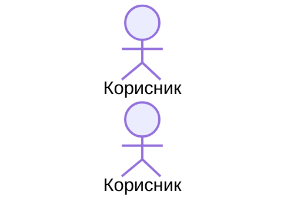

# Plan: docs-mcp/ skeleton — структура, конвенции и темплејти

**Датум:** 2026-07-10
**Цел:** Се креира `docs-mcp/` — новиот кориснички документациски корпус што MCP серверот ќе го индексира. Овој план создава САМО скелетот: фолдери, README со нормативни конвенции (parsing contract) и темплејти. Не се мигрира ниту еден постоечки документ.

## Ограничувања (ЗАДОЛЖИТЕЛНО)

- НЕ допирај ништо во `architecture_docs_draft/`, `docs/`, `js/`, `scss/`, `.claude/`.
- Креирај ТОЧНО ги фајловите наведени подолу, со содржината дадена verbatim.
- Нема build, нема тестови — ова се markdown фајлови и празни фолдери.

## Фајлови за креирање

### 1. `docs-mcp/README.md`

```markdown
# docs-mcp — Кориснички документациски корпус на ln-ashlar

Овој фолдер е **единствениот извор** што MCP серверот на ln-ashlar го индексира и сервира.
Целта: сите агенти, вработени и корисници на библиотеката да имаат ист „mindset“ —
кои атрибути постојат, какви вредности примаат, кои настани се емитираат, и готови
markup темплејти за копирање.

## Публика и слоеви

| Слој | Локација | Публика |
|---|---|---|
| Low-level (внатрешности) | `js/ln-*/README.md` покрај кодот | Развивачи НА библиотеката |
| **Кориснички корпус (овој фолдер)** | `docs-mcp/` | Корисници на библиотеката, AI агенти преку MCP |
| In-context skills | `.claude/skills/` (посебно repo) | Claude Code сесии |

## Структура на фолдерот

```
docs-mcp/
  README.md          ← овој фајл (НЕ се индексира)
  _templates/        ← темплејти за авторирање (НЕ се индексира)
  components/        ← JS компоненти, еден фајл по компонента: ln-<име>.md
  css/               ← SCSS компоненти/миксини/токени: <име>.md
  patterns/          ← композитни рецепти (табела+sort+filter, modal-fill CRUD...): <кебаб-име>.md
  guides/            ← workflow водичи (write-workflow...)
  doctrine/          ← mindset, правила, доктрина
```

MCP индексерот чита САМО од `components/`, `css/`, `patterns/`, `guides/`, `doctrine/`.
Сè што почнува со `_` или е `README.md` се игнорира.

## Frontmatter (задолжителен за секој документ)

```yaml
---
name: ln-toggle              # slug — МОРА да е еднаков со името на фајлот (без .md)
classification: simple       # види дозволени вредности подолу
status: draft                # draft | stable
summary: Една реченица — се прикажува во list/search резултати.
source: js/ln-toggle/src/ln-toggle.js   # главни изворни фајлови (може листа)
tags: [state, collapsible]
---
```

Дозволени `classification` вредности по фолдер:

| Фолдер | classification |
|---|---|
| `components/` | `simple` \| `coordinator` \| `service` |
| `css/` | `css` |
| `patterns/` | `pattern` |
| `guides/` | `guide` |
| `doctrine/` | `doctrine` |

## Нормативни наслови (parsing contract)

MCP парсерот се закачува на ТОЧНИТЕ наслови. Не менувај формулација, редослед или нумерација.
Темплејтите во `_templates/` се единствениот дозволен калап:

- `_templates/component.md` → за `components/`
- `_templates/css.md` → за `css/`
- `_templates/pattern.md` → за `patterns/`
- `_templates/guide.md` → за `guides/` и `doctrine/`

## Нормативни табели

**Атрибути** (компоненти, §3 под `### Табела со Атрибути`):

| Атрибут | Елемент | Тип / Вредности | Стандардна вредност | Опис |
|---|---|---|---|---|

**Настани** (компоненти, §3 под `### Настани (Events API)`):

| Настан | Насока | Cancelable | Опис | `detail` Објект |
|---|---|---|---|---|

`Насока` е `Емитува` или `Слуша`.

**SCSS API** (css документи, §3):

| Име | Вид | Параметри / Вредности | Опис |
|---|---|---|---|

`Вид` е `mixin` \| `класа` \| `токен` \| `атрибут`.

**Вклучени компоненти** (patterns, §3):

| Компонента | Улога во патернот |
|---|---|

## Markup темплејти (за `get_markup` tool)

Во §2, секој ```` ```html ```` блок под `### Базен HTML Маркап` е стандардниот темплејт,
а секој под `### Варијанта N: <име>` е именувана варијанта. MCP ги извлекува директно —
markup-от МОРА да е комплетен и copy-paste функционален, без халуцинирани атрибути.

## Крос-референци

Врски меѓу документи се пишуваат како релативни markdown линкови:
`[ln-accordion](./ln-accordion.md)`, `[tables](../css/tables.md)`.
MCP го гради крос-референтниот граф од овие линкови — нема посебно поле за одржување.

## Животен циклус

Нов документ се раѓа со `status: draft`. Откако е спроверен наспроти изворниот код
(атрибути, вредности, events, markup), преминува во `status: stable`.
Документ се менува во ИСТИОТ commit со промената на кодот што го опишува.

## Валидација

Контрактот е имплементиран НА ЕДНО МЕСТО — во MCP серверот (`validate_docs` tool /
CLI lint режим). Пред commit на нов/изменет документ, пушти ја валидацијата таму.
```

### 2. `docs-mcp/_templates/component.md`

```markdown
---
name: ln-ime
classification: simple
status: draft
summary: Една реченица за улогата на компонентата.
source: js/ln-ime/src/ln-ime.js
tags: []
---

# [емоџи] ln-ime

> **Класификација:** 🟢 Едноставна компонента / Координатор / Сервис

---

## 1. Заднинско дејство и одговорност

- Концизно објаснување на основната улога (bullet листа со **задебелени** клучни одговорности).
- Линк кон изворниот фајл во првиот пасус.

> [!IMPORTANT]
> **Што компонентата НЕ прави (Orthogonality Doctrine):**
> - Експлицитна листа на одговорности што ѝ припаѓаат на друга компонента, со линк кон неа.

---

## 2. Минимален HTML Маркап и Варијанти на Употреба

### Базен HTML Маркап

```html
<!-- Наједноставниот комплетен, copy-paste функционален пример -->
```

### Варијанта 1: [Име на варијантата]

Кратко објаснување кога се користи.

#### HTML Маркап
```html
<!-- Комплетен пример за варијантата -->
```

---

## 3. Декларативен API Договор (Атрибути и Настани)

### Табела со Атрибути

| Атрибут | Елемент | Тип / Вредности | Стандардна вредност | Опис |
|---|---|---|---|---|
| `data-ln-ime` | Панел | `"a"` \| `"b"` | `"a"` | ... |

### Настани (Events API)

| Настан | Насока | Cancelable | Опис | `detail` Објект |
|---|---|---|---|---|
| `ln-ime:open` | Емитува | Не | ... | `{ target: HTMLElement }` |

---

## 4. CSS Стилизирање и Поведенски Концепт

SCSS миксини, класи и поведенски концепти (порталирање, позиционирање, анимации),
со линкови кон изворните `.scss` фајлови и кратки изворни извадоци.

---

## 5. Пристапност (ARIA) и Чести Грешки

### ARIA & Тастатура

- ARIA улоги, поврзувања и тастатурна навигација.

### Чести Грешки и Анти-патерни (Common Pitfalls)

> [!CAUTION]
> 1. **[Грешка]:** објаснување и последица.

---

## 6. Дијаграм на Текот и Животен Циклус



---

## 7. Поврзани Компоненти

- [`ln-drugo`](./ln-drugo.md) — зошто е поврзана.
```

### 3. `docs-mcp/_templates/css.md`

```markdown
---
name: ime
classification: css
status: draft
summary: Една реченица за визуелната компонента / миксинот.
source: scss/components/_ime.scss
tags: []
---

# [емоџи] ime

---

## 1. Заднинско дејство и одговорност

- Улогата на визуелната компонента и кој слој ја носи (mixin layer / component binding).

---

## 2. Минимален HTML Маркап и Варијанти на Употреба

### Базен HTML Маркап

```html
<!-- Комплетен, copy-paste функционален пример -->
```

### Варијанта 1: [Име]

#### HTML Маркап
```html
<!-- ... -->
```

---

## 3. SCSS API (Миксини, Класи и Токени)

| Име | Вид | Параметри / Вредности | Опис |
|---|---|---|---|
| `card` | mixin | — | ... |
| `--card-bg` | токен | боја | ... |

---

## 4. Пристапност и Чести Грешки

> [!CAUTION]
> 1. **[Грешка]:** објаснување.

---

## 5. Поврзани Документи

- [`tokens`](./tokens.md) — зошто.
```

### 4. `docs-mcp/_templates/pattern.md`

```markdown
---
name: ime-na-pattern
classification: pattern
status: draft
summary: Една реченица — кој UI проблем го решава рецептот.
source: demo/admin/primer.html
tags: []
---

# [емоџи] Име на патернот

---

## 1. Проблем и Контекст

Кога се користи овој патерн, за каков тип содржина/интеракција.

---

## 2. Комплетен HTML Маркап

### Базен HTML Маркап

```html
<!-- Целиот композитен рецепт — copy-paste функционален -->
```

### Варијанта 1: [Име]

#### HTML Маркап
```html
<!-- ... -->
```

---

## 3. Вклучени Компоненти

| Компонента | Улога во патернот |
|---|---|
| [`ln-table`](../components/ln-table.md) | ... |

---

## 4. Тек на Податоци

Како течат настаните/податоците низ компонентите (опционално Mermaid).

---

## 5. Чести Грешки

> [!CAUTION]
> 1. **[Грешка]:** објаснување.

---

## 6. Поврзани Патерни и Компоненти

- [`drug-pattern`](./drug-pattern.md) — зошто.
```

### 5. `docs-mcp/_templates/guide.md`

```markdown
---
name: ime-na-vodic
classification: guide
status: draft
summary: Една реченица — што покрива водичот.
source:
tags: []
---

# [емоџи] Наслов на водичот

## Резиме

2-3 реченици — за кого е и што ќе научи.

---

Слободна форма. Задолжително: frontmatter, `## Резиме` како прва секција,
релативни линкови кон компоненти/патерни за крос-референтниот граф.
За `doctrine/` документи важи истиот калап со `classification: doctrine`.
```

### 6. Празни фолдери со `.gitkeep`

- `docs-mcp/components/.gitkeep`
- `docs-mcp/css/.gitkeep`
- `docs-mcp/patterns/.gitkeep`
- `docs-mcp/guides/.gitkeep`
- `docs-mcp/doctrine/.gitkeep`

(секој `.gitkeep` е празен фајл)

## Критериуми за прифаќање

1. `docs-mcp/README.md` постои и содржи: frontmatter спецификација, табела со classification вредности, нормативни табели (Атрибути со 5 колони, Настани со 5 колони), секција „Валидација“.
2. Четирите темплејти постојат во `docs-mcp/_templates/` и секој почнува со YAML frontmatter блок (`---` … `---`) со полиња `name`, `classification`, `status`, `summary`, `source`, `tags`.
3. `component.md` темплејтот ги содржи точно 7-те нумерирани `## N.` секции со формулации идентични на постоечкиот draft стил (`## 1. Заднинско дејство и одговорност` … `## 7. Поврзани Компоненти`).
4. Петте `.gitkeep` фајлови постојат.
5. Ниту еден фајл надвор од `docs-mcp/` не е менуван.
