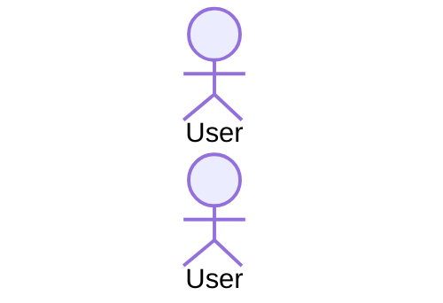

# Plan: docs-mcp англиски контракт + средни/ситни поправки од Фаза-1 ревјуто

**Датум:** 2026-07-11
**Одлука (корисник):** крајната содржина на docs-mcp корпусот е на АНГЛИСКИ — проза, наслови, табели. Темплејтите се менуваат на англиски; MCP парсерот ќе се синхронизира одделно (Проект 2). Meta-фајловите (README проза, mcp-todo, refactor-todo) остануваат на македонски.

## Ограничувања

- НЕ ги допирај write-pipeline секциите: `docs-mcp/doctrine/data-flow.md` §2 „The Write Loop" и `docs-mcp/doctrine/data-layer.md` §3.A „Direct Pipeline" — тие се одложени за посебна сесија (задача Е подолу само го креира todo фајлот за нив).
- НЕ допирај ништо во `architecture_docs_draft/`, `docs/` (освен што овој план живее таму), `js/`, `scss/`.
- Нема build, нема тестови — markdown работа.

---

## А. Темплејти → целосно англиски (замени содржина verbatim)

### А1. `docs-mcp/_templates/component.md`

````markdown
---
name: ln-name
classification: simple
status: draft
summary: One sentence describing the component's role.
source: js/ln-name/src/ln-name.js
tags: []
---

# [emoji] ln-name

> **Classification:** 🟢 Simple component / Coordinator / Service

---

## 1. Core Behavior & Responsibility

- Concise explanation of the core role (bullet list with **bold** key responsibilities).
- Link to the source file in the first paragraph.

> [!IMPORTANT]
> **What the component does NOT do (Orthogonality Doctrine):**
> - Explicit list of responsibilities that belong to another component, with a link to it.

---

## 2. Minimal HTML Markup & Usage Variants

### Base HTML Markup

```html
<!-- The simplest complete, copy-paste functional example -->
```

### Variant 1: [Variant name]

Short explanation of when to use it.

#### HTML Markup
```html
<!-- Complete example for the variant -->
```

---

## 3. Declarative API Contract (Attributes & Events)

### Attributes Table

| Attribute | Element | Type / Values | Default | Description |
|---|---|---|---|---|
| `data-ln-name` | Panel | `"a"` \| `"b"` | `"a"` | ... |

### Events API

| Event | Direction | Cancelable | Description | `detail` Object |
|---|---|---|---|---|
| `ln-name:open` | Emits | No | ... | `{ target: HTMLElement }` |

---

## 4. CSS Styling & Behavioral Concept

SCSS mixins, classes and behavioral concepts (teleporting, positioning, animations),
with links to the source `.scss` files and short source excerpts.

---

## 5. Accessibility (ARIA) & Common Pitfalls

### ARIA & Keyboard

- ARIA roles, relationships and keyboard navigation.

### Common Pitfalls & Anti-patterns

> [!CAUTION]
> 1. **[Pitfall]:** explanation and consequence.

---

## 6. Flow Diagram & Lifecycle



---

## 7. Related Components

- [`ln-other`](./ln-other.md) — why it is related.
````

### А2. `docs-mcp/_templates/css.md`

````markdown
---
name: name
classification: css
status: draft
summary: One sentence about the visual component / mixin.
source: scss/components/_name.scss
tags: []
---

# [emoji] name

---

## 1. Core Behavior & Responsibility

- The role of the visual component and which layer owns it (mixin layer / component binding).

---

## 2. Minimal HTML Markup & Usage Variants

### Base HTML Markup

```html
<!-- Complete, copy-paste functional example -->
```

### Variant 1: [Name]

#### HTML Markup
```html
<!-- ... -->
```

---

## 3. SCSS API (Mixins, Classes & Tokens)

| Name | Kind | Parameters / Values | Description |
|---|---|---|---|
| `card` | mixin | — | ... |
| `--card-bg` | token | color | ... |

---

## 4. Accessibility & Common Pitfalls

> [!CAUTION]
> 1. **[Pitfall]:** explanation.

---

## 5. Related Documents

- [`tokens`](./tokens.md) — why.
````

### А3. `docs-mcp/_templates/pattern.md`

````markdown
---
name: pattern-name
classification: pattern
status: draft
summary: One sentence — which UI problem the recipe solves.
source: demo/admin/example.html
tags: []
---

# [emoji] Pattern Name

---

## 1. Problem & Context

When to use this pattern, for what kind of content/interaction.

---

## 2. Complete HTML Markup

### Base HTML Markup

```html
<!-- The full composite recipe — copy-paste functional -->
```

### Variant 1: [Name]

#### HTML Markup
```html
<!-- ... -->
```

---

## 3. Included Components

| Component | Role in the Pattern |
|---|---|
| [`ln-table`](../components/ln-table.md) | ... |

---

## 4. Data Flow

How events/data flow through the components (optional Mermaid).

---

## 5. Common Pitfalls

> [!CAUTION]
> 1. **[Pitfall]:** explanation.

---

## 6. Related Patterns & Components

- [`other-pattern`](./other-pattern.md) — why.
````

### А4. `docs-mcp/_templates/guide.md`

````markdown
---
name: guide-name
classification: guide
status: draft
summary: One sentence — what the guide covers.
source:
tags: []
---

# [emoji] Guide Title

## Summary

2-3 sentences — who it is for and what they will learn.

---

Free form. Mandatory: frontmatter, `## Summary` as the first section,
relative links to components/patterns for the cross-reference graph.
For `doctrine/` documents the same template applies with `classification: doctrine`.
````

---

## Б. `docs-mcp/README.md` — нормативните токени стануваат англиски (прозата останува македонска)

Б1. Веднаш по параграфот „MCP парсерот се закачува на ТОЧНИТЕ наслови..." (секција „Нормативни наслови"), додај нов пасус:

```markdown
**Јазик:** содржината на секој индексиран документ е на АНГЛИСКИ — проза, наслови,
табели. Насловите и колоните подолу се англиски и се дел од parsing contract-от.
Meta-фајловите (овој README, работните todo фајлови) остануваат на македонски.
```

Б2. Во секција „Нормативни табели" замени:
- `**Атрибути** (компоненти, §3 под \`### Табела со Атрибути\`):` → `**Атрибути** (компоненти, §3 под \`### Attributes Table\`):`
- header `| Атрибут | Елемент | Тип / Вредности | Стандардна вредност | Опис |` → `| Attribute | Element | Type / Values | Default | Description |`
- `**Настани** (компоненти, §3 под \`### Настани (Events API)\`):` → `**Настани** (компоненти, §3 под \`### Events API\`):`
- header `| Настан | Насока | Cancelable | Опис | \`detail\` Објект |` → `| Event | Direction | Cancelable | Description | \`detail\` Object |`
- `\`Насока\` е \`Емитува\` или \`Слуша\`.` → `\`Direction\` е \`Emits\` или \`Listens\`.`
- SCSS header `| Име | Вид | Параметри / Вредности | Опис |` → `| Name | Kind | Parameters / Values | Description |`
- `\`Вид\` е \`mixin\` \| \`класа\` \| \`токен\` \| \`атрибут\`.` → `\`Kind\` е \`mixin\` \| \`class\` \| \`token\` \| \`attribute\`.`
- patterns header `| Компонента | Улога во патернот |` → `| Component | Role in the Pattern |`

Б3. Во секција „Markup темплејти (за `get_markup` tool)" замени ги референците на наслови:
- `### Базен HTML Маркап` → `### Base HTML Markup`
- `### Варијанта N: <име>` → `### Variant N: <name>`
(и во главниот параграф и во service-исклучокот, ако се спомнуваат)

---

## В. `docs-mcp/mcp-todo.md` — ново правило за јазик

Во „Правила на работа (за секој документ)" додај по правило 6:

```markdown
7. **Јазик:** содржината на документот е на АНГЛИСКИ (проза, наслови, табели) — насловите се англиски и се parsing contract. Meta/работните фајлови остануваат на македонски.
```

---

## Г. Поправки во `docs-mcp/doctrine/` (средни/ситни наоди од ревјуто)

НЕ менувај ништо друго во овие фајлови освен наведеното. Сите текстуални измени на англиски.

**Г1. `data-flow.md` §1** — табелата/прозата именува компонента „`ln-store`". Реалната компонента е **`ln-data-store`** (атрибут `data-ln-data-store`, елемент API `el.lnDataStore`); `ln-store:` е само префикс на настаните. Поправи ги референците во §1 така што компонентата се вика `ln-data-store`, а каде што се мисли на настани остави `ln-store:*`.

**Г2. `scss-architecture.md`** — формулацијата дека teleport-иран слој „елевира до `z-index: 50`". Кодот користи `calc(var(--z-modal) + 10)` (`scss/components/_dropdown.scss`, `_popover.scss`). Прочитај ги двата scss фајла, потврди, и преформулирај ја реченицата да ја одрази реалната формула (резултатот 50 може да остане како објаснување во заграда).

**Г3. `js-component-model.md`** — примерот `data-ln-toast-dict` не постои во кодот. Замени го со реалниот `data-ln-upload-dict` (потврди: `js/ln-upload/src/ln-upload.js`, `DICT_SELECTOR`). Приспособи ја околната реченица ако именува toast.

**Г4. Крос-референтни линкови (сите 6 doctrine документи)** — при ПРВОТО спомнување на ln-компонента, css документ или guide во секој документ, додај релативен markdown линк: `[ln-toast](../components/ln-toast.md)`, `[tokens](../css/tokens.md)`, `[ln-form](../components/ln-form.md)`... Правила:
- Линкувај САМО имиња што постојат како планирани документи во `docs-mcp/mcp-todo.md` (Фаза 2-5 листите) — тие се идни фајлови, dangling линк е ОК.
- Еден линк по документ по цел (првото спомнување); останатите спомнувања остануваат обичен код-спан.
- Не линкувај внатре во код-блокови или табели со атрибути/настани — само во проза.

**Г5. Checkbox-hack дедупликација** — темата е речиси дуплирана меѓу `html-markup-rules.md` и `js-component-model.md`. Одлука: целосната обработка (зошто е анти-патерн, што наместо тоа) останува во **`js-component-model.md`** (тоа е доктрина за state/behavior). Во `html-markup-rules.md` сведи ја секцијата на 1-2 реченици + линк: `See [js-component-model](./js-component-model.md) for the full anti-pattern rationale.`

---

## Д. Нов фајл `docs-mcp/refactor-todo.md` (verbatim)

````markdown
# refactor-todo — одложени поправки по ревјуто на Фаза 1 (2026-07-11)

> Работен фајл — НЕ се индексира (надвор од петте индексирани фолдери).
> За посебна сесија. Се брише кога сè е решено.

## 1. `doctrine/data-flow.md` — препишување на §2 „The Write Loop" (pre-v2 → v2)

Погрешно сега / вистина во кодот:

- `ln-form:submit` → реалниот настан е **`ln-form:submit-record`** (`js/ln-form/src/ln-form.js:64`); формата бара claim преку `data-ln-form-scope`, инаку `console.warn`
- `_pending: true/false` — НЕ постои; v2 нема pending machinery (ruling 2026-07-09)
- настан `ln-store:change` (+ source `reconcile`/`revert`) — НЕ постои; реални настани: `ln-store:created` / `updated` / `deleted` / `loaded` / `synced` / `ready` / `initialized`
- „revert на pre-submit снимка" — реалната error-политика е диференцирана по HTTP статус (`js/ln-data-coordinator/src/ln-data-coordinator.js`, `connError` handler): 401/419 → auth-pause; 5xx/network → retry/queue; 409 update → замена со remote; 4xx create → бришење на локалниот запис; други 4xx → остава локално

Извор на вистина: `js/ln-data-coordinator/src/`, `js/ln-form/src/`, `js/ln-couchdb-connector/src/` —
НЕ `docs/architecture/data-flow.md` (тој е застарен, самиот го носи pre-v2 наративот).

## 2. `doctrine/data-layer.md` — препишување на §3.A „Direct Pipeline" + v2 котви

- истите pre-v2 грешки како точка 1, плус: tempId форматот е **`_temp_<uuid>`**, не `tmp_<uuid>` (`ln-data-coordinator.js`, `_uuid()`)
- недостасуваат мандаторните v2 котви:
  - toast envelope **`{message, content}`** (`ln-couchdb-connector.js` + `_toastFromMessage` во координаторот)
  - **`data-ln-form-scope`** write intake
  - **паралелен fan-out** (`_fanOutCreate` / `_fanOutUpdate` / `_fanOutDelete` — двоен dispatch кон store + connector/queue, без snapshot/pending книговодство)

## 3. MCP парсер (Проект 2) — синхронизација со англискиот контракт

Нормативните наслови се сега англиски (одлука 2026-07-11):

- `## Summary` (guides/doctrine, прва секција)
- `### Attributes Table`, `### Events API` (§3, компоненти)
- `### Base HTML Markup`, `### Variant N: <name>` (§2)
- табели: `| Attribute | Element | Type / Values | Default | Description |`,
  `| Event | Direction | Cancelable | Description | detail Object |` (Direction: `Emits` | `Listens`),
  `| Name | Kind | Parameters / Values | Description |` (Kind: `mixin` | `class` | `token` | `attribute`),
  `| Component | Role in the Pattern |`

Целосниот контракт: `docs-mcp/README.md` + `docs-mcp/_templates/`.
````

---

## Критериуми за прифаќање

1. `grep "Резиме" docs-mcp/_templates/` → 0 резултати; ниту еден кириличен карактер во четирите темплејти.
2. `docs-mcp/README.md` содржи `### Attributes Table`, `### Base HTML Markup`, `| Event | Direction | Cancelable |`, и новиот „Јазик" пасус.
3. `docs-mcp/mcp-todo.md` има правило 7 (јазик).
4. `docs-mcp/refactor-todo.md` постои со трите секции.
5. `data-flow.md` §1 повеќе не именува компонента „ln-store" (како компонента); `ln-store:*` настаните остануваат.
6. `js-component-model.md`: `data-ln-toast-dict` → 0 резултати; `data-ln-upload-dict` присутен.
7. `scss-architecture.md` содржи `calc(var(--z-modal) + 10)`.
8. Секој од 6-те doctrine документи има барем 1 релативен md линк (`](../` или `](./`).
9. Checkbox-hack детално само во `js-component-model.md`; во `html-markup-rules.md` кратко + линк.
10. §2 „The Write Loop" (data-flow.md) и §3.A „Direct Pipeline" (data-layer.md) се НЕПРОМЕНЕТИ (одложени).
