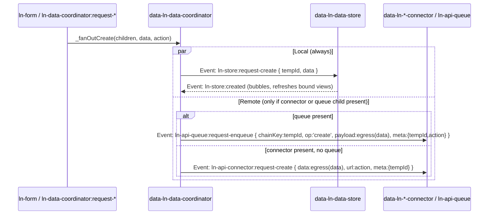
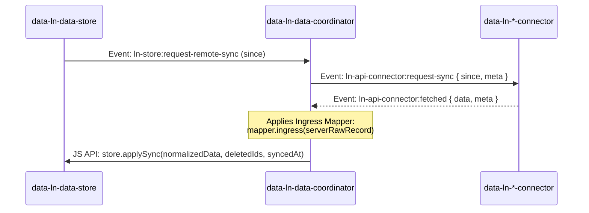
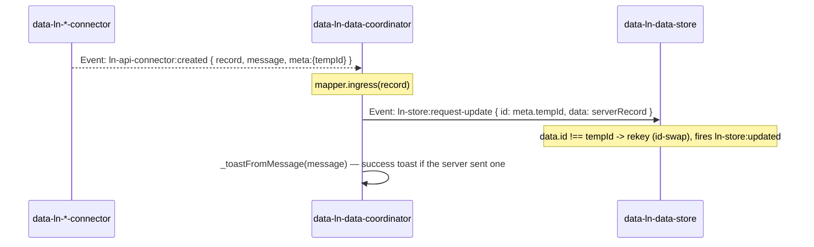

# `data-ln-data-coordinator`

A zero-dependency, Local-First **Data Coordinator** component that orchestrates the full 3-Tier Data Layer in `ln-ashlar`: it bridges the local cache store to remote connectors **and** delivers live data to bound view components (tables, lists, selects, stat counters) with zero application JavaScript.

This component monitors its DOM subtree, intercepts events, and coordinates the lifecycle between a **Local Storage Cache** (`data-ln-data-store`) and any **Transport Gateway** (`data-ln-*-connector`). It also listens on `document` for view-binding requests and refreshes all bound view elements on every store mutation.

---

## Declarative View Binding

Add these attributes to view elements to bind them to this coordinator's child store. No app JS needed.

| Attribute | Applied To | Description |
|---|---|---|
| `data-ln-table-store="<storeName>"` | `[data-ln-table]` | Binds a table — receives `ln-table:set-data` automatically. |
| `data-ln-list-store="<storeName>"` | `[data-ln-list]` | Binds a list — receives `ln-list:set-data` automatically. |
| `data-ln-options="<storeName>"` | `<select>` | Populated by `ln-options` via `ln-options:set-data`. |
| `data-ln-stat="<storeName>"` | Inline element | Receives count via `ln-stat:set-count`. |

`<storeName>` = the value of `data-ln-data-store` on the coordinator's child store. Multiple coordinators on one page each serve only their own store — isolated by the `_ownsStore(name)` guard.

### Presenter / Binder Split

- **Presenters** (`store.setPresenters({computed})`) — registered on the store; computed display fields flow through `getAll → set-data` automatically.
- **Binder** (this coordinator) — delivers already-decorated records without knowing their shape.

Use `setPresenters` for fields like `updated_display`, `size_display`, `status_label`. The binder delivers them as-is.

### Store-Change Refresh

The coordinator listens on `this.dom` for `ln-store:ready`, `loaded`, `created`, `updated`, `deleted`, and `synced` (only when `changed`). On any of these, `_refreshAll()` re-queries all bound view elements using their last cached query parameters.

### Zero-JS Example

```html
<div data-ln-data-coordinator>
  <div data-ln-data-store="people" data-ln-store-endpoint="/api/people"></div>
  <div data-ln-api-connector data-ln-api-endpoint="/api/people"></div>
</div>

<section data-ln-table="people"
         data-ln-table-source="people"
         data-ln-table-store="people">
  <table>
    <thead>
      <tr>
        <th data-ln-table-col="name">Name <button data-ln-table-col-sort …></button></th>
        <th data-ln-table-col="status">Status <button data-ln-table-col-filter …></button></th>
      </tr>
    </thead>
    <tbody data-ln-table-body></tbody>
  </table>
  <template data-ln-template="people-row">
    <tr data-ln-table-row>
      <td>{{ name }}</td>
      <td>{{ status_display }}</td>
    </tr>
  </template>
</section>

<select data-ln-options="people" data-ln-options-value="id" data-ln-options-label="name">
  <option value="">All</option>
</select>

<strong data-ln-stat="people" data-ln-stat-filter="status:active"></strong> active
```

No `<script>` block needed. The coordinator wires everything.

---

## 🧭 The 3-Tier Data Layer Anatomy

The coordinator acts as a parent wrapper enclosing the database cache and transport connector:

```html
<div data-ln-data-coordinator="documents"
     data-ln-data-mapper="documents">
     
    <!-- Tier 1: Local Cache Database (IndexedDB - pure and network-blind) -->
    <div data-ln-data-store 
         data-ln-store-indexes="status,updated_at">
    </div>

    <!-- Tier 2: Transport Gateway (API / REST Connector) -->
    <div data-ln-api-connector 
         data-ln-api-base-url="https://api.livenetworks.com/v1"
         data-ln-api-path="/documents">
    </div>
</div>
```

---

## ⚙️ Attributes

| Attribute | Category | Description |
|-----------|----------|-------------|
| `data-ln-data-coordinator` | Selector | Creates the coordinator instance. The value acts as the domain/scope name (e.g. `documents`). |
| `data-ln-data-mapper` | Mapping | Reference to an externally registered data mapper name (e.g. `documents`). |

---

## 🔄 Dynamic Child & Mapper Discovery

The coordinator is built to be highly dynamic, reacting to runtime modifications in its DOM subtree.

1. **Child Discovery**: The coordinator automatically locates its child components by querying its DOM subtree:
   * **Store Cache**: Looks for `[data-ln-data-store]` and accesses `el.lnDataStore || el.lnStore`.
   * **Transport Connector**: Looks for any connector selector (`[data-ln-api-connector]`, `[data-ln-couchdb-connector]`, `[data-ln-websocket-connector]`, `[data-ln-rest-connector]`) and accesses the universal alias `el.lnConnector`.
   * **Offline Outbox (optional Child 3)**: Looks for `[data-ln-api-queue]` and accesses `el.lnApiQueue`. When present, write routing (below) enqueues instead of calling the connector directly. When absent, behavior is byte-for-byte the direct-connector path described in this document.

2. **Mapper Resolution**: The coordinator resolves mapping functions using two strategies:
   * **Inline Script (Highly Encapsulated)**: Looks for a nested `<script type="application/javascript" data-ln-mapper>` tag in its subtree:
     ```html
     <script type="application/javascript" data-ln-mapper>
       ({
         ingress(serverRaw) {
           return {
             id: serverRaw.id,
             title: serverRaw.title,
             status: serverRaw.status,
             updated_at: Date.parse(serverRaw.updated_at) / 1000
           };
         },
         egress(localDb) {
           return {
             title: localDb.title,
             status: localDb.status
           };
         }
       })
     </script>
     ```
   * **External Registry (Reusability)**: If no inline script exists, it reads the `data-ln-data-mapper` attribute and looks up the mapper via `window.lnCore.getDataMapper(name)`.
   * **Fallback**: Defaults to a safe no-op mapper: `{ ingress: r => r, egress: r => r }`.

---

## ⚡ The Event Loop Orchestration

Because all events dispatched by the child components bubble up, the coordinator listens directly on its own DOM boundary. It manages the following flows seamlessly:

### 0. Form Write Intake (`ln-form:submit-record`)

The coordinator listens for `ln-form:submit-record` on `document` (forms
can live outside the coordinator's own subtree via a named
`data-ln-form-scope`). It claims the event if either holds:

* `detail.scope === this._name` (named override), **or**
* `detail.scope` is empty and `detail.form.closest('[data-ln-data-coordinator]') === this.dom` (containment).

On claim it sets `detail.claimed = true` synchronously, then translates
the raw `{ action, method, data }` straight into a fan-out call — a literal
read of `method`, no fallback: `POST` → `_fanOutCreate`; `PUT`/`PATCH` →
`_fanOutUpdate` (reading `id`/`expected_version` off `data`); anything else
is ignored (this only happens for scoped forms whose effective method
wasn't POST/PUT/PATCH, which `ln-form` itself never dispatches — see the
`ln-form` README §5b). The coordinator generates the `tempId` itself for a
create (no correlation map needed — see Fan-Out below). The form's resource
`action` rides straight through as an argument, attached to the mutation's
transport `url` once the write reaches the connector — no `WeakMap`/`Map`
bookkeeping.

### Coordinator-Namespaced Intake Events

The same fan-out is reachable directly (no form involved) via four
events dispatched on the coordinator's own element:

| Event | `detail` | 
|---|---|
| `ln-data-coordinator:request-create` | `{ data, action? }` |
| `ln-data-coordinator:request-update` | `{ id, data, expected_version?, action? }` |
| `ln-data-coordinator:request-delete` | `{ id }` |
| `ln-data-coordinator:request-bulk-delete` | `{ ids }` |

These are intentionally namespaced under the coordinator (not
`ln-store:request-*`) so there is no naming collision with the events the
store dispatches — no loop-guard logic is needed.

### 1. Parallel Fan-Out — the core write model

Every write intake (form or coordinator-namespaced event) reaches one of
four `_fanOut*` methods. Each one does **two things from the same
synchronous handler**, independently — the local store write is never
gated on the remote call succeeding, and vice versa:



The only guard on all four write paths is `!children.storeEl` (console
warning + no-op). There is no `!children.connector` guard — **a
store-only coordinator (no connector, no queue child) is a valid,
supported offline-only setup**: the fan-out dispatches the local
`ln-store:request-*` event and stops there. No remote call, no toast; the
record simply keeps its `_temp_`-prefixed id until a connector is added
later.

### 2. Sync (`ln-store:request-remote-sync`) — unchanged

Triggered when the store cache boots up or detects stale data. This is
the one `request-remote-*` event that still exists — sync has no
per-record reconciliation, so it was never part of the fan-out/no-pending
refactor:



### 3. Server Confirmation — ordinary update, id-swap on create

There is no `confirmMutation`/`revertMutation`/`resolveConflict` anymore.
A server response is reconciled with **an ordinary
`ln-store:request-update`** — for a create, the target `id` is the
`tempId` and the incoming `data.id` is the real server id, which the store
detects as an id-swap (rekey) automatically:



Update/delete/bulk-delete confirmations follow the same shape (ordinary
`ln-store:request-update`/no reconciliation needed for delete since the
optimistic delete already applied) — see "Error reconciliation policy"
below for what happens when the server instead responds with an error.

---

## 📥 Offline Outbox Write Routing (optional `ln-api-queue` child)

When a `[data-ln-api-queue]` child is present, every fan-out write
(`create`/`update`/`delete`/`bulk-delete`) is routed through it instead of
calling the connector directly. When it is absent, the direct-connector
flow above applies unchanged. Presence is evaluated per-write inside each
`_fanOut*` method (`children.queue` takes priority over `children.connector`).

**Queue-present enqueue payloads:**

| op | `ln-api-queue:request-enqueue` detail |
|---|---|
| create | `{ chainKey: tempId, op:'create', targetId:null, payload: egress(data), expectedVersion:null, meta:{ tempId, action } }` |
| update | `{ chainKey: id, op:'update', targetId: id, payload: egress(data), expectedVersion, meta:{ id, action } }` |
| delete | `{ chainKey: id, op:'delete', targetId: id, payload:null, expectedVersion:null, meta:{ id } }` |
| bulk-delete | `{ chainKey: bulkKey, op:'bulk-delete', targetId:null, payload:{ ids }, expectedVersion:null, meta:{ bulkKey, ids } }` |

The store is **not** reconciled at enqueue time — reconciliation happens
only when the queue later commands the coordinator to send.

### Transport executor — `ln-api-queue:send`

The queue entry's opaque `meta.action` (the form's resource URL,
persisted across sessions) now rides into the connector request's `url`
field at send time; the connector executes the write against it, joined
with `data-ln-api-base-url` exactly like the `path` fallback.

The coordinator listens for `ln-api-queue:send` on the queue element. It
maps `op` to the matching connector `:request-*` event (same egress/ingress flow as the
direct path) and, on resolution, drives both the store and the queue via the
ordinary `ln-store:request-update`/`ln-store:request-delete` reconciliation
described above (no `confirmMutation`):

| op | success → store | success → queue command |
|---|---|---|
| create | `ln-store:request-update { id: meta.tempId, data: ingress(record) }` (id-swap) | `request-remap {oldKey:meta.tempId, newId:record.id}` **then** `ack {entryId}` |
| update | `ln-store:request-update { id: meta.id, data: ingress(record) }` | `ack {entryId}` |
| delete | — (optimistic delete already applied, no reconciliation) | `ack {entryId}` |
| bulk-delete | — (optimistic delete already applied, no reconciliation) | `ack {entryId}` |

Every success path also calls `_toastFromMessage(e.detail.message)` — see
Toasts below.

Remap is dispatched **before** ack on create success — a queued sibling
update targeting the temp id re-targets the real server id before its own
chain entry advances (both dispatches are synchronous).

**On error**, see "Error reconciliation policy" below — the determinism
classification (auth / transient / deterministic) applies identically on
the queued and non-queued paths; only the queue command (`nack` reason)
differs.

---

## 🧭 Local-only mode (no connector child)

A coordinator wrapping **only** a `[data-ln-data-store]` child — no
connector, no queue — is a first-class, supported configuration, not a
degraded fallback:

```html
<div data-ln-data-coordinator="drafts">
  <div data-ln-data-store="drafts"></div>
</div>
```

Every `_fanOut*` method checks `children.queue` then `children.connector`
and simply **stops after the local dispatch** if neither exists. Writes
still go through the coordinator's intake (form or
`ln-data-coordinator:request-*`), still hit `ln-store:request-create`/
`request-update`/`request-delete`/`request-bulk-delete`, and still refresh
bound views — there is just no outbound network call and no toast. This is
the same code path a connector-equipped coordinator uses; adding a
connector later requires no change to the write intake side.

---

## ⚠️ Error reconciliation policy

`connError` classifies every non-2xx connector response into exactly one
of three buckets by `detail.status` (never a fourth "unknown" bucket —
`status === 0` is treated as transient, the same as a 5xx):

| Bucket | Status | Store action | Queue action (if queued) | Toast |
|---|---|---|---|---|
| **Auth** | `401` / `419` | none — optimistic write stays | `nack {reason:'auth'}` (pauses that scope) | `auth` dict key |
| **Transient** | `0` (network) / `5xx` | none — optimistic write stays; never deleted | `nack {reason:'retry'}` (backoff ladder) | none immediately; on **terminal** failure (`ln-api-queue:failed`) → `network` dict key. Non-queued: `network` dict key fires immediately (single attempt already spent). |
| **Deterministic** | `409` (update) / other `4xx` / `3xx` | `409` update: ordinary `ln-store:request-update` with the server's `remote` record (server wins). `create`: `ln-store:request-delete` for the temp id (server rejected it outright). Other 4xx update/delete/bulk: left as-is, next sync reconciles. | `nack {reason:'drop'}` (never retried) | `conflict` (409 update) or `rejected` (everything else deterministic) |

**Never retried** = deterministic errors always `nack 'drop'` on the queued
path — a 4xx is never re-attempted, only sync eventually catches up.
**Never silently discards a local write on a transient/network failure** —
that is the core "no-pending" invariant: an optimistic write is only ever
removed by an explicit server rejection (create 4xx) or a genuine local
`ln-store:request-delete`, never by a retry-exhausted network error.

There is no `ln-store:sync-conflict` event and no `forceSync()` error
backstop — both were removed as part of this refactor (no grep-verified
consumer existed for either).

---

## 🔔 Toasts

The `ln-store-notify` component has been removed. Toasts now come from two
independent sources, both funneled through the standard `ln-toast:enqueue`
window event (consumed by `ln-toast` if present on the page, silently
ignored otherwise):

1. **Success — from the server's response envelope.** When a connector
   mutation response includes a `message` (see the
   [ln-api-connector README](../ln-api-connector/README.md) → Mutation
   Response Envelope), the coordinator's `_toastFromMessage(message)`
   enqueues it verbatim (`type`/`title`/`body` from the server, defaulting
   `type` to `'success'`). **No `message` → no toast.** This mirrors
   `ln-ajax`'s existing `data.message` → `ln-toast:enqueue` precedent
   exactly.
2. **Error — from a coordinator markup dictionary.** Error text is never
   hardcoded in JS. It is authored once per coordinator instance via
   `data-ln-data-coordinator-dict` child elements (parsed with the same
   `buildDict()` helper `ln-upload` uses for its dictionary):

   ```html
   <div data-ln-data-coordinator="documents">
     <div data-ln-data-store="documents"></div>
     <div data-ln-api-connector data-ln-api-base-url="/api" data-ln-api-path="/documents"></div>

     <!-- consumed once at init, then removed from the DOM -->
     <span data-ln-data-coordinator-dict="auth" hidden>Your session expired — please sign in again.</span>
     <span data-ln-data-coordinator-dict="network" hidden>Could not reach the server — your change is saved locally and will retry.</span>
     <span data-ln-data-coordinator-dict="conflict" hidden>Someone else updated this record — showing their version.</span>
     <span data-ln-data-coordinator-dict="rejected" hidden>The server rejected that change.</span>
   </div>
   ```

   Keys are exactly the four buckets from the error reconciliation table:
   `auth`, `network`, `conflict`, `rejected`. **A missing key is silent —
   no fallback string is ever synthesized.** If the coordinator has no
   dictionary at all, `this._dict` is `{}` and every `_toastFromDict` call
   is a no-op.

### Sync ownership

The coordinator — not the store — decides WHEN to sync:

* Listens for `ln-store:initialized` on its store child: if
  `!detail.hasCache` → `store.forceSync()` (initial load); else if the
  store is stale → `store.forceSync()`.
* **Race guard.** `ln-store:initialized` can fire before the coordinator
  finishes binding (async `_initStore`, SPA-injected subtree). When
  children resolve, if `store.isLoaded` is already true, the coordinator
  evaluates the same condition directly from instance state instead of
  relying on the event alone.
* A module-level singleton wires **one shared** `window 'online'`,
  `window 'offline'`, and `document 'visibilitychange'` listener set across
  every coordinator instance on the page (not one per instance). On
  `online`, dispatches `ln-store:online` on `document` once, then for each
  coordinator with a loaded, non-syncing store: `store.forceSync()`. On
  `offline`, dispatches `ln-store:offline` on `document` once. On
  `visibilitychange` (tab visible again), for each coordinator whose store
  is stale: `store.forceSync()`.

**New attributes:**

| Attribute | Description |
|---|---|
| `data-ln-data-coordinator-stale` | Seconds threshold before the store is considered stale; falls back to the store's own `data-ln-data-store-stale` / `data-ln-store-stale`; default 300; `-1` / `never` = never stale. |
| `data-ln-data-coordinator-no-autosync` | Presence opts the coordinator out of online/visibility auto-sync; falls back to the store's own `data-ln-data-store-no-autosync` / `data-ln-store-no-autosync`. |

`ln-store:online` / `ln-store:offline` now require a coordinator on the
page — the store itself no longer dispatches them (see the
[ln-data-store README](../ln-data-store/README.md)).

---

## 💡 JS API (On the element)

Access the coordinator instance programmatically via the `lnDataCoordinator` or `lnCoordinator` properties:

```javascript
const coordinator = document.querySelector('[data-ln-data-coordinator="documents"]').lnDataCoordinator;

// Force a remote configuration refresh
coordinator.refreshConfig();

// Retrieve children objects (queue is null when no [data-ln-api-queue] child exists)
const { store, connector, queue } = coordinator.findChildren();

// Fetch currently resolved mapper functions
const { ingress, egress } = coordinator.mapper;
```
