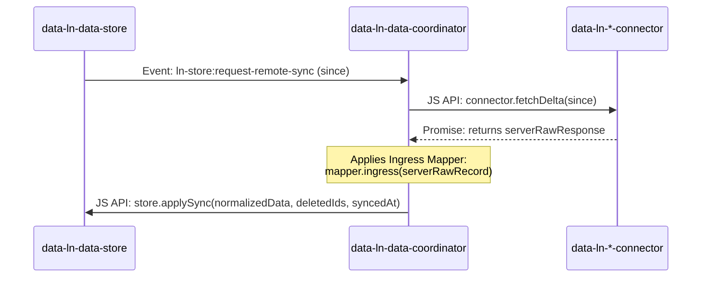
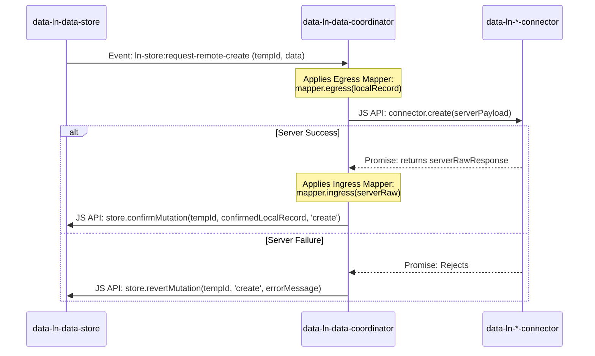
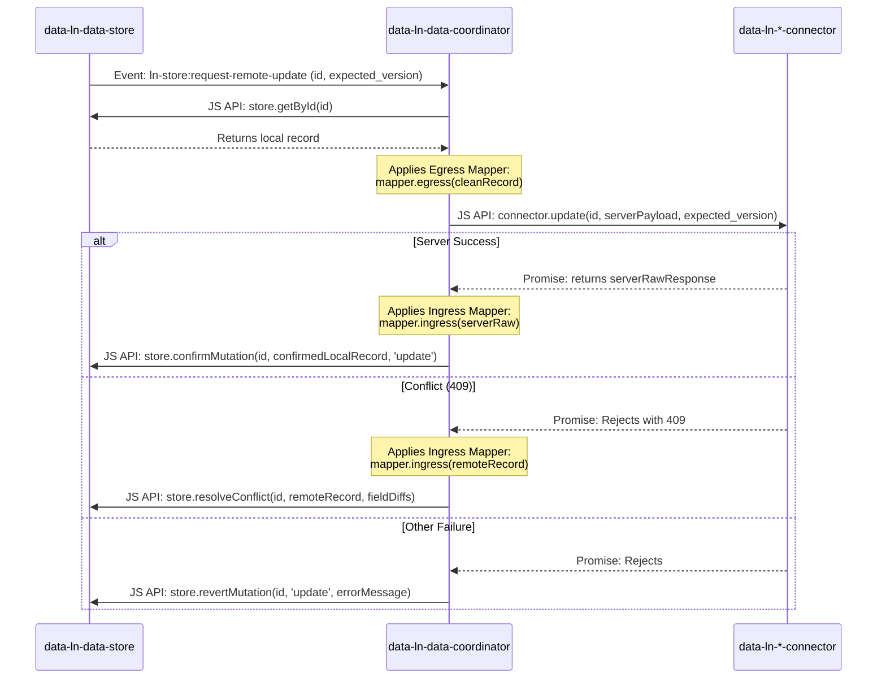

# `data-ln-data-coordinator`

A zero-dependency, Local-First **Data Coordinator** component that orchestrates the full 3-Tier Data Layer in `ln-ashlar`: it bridges the local cache store to remote connectors **and** delivers live data to bound view components (tables, lists, selects, stat counters) with zero application JavaScript.

This component monitors its DOM subtree, intercepts events, and coordinates the lifecycle between a **Local Storage Cache** (`data-ln-data-store`) and any **Transport Gateway** (`data-ln-*-connector`). It also listens on `document` for view-binding requests and refreshes all bound view elements on every store mutation.

---

## Declarative View Binding

Add these attributes to view elements to bind them to this coordinator's child store. No app JS needed.

| Attribute | Applied To | Description |
|---|---|---|
| `data-ln-table-store="<storeName>"` | `[data-ln-table]` | Binds a table — receives `ln-table:set-data` automatically. |
| `data-ln-list-store="<storeName>"` | `[data-ln-list]` | Binds a list — receives `ln-list:set-data` automatically. |
| `data-ln-options="<storeName>"` | `<select>` | Populated by `ln-options` via `ln-options:set-data`. |
| `data-ln-stat="<storeName>"` | Inline element | Receives count via `ln-stat:set-count`. |

`<storeName>` = the value of `data-ln-data-store` on the coordinator's child store. Multiple coordinators on one page each serve only their own store — isolated by the `_ownsStore(name)` guard.

### Presenter / Binder Split

- **Presenters** (`store.setPresenters({computed})`) — registered on the store; computed display fields flow through `getAll → set-data` automatically.
- **Binder** (this coordinator) — delivers already-decorated records without knowing their shape.

Use `setPresenters` for fields like `updated_display`, `size_display`, `status_label`. The binder delivers them as-is.

### Store-Change Refresh

The coordinator listens on `this.dom` for `ln-store:ready`, `loaded`, `created`, `updated`, `deleted`, and `synced` (only when `changed`). On any of these, `_refreshAll()` re-queries all bound view elements using their last cached query parameters.

### Zero-JS Example

```html
<div data-ln-data-coordinator>
  <div data-ln-data-store="people" data-ln-store-endpoint="/api/people"></div>
  <div data-ln-api-connector data-ln-api-endpoint="/api/people"></div>
</div>

<section data-ln-table="people"
         data-ln-table-source="people"
         data-ln-table-store="people">
  <table>
    <thead>
      <tr>
        <th data-ln-table-col="name">Name <button data-ln-table-col-sort …></button></th>
        <th data-ln-table-col="status">Status <button data-ln-table-col-filter …></button></th>
      </tr>
    </thead>
    <tbody data-ln-table-body></tbody>
  </table>
  <template data-ln-template="people-row">
    <tr data-ln-table-row>
      <td>{{ name }}</td>
      <td>{{ status_display }}</td>
    </tr>
  </template>
</section>

<select data-ln-options="people" data-ln-options-value="id" data-ln-options-label="name">
  <option value="">All</option>
</select>

<strong data-ln-stat="people" data-ln-stat-filter="status:active"></strong> active
```

No `<script>` block needed. The coordinator wires everything.

---

## 🧭 The 3-Tier Data Layer Anatomy

The coordinator acts as a parent wrapper enclosing the database cache and transport connector:

```html
<div data-ln-data-coordinator="documents"
     data-ln-data-mapper="documents">
     
    <!-- Tier 1: Local Cache Database (IndexedDB - pure and network-blind) -->
    <div data-ln-data-store 
         data-ln-store-indexes="status,updated_at">
    </div>

    <!-- Tier 2: Transport Gateway (API / REST Connector) -->
    <div data-ln-api-connector 
         data-ln-api-base-url="https://api.livenetworks.com/v1"
         data-ln-api-path="/documents">
    </div>
</div>
```

---

## ⚙️ Attributes

| Attribute | Category | Description |
|-----------|----------|-------------|
| `data-ln-data-coordinator` | Selector | Creates the coordinator instance. The value acts as the domain/scope name (e.g. `documents`). |
| `data-ln-data-mapper` | Mapping | Reference to an externally registered data mapper name (e.g. `documents`). |

---

## 🔄 Dynamic Child & Mapper Discovery

The coordinator is built to be highly dynamic, reacting to runtime modifications in its DOM subtree.

1. **Child Discovery**: The coordinator automatically locates its child components by querying its DOM subtree:
   * **Store Cache**: Looks for `[data-ln-data-store]` and accesses `el.lnDataStore || el.lnStore`.
   * **Transport Connector**: Looks for any connector selector (`[data-ln-api-connector]`, `[data-ln-couchdb-connector]`, `[data-ln-websocket-connector]`, `[data-ln-rest-connector]`) and accesses the universal alias `el.lnConnector`.

2. **Mapper Resolution**: The coordinator resolves mapping functions using two strategies:
   * **Inline Script (Highly Encapsulated)**: Looks for a nested `<script type="application/javascript" data-ln-mapper>` tag in its subtree:
     ```html
     <script type="application/javascript" data-ln-mapper>
       ({
         ingress(serverRaw) {
           return {
             id: serverRaw.id,
             title: serverRaw.title,
             status: serverRaw.status,
             updated_at: Date.parse(serverRaw.updated_at) / 1000
           };
         },
         egress(localDb) {
           return {
             title: localDb.title,
             status: localDb.status
           };
         }
       })
     </script>
     ```
   * **External Registry (Reusability)**: If no inline script exists, it reads the `data-ln-data-mapper` attribute and looks up the mapper via `window.lnCore.getDataMapper(name)`.
   * **Fallback**: Defaults to a safe no-op mapper: `{ ingress: r => r, egress: r => r }`.

---

## ⚡ The Event Loop Orchestration

Because all events dispatched by the child components bubble up, the coordinator listens directly on its own DOM boundary. It manages the following flows seamlessly:

### 1. Delta & Full Sync (`ln-store:request-remote-sync`)
Triggered when the store cache boots up or detects stale data:


### 2. Optimistic Creation (`ln-store:request-remote-create`)
Triggered when a form submits a new record to the local cache:


### 3. Optimistic Updates (`ln-store:request-remote-update`)
Triggered when a record is updated locally. The coordinator pulls the complete merged record from the database to support standard REST `PUT` schemas:


### 4. Deletions (`ln-store:request-remote-delete` & `bulk-delete`)
Triggered when records are deleted in-memory:
* **Single Delete**: Calls `connector.delete(id)` $\rightarrow$ calls `store.confirmMutation(id, null, 'delete')` (or `revertMutation` on failure).
* **Bulk Delete**: Calls `connector.bulkDelete(ids)` $\rightarrow$ calls `store.confirmMutation(ids.join(','), null, 'bulk-delete')` (or `revertMutation` on failure).

---

## 💡 JS API (On the element)

Access the coordinator instance programmatically via the `lnDataCoordinator` or `lnCoordinator` properties:

```javascript
const coordinator = document.querySelector('[data-ln-data-coordinator="documents"]').lnDataCoordinator;

// Force a remote configuration refresh
coordinator.refreshConfig();

// Retrieve children objects
const { store, connector } = coordinator.findChildren();

// Fetch currently resolved mapper functions
const { ingress, egress } = coordinator.mapper;
```
